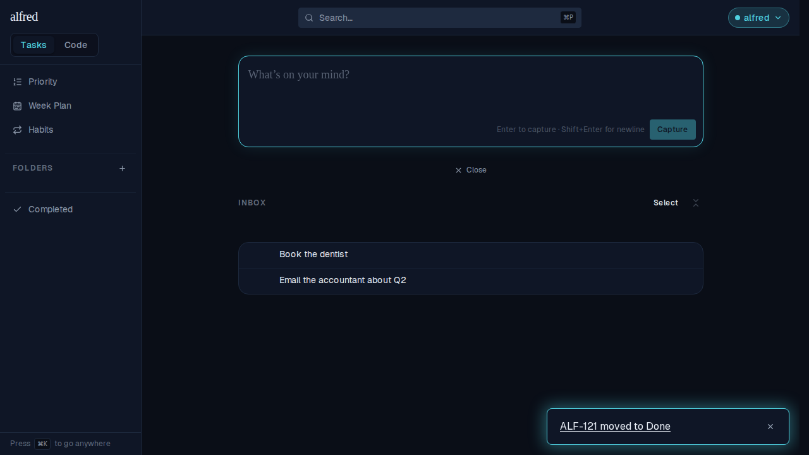
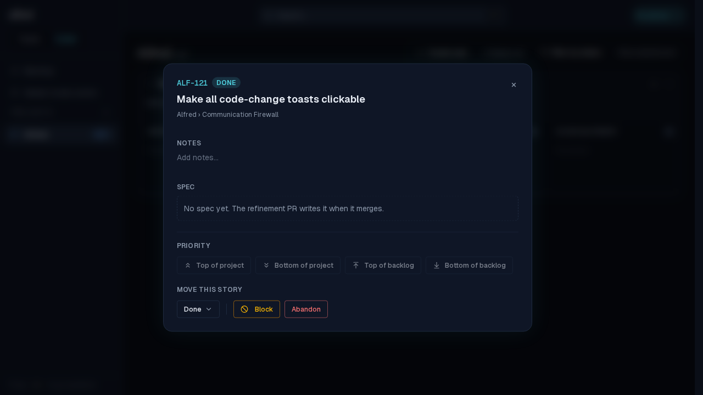
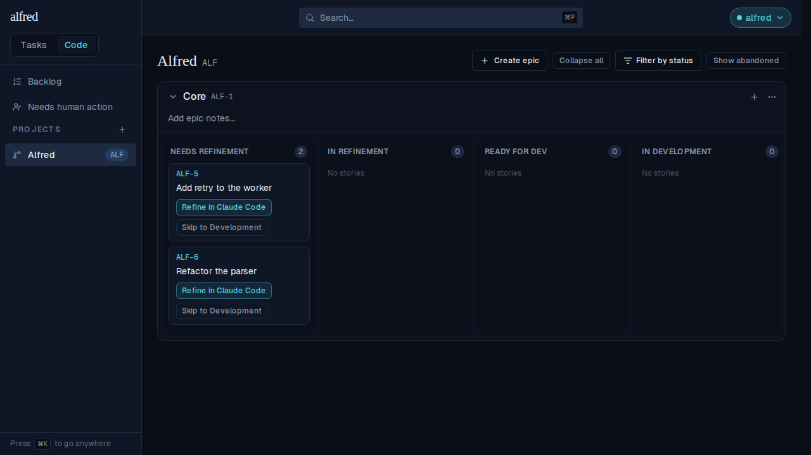

# ALF-121 — every code-change toast is a way to the change

*2026-07-30T17:17:34.857Z*

ALF-68 made the story-creation toast clickable; every other Code-module toast stayed inert text. ALF-121 finishes the job: the realtime **move** alert and the Inbox **bulk send** confirmation now carry an `href` too, so a notification about a code change is also the way to that change.

## Every Worker-driven move

One toast fires for **every** factory-state change, so the whole PR lifecycle the Worker drives is covered by one code path. Here ALF-121 walks its own: the refinement PR merges, the implementation PR opens, then it merges — each alert arriving while the user is in Tasks, each now a link (hovered here, revealing its underline).

**1 · the refinement PR merged → Ready for Dev.** One click lands on `/code/[projectId]?story=ALF-121` with the detail modal open on the state the alert announced.

**2 · the implementation PR opened → Ready for Review.** The alert that used to be a dead end is now the fastest route to the card waiting on you.

**3 · the implementation PR merged → Done.** Same for the last move of the lifecycle.

## The Inbox bulk send

Two captures selected in the Inbox and sent through the gate under one project + epic. The confirmation has no single story to open, so it links to the project board the batch just landed on — the destination the ALF-68 demo explicitly left for later.

Clicking it lands on `/code/[projectId]`, where both stories (ALF-5, ALF-6) sit in Needs Refinement under Core.

Toasts with no navigable target are unchanged: every `Couldn't …` error and the `Prompt copied to clipboard` launch confirmation still render as plain, non-link text.
