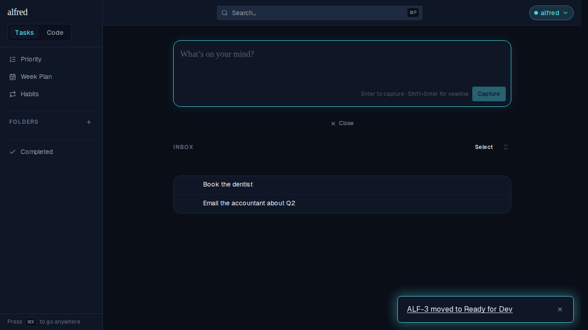
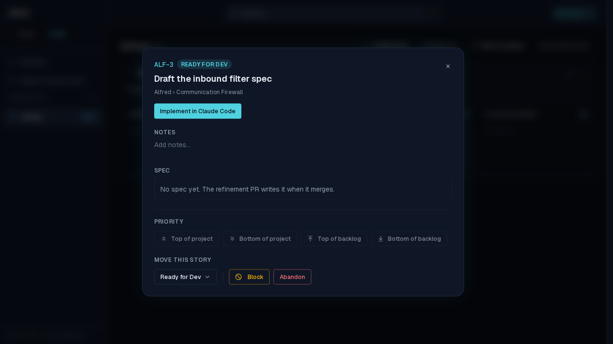
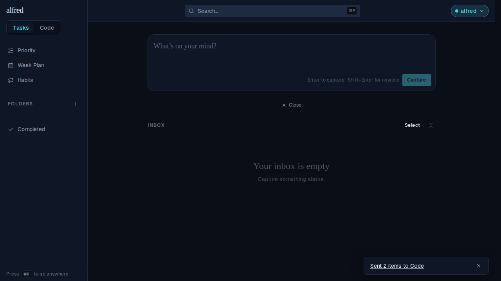
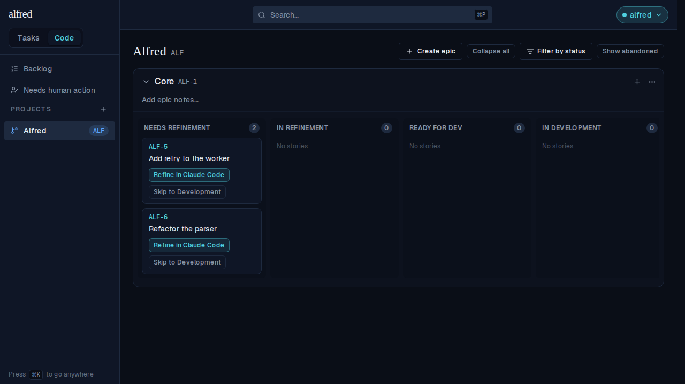

# ALF-121 — every code-change toast is a way to the change

*2026-07-30T16:12:04.157Z*

ALF-68 made the story-creation toast clickable; every other Code-module toast stayed inert text. ALF-121 finishes the job: the realtime **move** alert and the Inbox **bulk send** confirmation now carry an `href` too, so a notification about a code change is also the way to that change.

## The realtime move alert

A refinement PR merges while you're in Tasks. The Worker flips ALF-3 to Ready for Dev out of band and the tab is told over realtime. The alert is now a link (hovered here, revealing its underline) — before ALF-121 it was plain text and finding the card meant switching to Code and hunting for it.

One click lands on that story's board at `/code/<projectId>?story=ALF-3` with its detail modal open — showing the very state the alert announced, **Ready for Dev**.

## The Inbox bulk send

Two captures selected in the Inbox and sent through the gate under one project + epic. The confirmation has no single story to open, so it links to the project board the batch just landed on — the destination the ALF-68 demo explicitly left for later.

Clicking it lands on `/code/<projectId>`, where both stories (ALF-5, ALF-6) sit in Needs Refinement under Core.

Toasts with no navigable target are unchanged: every `Couldn't …` error and the `Prompt copied to clipboard` launch confirmation still render as plain, non-link text.
