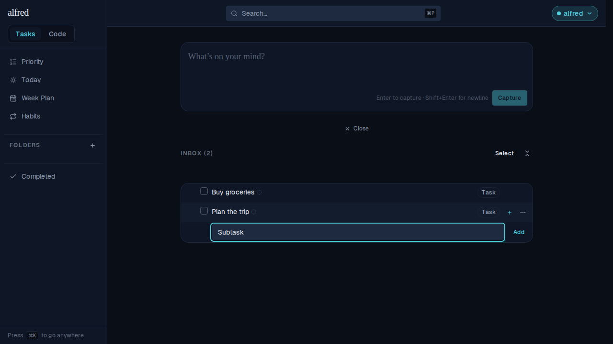
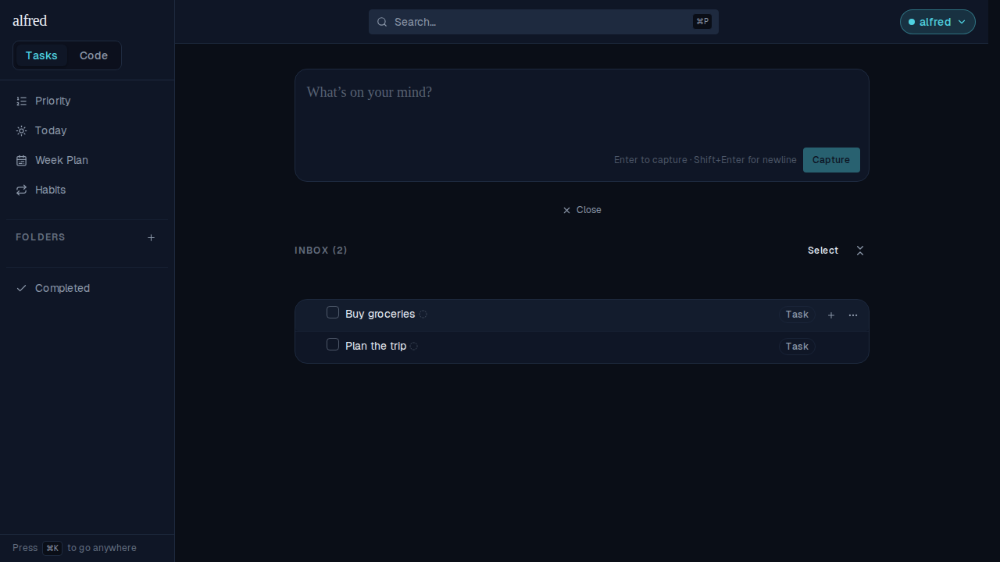

# Click outside dismisses the add-subtask entry

*2026-09-10T21:53:22.858Z*

ALF-127: clicking anywhere outside the inline "Add subtask" entry dismisses it and discards whatever was typed — the same as pressing Escape (ALF-66), and regardless of whether the field currently holds focus.

The mouse-driven case below already worked: CaptureBox's compact form dismisses as soon as it *loses* focus, and a real browser blurs a focused input on any outside press by default. But that mechanism only fires when the field actually has focus to lose. After a touch "Add" tap (ALF-98) the field stays open — ready for the next subtask — with focus landing nowhere, since the tap's blur is deliberately skipped so the submit isn't cut off. From that state, no further blur ever fires, so a later outside press had nothing to dismiss it. The fix adds a second, focus-independent dismiss: an outside pointer press now closes the entry via the same document-level listener the detail panel already uses (ALF-78's `useDismiss`, scoped to the row), so it closes whether or not anything inside it is focused.

Before: the "Plan the trip" row's Add-subtask field is open with unsaved text ("Half-typed subtask").

After: a single click on the unrelated "Buy groceries" row closes the field and discards the unsaved text — no subtask is created.

Regression coverage: frontend/components/tasks/task-row.test.tsx ("TaskRow — dismissing the add-subtask entry on an outside click (ALF-127)") pins the outside-dismiss, the discard-unsaved-text, and the stays-open-inside-it cases at the unit level, plus the specific bug this PR fixes — "closes on an outside press even after the field already lost focus without dismissing" — which reproduces the touch-submit sequence (pointer-down on Add, a real `.blur()`, then submit) that leaves the field open with nothing focused, then asserts an outside press still closes it. frontend/e2e/subtask-dismiss-click-outside.spec.ts reproduces the general mouse journey shown above against a real browser, since jsdom can't replicate default focus-loss on a plain outside click.
