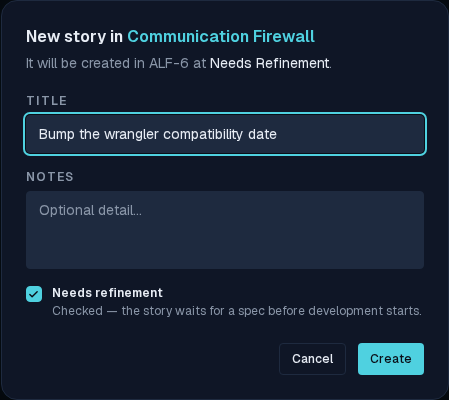
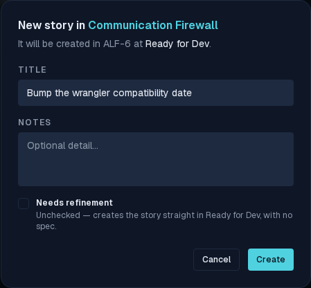
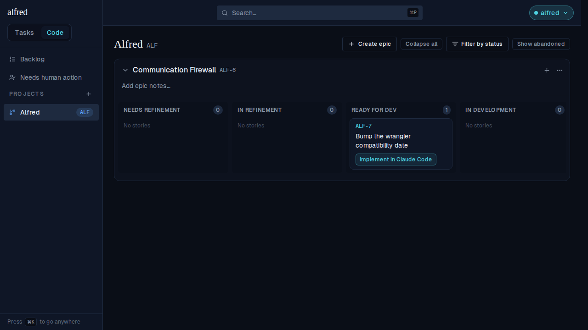
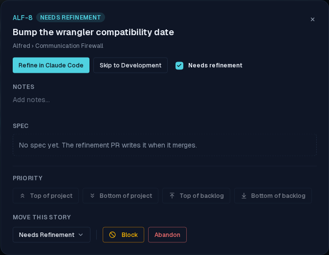
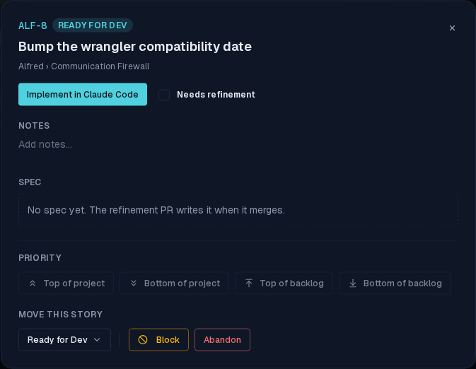
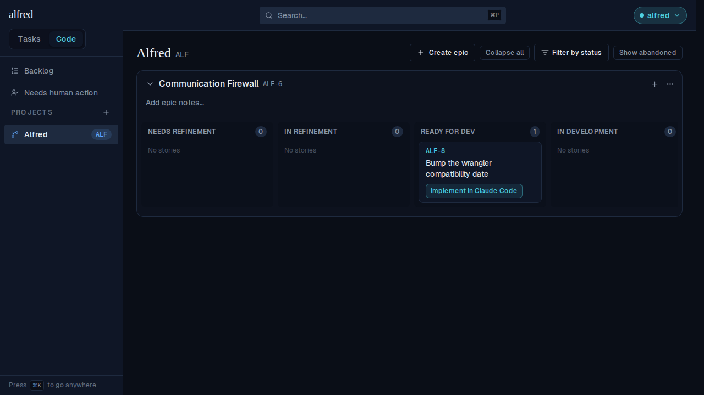
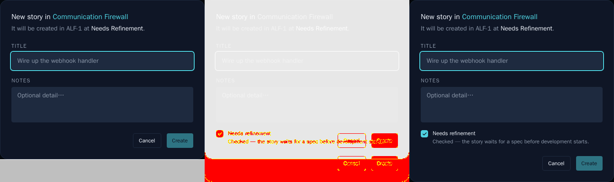
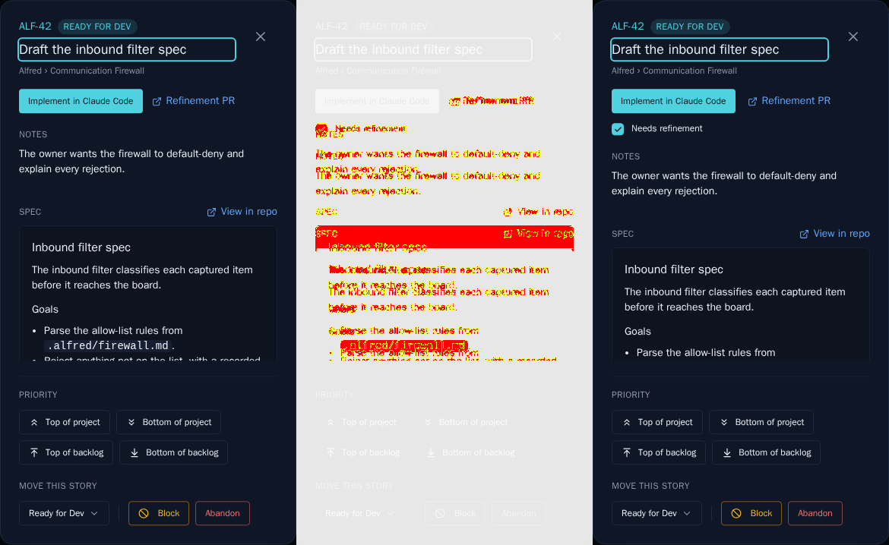

# Mark a story as not needing refinement

*2026-07-30T16:24:53.715Z*

A code story enters the factory at **Needs Refinement**, and the only way out short of actually refining it was the *Skip to Development* chip — a launch action that writes `in_development` **and opens a Claude Code tab in the same click**. That welded the decision "this one doesn't need a spec" to the act "start building it right now", and left no trace of the judgement on the row.

ALF-137 separates the two. A story now carries a persisted `requires_refinement` flag, settable at creation or flipped later; clearing it parks the story in **Ready for Dev** with nothing opened.

## 1 · Creating a story that needs no spec

The New Story dialog gains a **Needs refinement** checkbox, checked by default — so nothing changes unless you say so.



Unchecking it restates the consequence *before* you submit — the description's trailing state follows the box to **Ready for Dev**, and the hint spells out that no spec will be written.



On Create, the card appears straight in **Ready for Dev** — never in Needs Refinement — showing the ordinary *Implement in Claude Code* button. No browser tab was opened.



## 2 · Marking a story that already exists

The same control sits in the detail modal's header, next to the launch button. Here is ALF-8 sitting in Needs Refinement, offering *Refine in Claude Code*.



Unchecking the box moves the story on the spot: the chip reads **Ready for Dev** and the primary action becomes *Implement in Claude Code*. Still no tab — the modal stays open and you carry on triaging.



Behind the modal the card has already moved lanes.



Re-checking the box undoes it, but only while no spec exists: a story whose refinement PR recorded a `spec_path` is never rewound past it. And in any other state — mid-development, in review — the flag is simply recorded and the card stays put.

## 3 · The prompt the launch actually builds

Landing stories in Ready for Dev without a spec exposed an existing bug: that state *assumed* a merged spec, so its prompt told the agent to read a file that was never written. (The Worker already produced such stories by reverting a closed-unmerged implementation PR.) The development launch now picks its prompt from whether a spec exists, not from the lane.

Below is the prompt the app built when *Implement in Claude Code* was clicked on the spec-less ALF-7 above, captured from the live launch URL — it says SKIP-REFINEMENT, names no spec file, and carries no archive step.

```bash
cat docs/demos/ALF-137-skip-refinement/launch-prompt.txt
```

````output
ALF-7: Bump the wrangler compatibility date

You are implementing the ticket ALF-7. This is a SKIP-REFINEMENT session: there is NO committed spec to read — settle the plan here, then build it directly in this one session.

1. Ground yourself first: skim the repo and honor its own conventions — read any CONTRIBUTING or CLAUDE.md — and base your work on the code that already exists.
2. If the title and context below don't pin down the scope, ASK ME HERE before building rather than guessing — you don't need to guess, I'm in this tab. Once the plan is settled, go ahead.
3. Implement the change directly, following the repo's own conventions (tests/TDD included) — pin each requirement with a test.
4. When done, open a pull request whose description carries this machine-readable block verbatim — a CI check enforces it, so reproduce the fence exactly:

```alfred
alfred-ticket: ALF-7
phase: implementation
```

5. Before opening the PR, confirm your changes satisfy the agreed plan and the block above is reproduced exactly.
````

A story that *does* carry a recorded `spec_path` still gets the spec-reading implementation prompt, and the button reads *Implement in Claude Code* either way.

## 4 · Storybook baselines

Both surfaces carry committed visual snapshots. The gate emitted these diffs (baseline | changed pixels | new render); the new baselines are approved and committed alongside.





## 5 · The durable mark

`code_items.requires_refinement` is a real column (`boolean not null default true`), so every existing story keeps today's meaning with no backfill, the judgement survives a state revert, and a future automated dispatcher has something to query. *Skip to Development* is unchanged apart from now writing the same flag — both routes leave identical rows.
