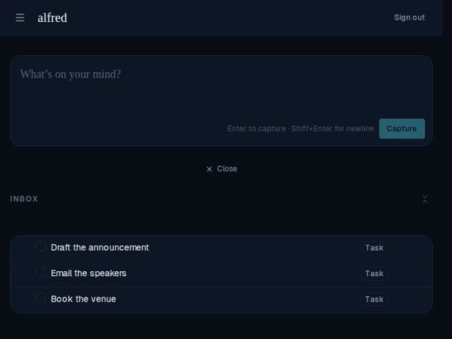

# Task deletion animation

*2026-06-29T15:28:26.952Z*

Deleting a task or inbox item used to make its row vanish instantly. It now plays the same
deliberate exit as completion: choosing **Delete** fades the whole row out while its height
collapses to zero (ease-out), pulling the rows below up to close the gap. The row stays
rendered through the animation — `deleteTask` only commits once the collapse transition ends —
so the optimistic removal can't yank it out mid-motion. Under `prefers-reduced-motion: reduce`
there is no animation to wait on, so the row is removed immediately.

Below: the inbox holds three tasks; we delete the top one ("Draft the announcement"). It fades
and shrinks away, and the two tasks beneath it rise into its place.

