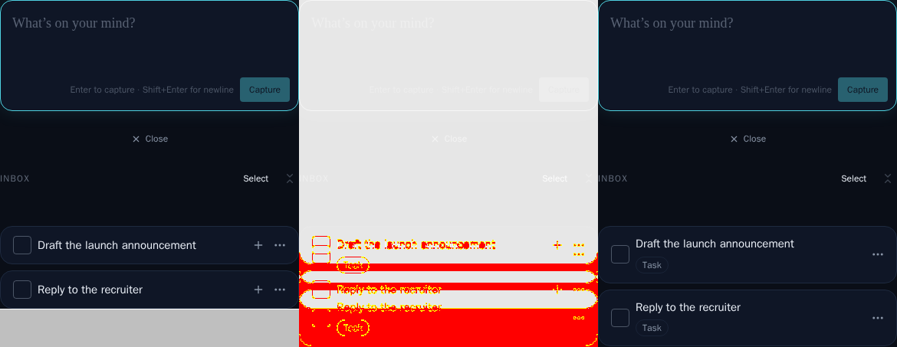
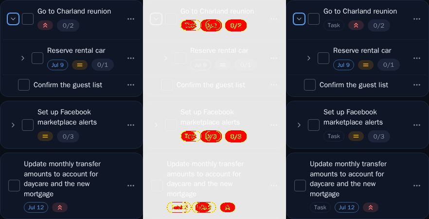
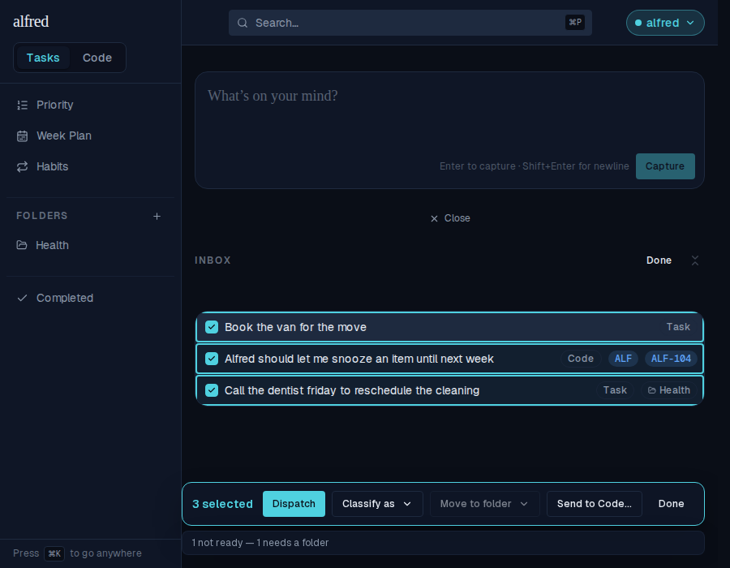
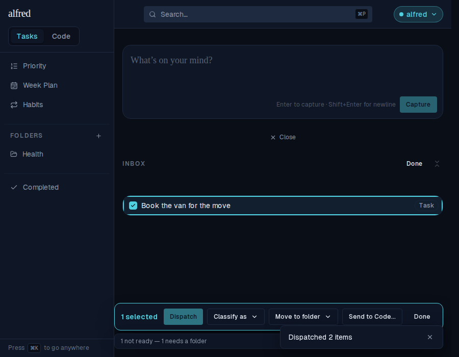
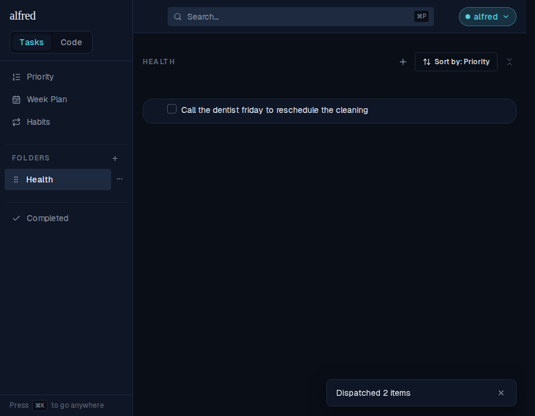
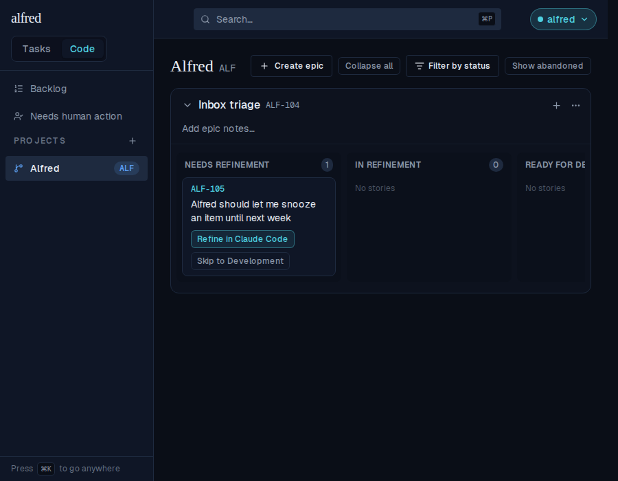
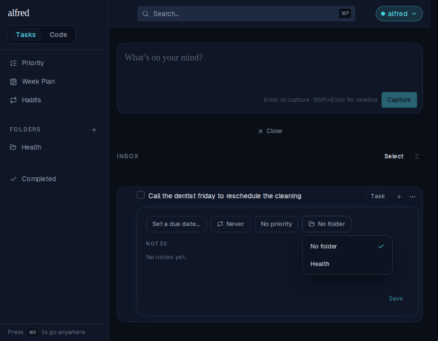
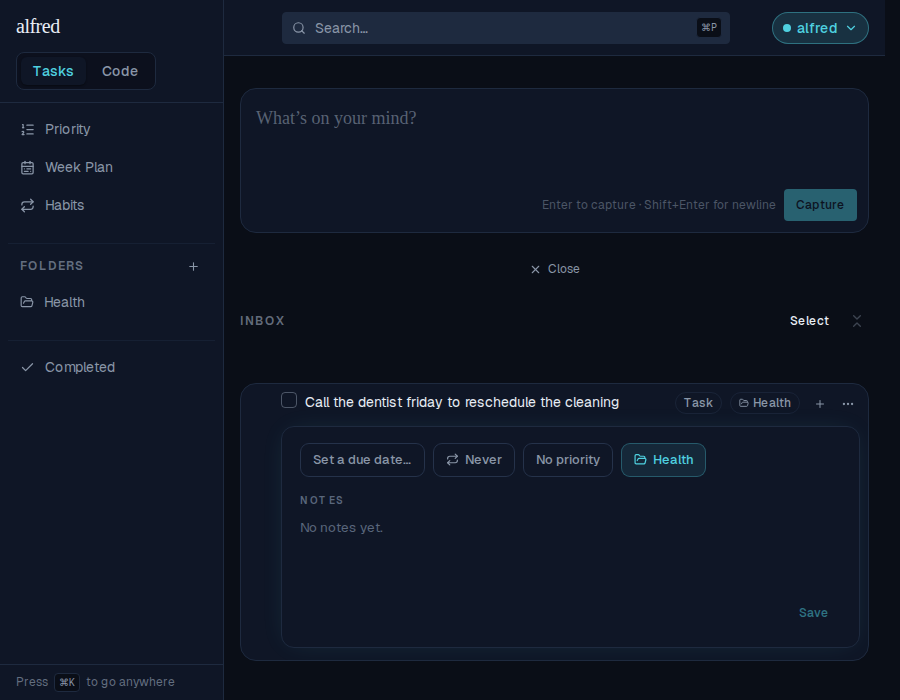

# ALF-170 — Inbox labels, editing parity, and one-press Dispatch

*2026-08-08T04:20:26.383Z*

Everything the classifier will need, built by hand first: an item gains a pre-factory epic hint beside its project hint, the Inbox row and detail panel become the one place every classifier-written field is editable, and the bulk bar gains Dispatch — one press that sends each ready selected item to its own destination.

## The schema: the epic hint and its coherence trigger

Migration 0027 adds items.intended_epic_id — shaped exactly like the project hint (nullable FK, code-only CHECK, index, task_items recreation) — plus the one thing the project hint never needed: a deferred constraint trigger proving the epic belongs to the intended project. The script below builds a throwaway Postgres from the repo's migrations and exercises every rule; note the deleting-the-epic case, where the cascade nulls the hint and keeps the project.

```bash
node docs/demos/ALF-170-inbox-dispatch/intended-epic-trigger-demo.mjs 2>/dev/null
```

```output
a task carrying an epic hint: REJECTED — new row for relation "items" violates check constraint "items_intended_epic_code_only"
an epic hint with no project hint: REJECTED — intended epic 33333333-3333-3333-3333-333333333333 does not belong to intended project <NULL>
an epic from another project's intended project: REJECTED — intended epic 33333333-3333-3333-3333-333333333333 does not belong to intended project 22222222-2222-2222-2222-222222222222
a coherent project + epic pair: OK
task_items surfaces the hints: {"intended_project_id":"11111111-1111-1111-1111-111111111111","intended_epic_id":"33333333-3333-3333-3333-333333333333"}
after deleting the epic: {"intended_project_id":"11111111-1111-1111-1111-111111111111","intended_epic_id":null}
```

## The moved visual baselines (S8's predicted diffs)

The Task badge returns on undispatched Inbox roots, so every Inbox story seeded with a task row re-rendered. The 3-panel diffs below (baseline | changed pixels | received) are the evidence; the regenerated PNGs are the approval. The mobile Inbox diff also surfaces an older, sub-threshold staleness: the row's + button went menu-only on mobile in an earlier story, under this baseline's 1% threshold — my re-baseline picks that up too.





## One press, three outcomes — the dispatch journey in the running app

A mixed selection mid-triage: a task labelled Health, a code item carrying ALF · ALF-104, and a bare task. Select mode keeps every label visible (inert — the whole row is one button), Dispatch leads the bar, and the readiness line names the blocker before the press.



After one press: the two ready rows are gone to their own destinations, the toast counts them, and the unready row stays selected with the line still explaining itself.



The task landed in Health…



…and the code item entered the factory at Needs Refinement — no dialog: it already carried both hints, so the gate had nothing left to ask.



## Labelling from the detail panel never moves the row

The task panel's new Folder chip (beside Due · Repeat · Priority) opens the shared picker — "No folder" present because the row is undispatched.



Picking Health labels the row and leaves it exactly where it was: still in the Inbox, now wearing the folder chip — setting a folder stopped meaning "file it"; Dispatch is the press that moves things.


