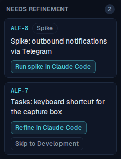
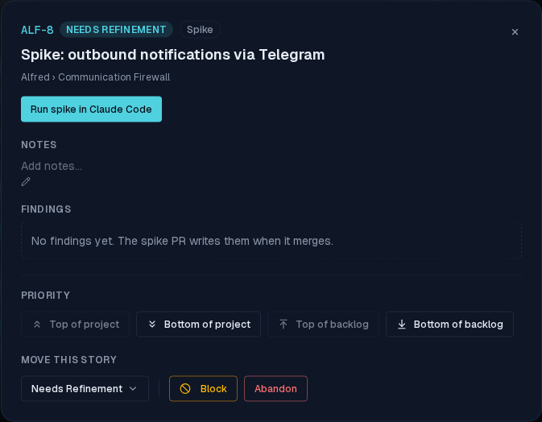
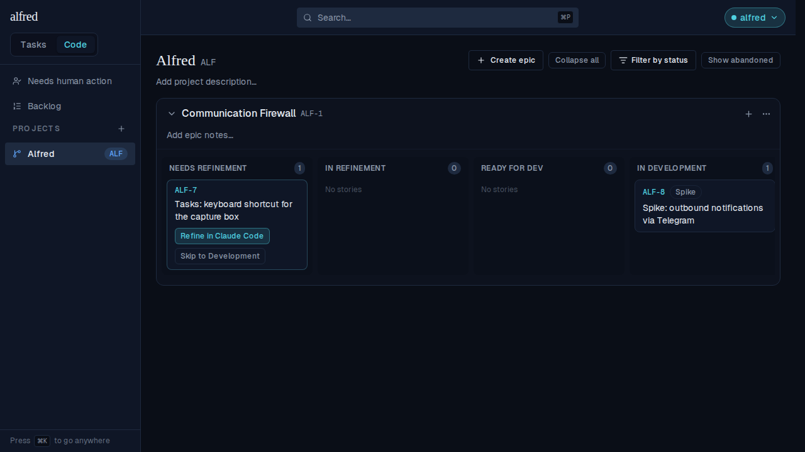
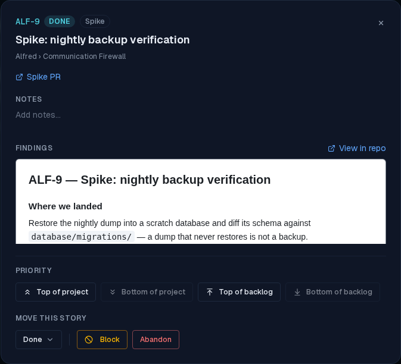

# Spikes are a first-class factory phase

*2026-08-30T15:02:06.122Z*

A story titled `Spike: …` now gets its own factory phase: its own launch prompt, its own committed skill, its own `phase: spike` value in the machine-readable `alfred` block, and its own rows in the Worker's transition table — whose deliverable is a self-contained HTML findings document in `docs/spikes/` rather than a feature spec or code changes.

## 1 · The board: one action instead of two

Spike-ness is derived from the title alone — nothing is persisted, so renaming a story re-classifies it. In the same Needs Refinement lane, the spike card (ALF-8) carries a muted **Spike** badge after its ref and offers exactly one action, *Run spike in Claude Code*; the ordinary card beside it (ALF-7) is untouched, still offering *Refine* plus the subordinate *Skip to Development*.



## 2 · The spike's detail modal, before the run

The badge repeats beside the state chip; the header offers the single solid *Run spike in Claude Code* button with no subordinate beside it; the **Needs refinement** checkbox is gone entirely (a spike is never refined, so a toggle promising refinement could only mislead); and the document section reads **Findings**, with its own empty copy.



## 3 · Launching moves the card to In Development

A spike is one session: it answers the question and writes the findings, so there is no separate build phase. Clicking the chip awaits the state write (which also records `requires_refinement: false`) and then opens the prefilled tab — the card lands in **In Development**, still badged, with nothing left to launch.



## 4 · The prompt the launch actually builds

Captured from the live launch URL above. It asks for findings only, names neither a spec to read nor an archive to move anything into, points at the spike skill with a no-skill fallback, and carries the `alfred` block with `phase: spike` and the unresolved `spec-path` placeholder the session fills in.

```bash
cat docs/demos/ALF-173-spike-phase/launch-prompt.txt
```

````output
ALF-8: Spike: outbound notifications via Telegram

You are running a SPIKE for the ticket ALF-8. Produce a FINDINGS DOCUMENT ONLY — answer the question and record what you found, in enough detail that a later refinement or implementation session can act on it. Do NOT implement anything (no app or source changes) and do NOT write a feature spec.

1. Ground yourself first: skim the repo and honor its own conventions — read any CONTRIBUTING or CLAUDE.md — and base your findings on the code that already exists.
2. If the title and context below don't pin down the question this spike has to answer, ASK ME HERE before investigating — you don't need to guess, I'm in this tab. Otherwise go ahead.
3. Investigate, then write the findings following the spike skill at `.claude/skills/spike/SKILL.md` (it auto-loads in a spike session) — it defines this repo's findings format, structure, and where the document lives. If the skill is absent, write a single self-contained HTML findings document under the repo's spikes directory.
4. The findings document is LONG-LIVED reference material — later sessions keep reading it. Do not archive or move it, and do not add it to the specs directory.
5. Open a pull request whose description carries this machine-readable block — the orchestrator (alfred) reads it to advance the ticket and a CI check enforces it. Reproduce the `alfred-ticket` and `phase` lines exactly, and set `spec-path` to where you saved the findings document:

```alfred
alfred-ticket: ALF-8
phase: spike
spec-path: <path-or-folder-of-the-spec>
```

6. If the spec is an HTML file, also link it in the description so a reviewer can read the plan rather than the markup — GitHub serves a committed `.html` as raw source. On a public repo, route it through htmlpreview: `https://htmlpreview.github.io/?https://github.com/ac3charland/alfred/blob/<head-branch>/<spec-path>`. htmlpreview can't reach a private repo — if this one is private, link the file directly instead (`https://github.com/ac3charland/alfred/blob/<head-branch>/<spec-path>`) so the reviewer can download and open it. Either way point at this PR's head branch; the spec isn't on main yet.
7. Before opening the PR, confirm the findings document is saved, `spec-path` above names that document (not the placeholder), the preview link is there, and the block is reproduced exactly.
````

## 5 · The findings, once the spike PR merged

Merging is the snapshot point: a spike's document only exists on its own PR, so the Worker records `spec_path` and snapshots the file when the PR merges. The modal renders it in the same sandboxed frame the HTML specs use, the sha-pinned **View in repo** link points into `docs/spikes/`, and the recorded PR reads **Spike PR** rather than *Implementation PR*.



## 6 · The contract and the state machine

`phase` gained its fourth legal value in the three places that must stay in lockstep — the Worker's parser, the enforcing GitHub Action, and the repo-setup contract table. Below, the enforcing check's own script is lifted verbatim out of the committed workflow and run against four PR bodies: it accepts a spike block, rejects one that names no findings document, and its archive rule is unchanged — still firing on an un-archived implementation spec, and never on a spike, whose findings live outside `docs/specs/`.

```bash
set -e
# Lift the enforcing check's script verbatim out of the committed workflow and run it.
sed -n '/^        run: |$/,$p' docs/code-module/repo-setup/alfred-frontmatter.yml \
  | tail -n +2 | sed 's/^          //' > /tmp/alfred-frontmatter-check.sh
block() { printf 'Body.\n\n```alfred\nalfred-ticket: %s\nphase: %s\n%s```\n' "$1" "$2" "$3"; }
run() { BODY="$1" sh /tmp/alfred-frontmatter-check.sh 2>&1 || echo "(check failed)"; }

echo '— a spike PR naming its findings document —'
run "$(block ALF-9 spike 'spec-path: docs/spikes/ALF-9-nightly-backup-verification.html
')"

echo '— a spike PR with no spec-path —'
run "$(block ALF-9 spike '')"

echo '— the archive rule is untouched: it still fires on an un-archived implementation spec —'
mkdir -p /tmp/archive-demo/docs/specs && : > /tmp/archive-demo/docs/specs/ALF-9.html
(cd /tmp/archive-demo && run "$(block ALF-9 implementation 'spec-path: docs/specs/ALF-9.html
')")

echo '— …and never for a spike, whose findings live outside docs/specs/ —'
mkdir -p /tmp/archive-demo/docs/spikes && : > /tmp/archive-demo/docs/spikes/ALF-9-nightly-backup-verification.html
(cd /tmp/archive-demo && run "$(block ALF-9 spike 'spec-path: docs/spikes/ALF-9-nightly-backup-verification.html
')")
```

```output
— a spike PR naming its findings document —
ok: ALF-9 spike
— a spike PR with no spec-path —
refinement and spike PRs need spec-path
(check failed)
— the archive rule is untouched: it still fires on an un-archived implementation spec —
implementation PR must archive its spec: git-move docs/specs/ALF-9.html to docs/specs/archive/ALF-9.html
(check failed)
— …and never for a spike, whose findings live outside docs/specs/ —
ok: ALF-9 spike
```

## 7 · The conventions the phase ships with

The launch prompt above points at a committed skill, so the phase travels with the repo it runs in: `.claude/skills/spike/SKILL.md` pins this repo's findings convention (`docs/spikes/<REF>-<short-slug>.html`, the *Where we landed → Why → Technical shape → Sidebars → Cost & open questions → Sources* shape, grounded findings, never archived), and the repo-setup README lists it beside the two refinement skills as a per-repo copy-me artifact. The directory it points at now holds the repo's two hand-written spike documents, moved in and re-linked:

```bash
ls docs/spikes && npm run lint:skills -w tools/skill-lint -- "$PWD/.claude/skills/spike/SKILL.md" 2>&1 | tail -1
```

```output
notifications-spike.md
scheduled-cloud-backups.md
skill-lint: 1 skill(s), 0 error(s), 0 warning(s).
```
