# ALF-191 — Contextual label dropdowns in the row ⋯ menu

*2026-09-04T01:35:44.906Z*

An Inbox row's metadata chips are editable in place — but only once a field is *set*. So the rows that most need attention (a task with no folder, a code story with no epic) show no affordance at all, and the only way to fill one in was `⋯ → Open details → click the chip → pick → ⋯ → Dispatch`, per row.

This change gives the row's ⋯ menu a set of **type-contextual label submenus** — Due date, Priority, Folder for a task; Project, Epic for a code story — so a row can be made dispatch-ready without ever opening the detail panel. And it retires **Classify as…** the moment a row has a type: a flip after the fields are filled silently drops the ones the new type forbids, so the way back from a wrong type is now Delete and re-capture.

Every shot below is the live app, driven through the Playwright mock backend.

## A task row: Due date · Priority · Folder

The menu on an undispatched task root. The three label submenus sit exactly where Classify as… used to — between the reorder items and Dispatch — and Classify as… is gone, because this row already has a type. Dispatch is dimmed: the row still needs a folder.

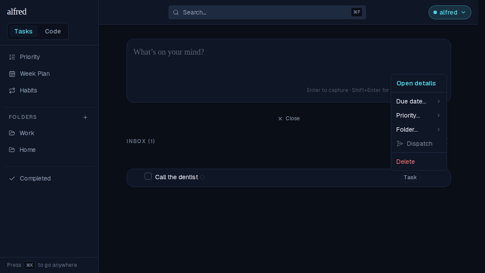

**Folder ▸** lists the folders in sidebar order plus "No folder" — the same options, in the same shape, that the row's folder chip popover offers.

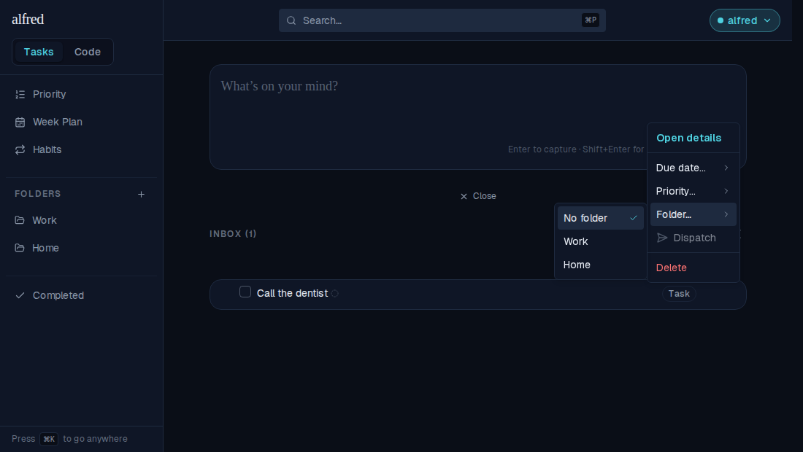

Picking **Work** writes `folder_id` alone — a *label*, not a move. The row stays in the Inbox, now wearing the folder chip, and the green **Ready to dispatch** pip lights up immediately.

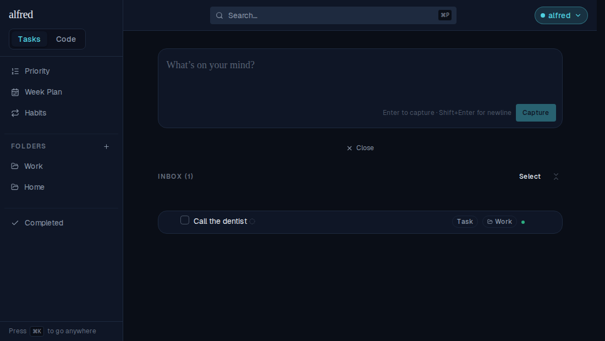

Re-opening the menu: **Dispatch is live**, and Folder ▸ ticks Work in teal — the same trailing check the chip pickers use.

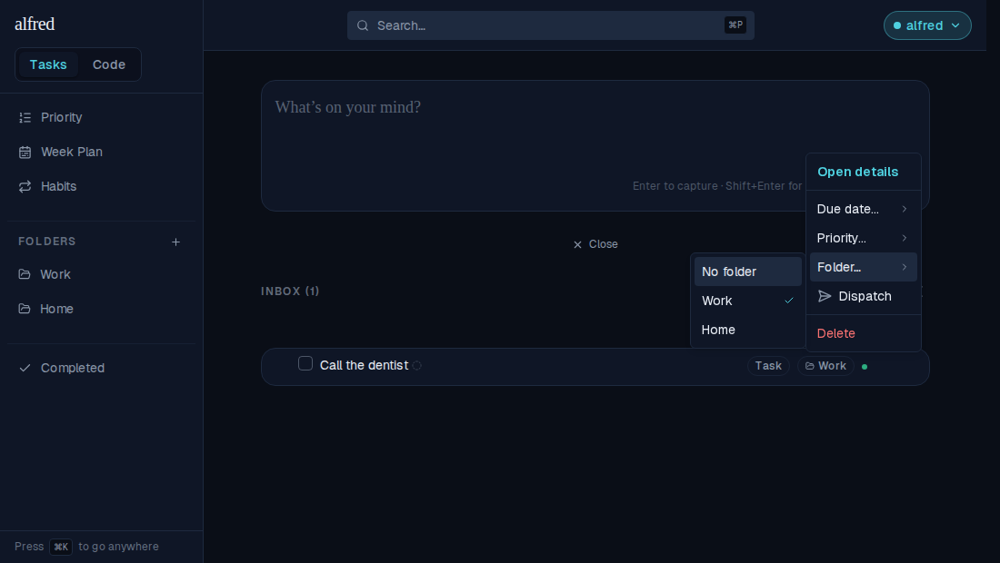

## Due date: presets, not a calendar grid

**Due date ▸** offers Today / Tomorrow / Next week and Custom…. "No due date" is absent while there is no date to clear. (A 7-column grid inside a submenu would break Radix's roving focus — arrows move between menu items, not grid cells — and is a cramped touch target.)

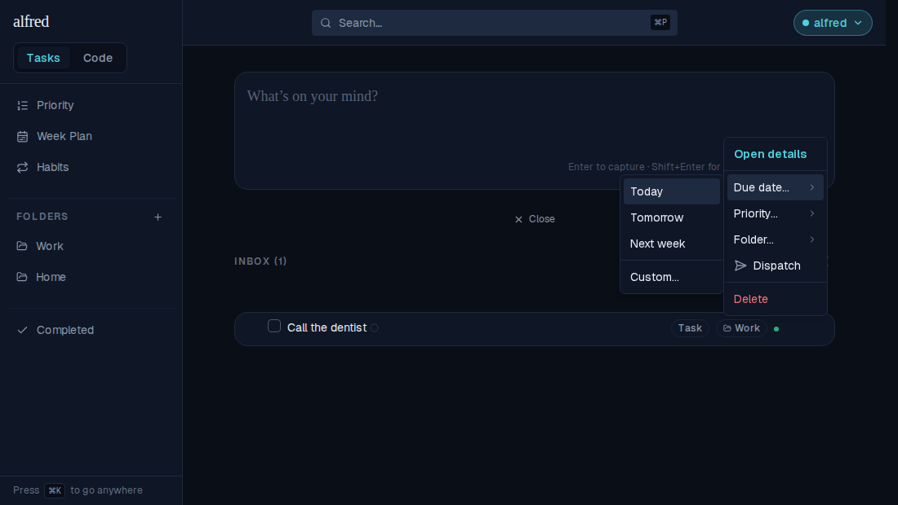

**Tomorrow** persists that exact calendar date, and the row picks up its due chip.

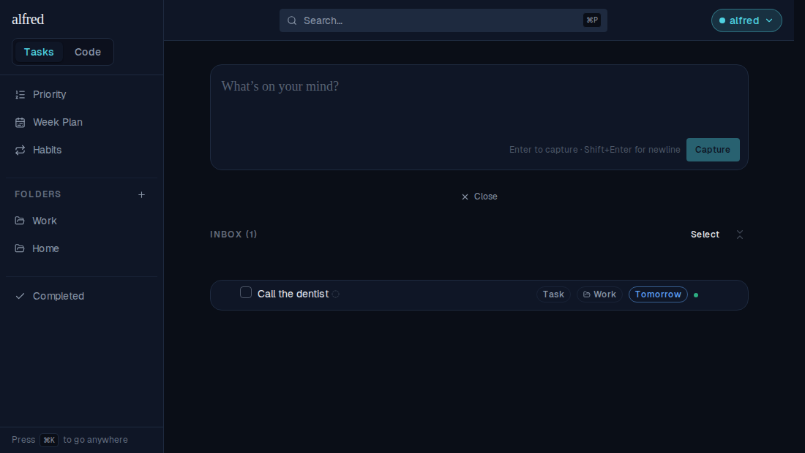

Re-opened with a date set, the matching preset carries the tick and **No due date** has appeared above Custom…. The separator stays after the third preset in *both* shapes, so the divider doesn't jump when the clear entry arrives.

The tick is the part that is easy to get wrong: `due_date` is a `timestamptz`, so a reconciled row carries `2026-09-05T00:00:00+00:00`. Compared raw against a `YYYY-MM-DD` preset, no preset would ever tick — the menu normalises the column to its calendar date first.

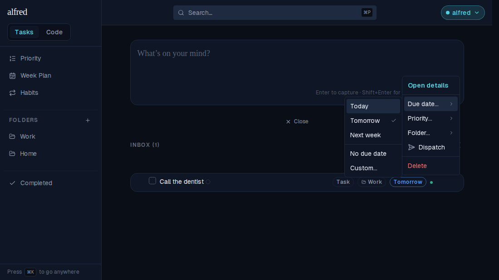

**Custom…** closes the menu and hands off to the existing Calendar, in a popover anchored to the ⋯ button.

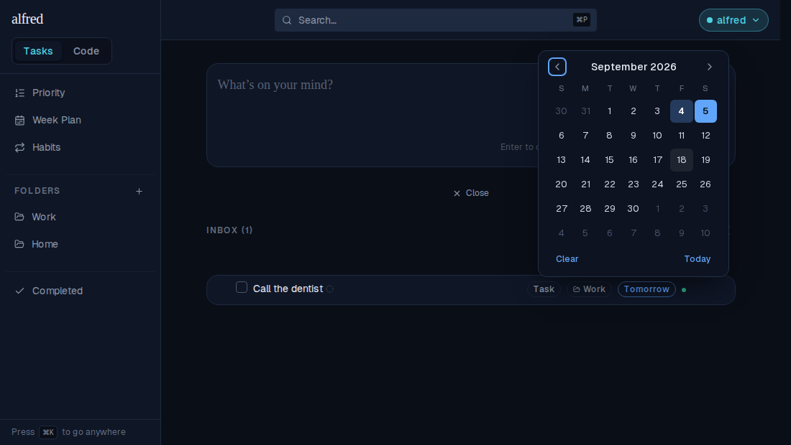

**Priority ▸** is byte-for-byte the chip's own menu: "No priority", a separator, then High / Medium / Low with their chevron glyphs in their accent colours.

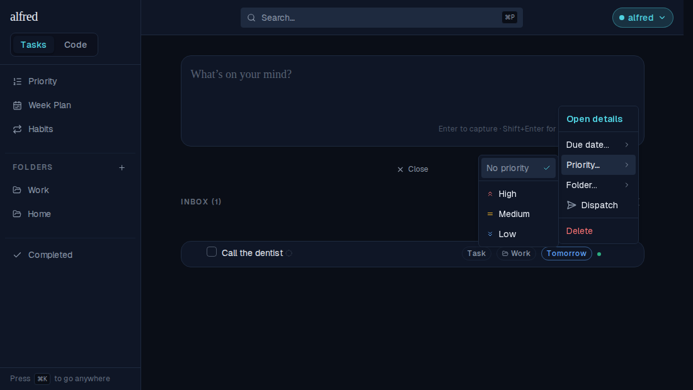

Dispatch from the same menu files the row into Work. Folder, due date and priority were all set without the detail panel ever opening.

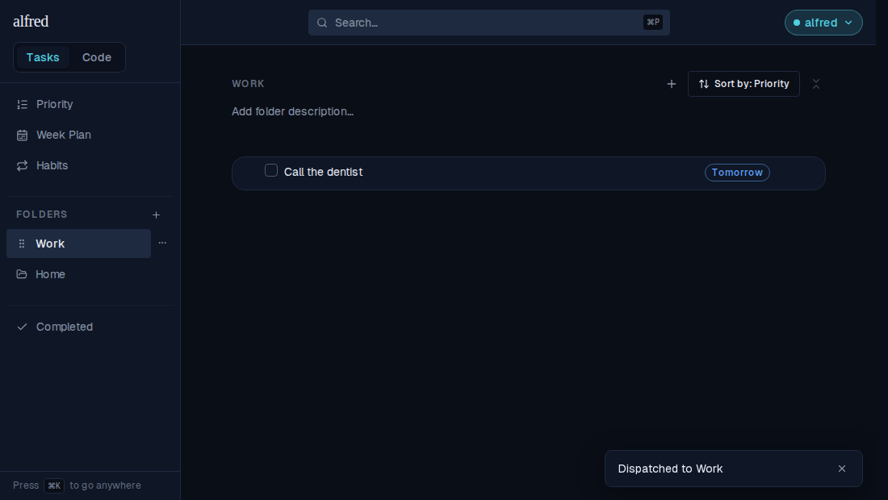

## A code story: Project · Epic

A childless code root gets a different pair. **Epic ▸** renders disabled until a project is set — and its blocker, *"Pick a project first"*, is drawn as **visible text**, not only a `title`. A disabled Radix sub-trigger is `pointer-events-none`, so it is never a hover target and the browser draws no tooltip at all; on touch there is none to draw either. The `title` stays for assistive tech, and the muted span is for everyone else.

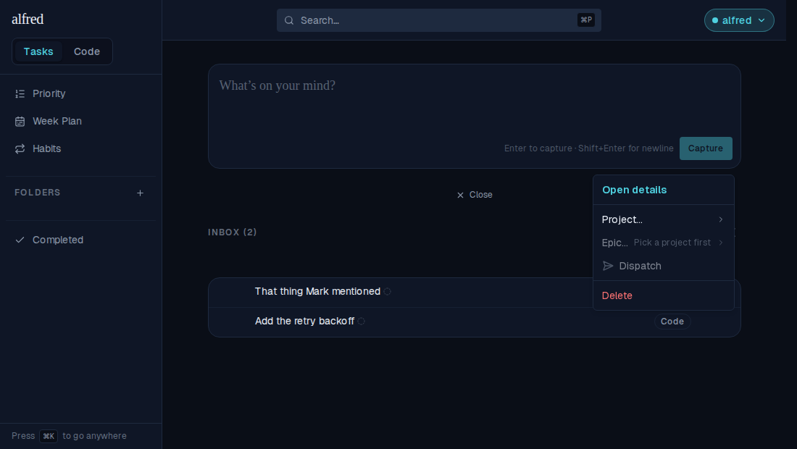

**Project ▸** lists name left, key right in mono — the gate's own listbox convention, now shared between the chips and the menu by one option builder.

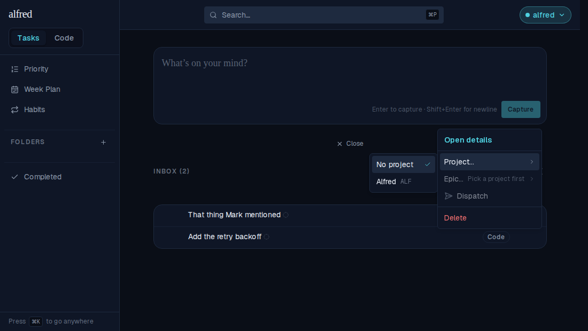

With a project set, **Epic ▸** lights up and lists only that project's epics (name left, ref right). Note that setting the project also reset the epic hint to "No epic" — `setIntendedProject` clears both in one PATCH, matching the DB trigger, so a row can never hold an epic from the wrong project.

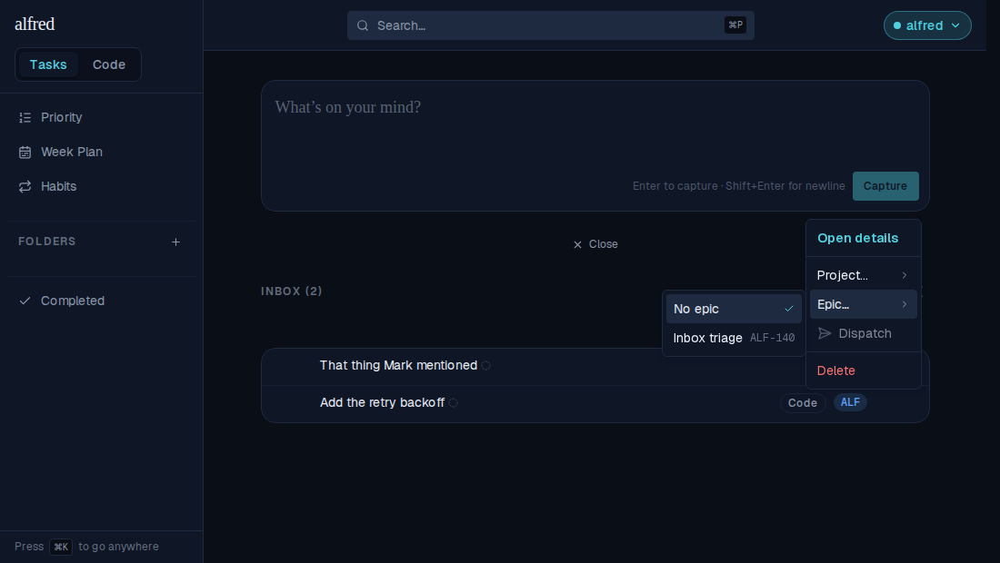

## Classify as… is now unclassified-only

An untyped capture still gets **Classify as…** — and nothing else. It has no fields to hang a label on (the detail panel draws no chip row for one either), so one group cleanly replaces the other: the menu carries exactly one of them at any time.

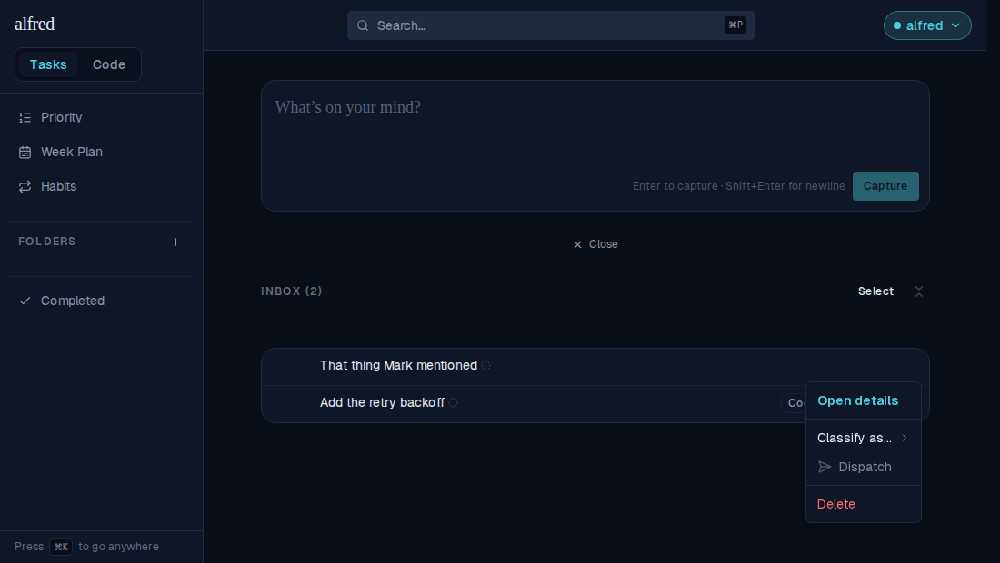

The bulk bar narrows to match. The reasoning is about the *write*, not the surface — `bulkClassify` runs the same `classifyPatch` — so leaving the bar able to re-type a filled row would leave the hole open behind a second door. The moment a typed row joins the selection, **Classify as** disables with its new hint: *"Only unclassified items can be classified"*.

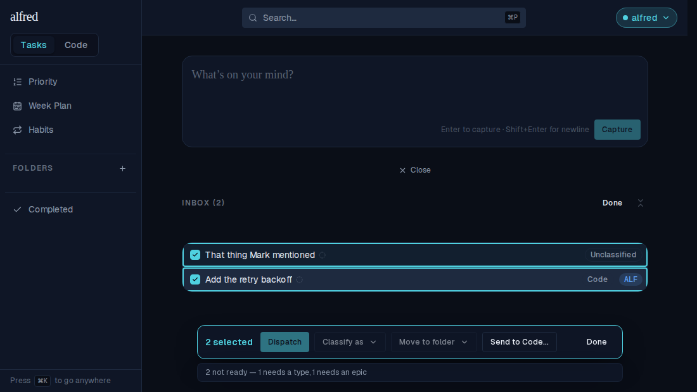

Both journeys above — classify → label → dispatch, for a task and for a code story — run end to end against the in-memory Supabase mock in `frontend/e2e/inbox-labels.spec.ts`. The menu's per-type shape is also snapshot-covered by four new `Tasks/TaskRow` stories, each targeting `body` so the portalled menu actually lands in the baseline.
