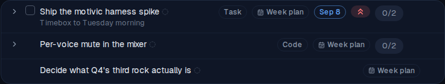

# Weekly-plan items: create the week, then read what happened

*2026-09-03T04:13:57.935Z*

The Friday review already archives a week-plan HTML document, but the work that document describes never entered alfred — so at the next review the only source for "what got done?" was the owner's memory, a week later.

Two keyed endpoints close that loop. `POST /api/weekly-plans/{planId}/items` writes a week's work into the Inbox against the plan it came from; `GET /api/weekly-plans/latest/items` reads that same cohort back with one call — which are done, when they were done, when they were scheduled for, and what the rest are doing.

## 1 · The round trip, live

Below, the app runs against the in-memory Supabase backend the E2E suite wires up — real route handlers, real Supabase client, no live database. The week is the one from the spec: a scheduled task with two subtasks, a code item shaped like an epic under construction, and a bare capture the classifier will type.

```bash
cd frontend
# Boot the app against the in-memory Supabase backend the e2e suite uses — real route
# handlers, real Supabase client, no live database.
export MOCK_SUPABASE_PORT=54333 INGEST_API_KEY=demo-ingest-key
export NEXT_PUBLIC_SUPABASE_URL=http://localhost:54333 \
       NEXT_PUBLIC_SUPABASE_ANON_KEY=sb_publishable_mock \
       SUPABASE_SERVICE_ROLE_KEY=sb_secret_mock
# Unconditional: Next inlines NEXT_PUBLIC_* at BUILD time, so a reused .next would point at
# whatever port the last build used.
npm run build >/dev/null 2>&1
node scripts/mock-supabase.mjs >/dev/null 2>&1 & MOCK=$!
npm run start -- -p 3012 >/dev/null 2>&1 & APP=$!
# `npm run start` spawns next-server as a child, so kill the child too or it outlives the
# block and holds the port.
cleanup() { pkill -P "$APP" 2>/dev/null; kill "$APP" "$MOCK" 2>/dev/null; }
trap cleanup EXIT
until curl -sf localhost:54333/__mock__/health >/dev/null 2>&1; do sleep 0.2; done
until curl -s -o /dev/null localhost:3012/login 2>/dev/null; do sleep 0.5; done

KEY="x-api-key: demo-ingest-key"
API=localhost:3012/api/weekly-plans
LATEST="localhost:3012/api/weekly-plans/latest/items"

echo "== nothing has ever been planned: an empty answer, not a 404"
curl -s -o /dev/null -w 'HTTP %{http_code}\n' "$LATEST" -H "$KEY"
curl -s "$LATEST" -H "$KEY" | jq -c .

echo
echo "== the review posts its plan document, then creates the week against the id it gets back"
PLAN=$(curl -s -X POST "$API" -H "$KEY" -H 'Content-Type: text/html' \
  --data-binary '<!doctype html><html><body><h1>Week of Sep 7</h1></body></html>' | jq -r .id)
curl -s -X POST "$API/$PLAN/items" -H "$KEY" -H 'Content-Type: application/json' --data-binary @- <<'JSON' | jq -c '{created, plan_echoed: (.plan.id != null)}'
{"items":[
  {"item_type":"task","title":"Ship the motivic harness spike","notes":"Timebox to Tuesday morning",
   "due_date":"2026-09-08","priority":"high",
   "children":[{"title":"Re-read last week's findings doc"},
               {"title":"Write the harness skeleton","due_date":"2026-09-08"}]},
  {"item_type":"code","title":"Per-voice mute in the mixer",
   "children":[{"title":"Mute state in the audio graph"},{"title":"Mixer strip mute button"}]},
  {"title":"Decide what Q4's third rock actually is"}
]}
JSON

echo
echo "== GET .../latest/items — the tree, in the order the batch was sent"
curl -s "$LATEST" -H "$KEY" \
  | jq -c '.items[] | {item_type, title, due_date, priority, state, done, in_inbox, children: [.children[].title]}'

echo
echo "== ...and its counts, before anything has been worked on"
curl -s "$LATEST" -H "$KEY" | jq -c .counts

echo
echo "== a field the root's type forbids is a 400 naming it, never a dropped value"
curl -s -X POST "$API/$PLAN/items" -H "$KEY" -H 'Content-Type: application/json' \
  -d '{"items":[{"item_type":"code","title":"Per-voice mute","due_date":"2026-09-08"}]}' \
  | jq -c '.details[0] | {path, message}'
curl -s -X POST "$API/$PLAN/items" -H "$KEY" -H 'Content-Type: application/json' \
  -d '{"items":[{"title":"a bare capture","children":[{"title":"a subtask"}]}]}' \
  | jq -c '.details[0] | {path, message}'

echo
echo "== and the rest of the contract"
curl -s -o /dev/null -w 'POST against an unknown plan -> %{http_code}\n' -X POST \
  "$API/00000000-0000-0000-0000-000000000000/items" -H "$KEY" \
  -H 'Content-Type: application/json' -d '{"items":[{"title":"orphan"}]}'
curl -s -o /dev/null -w 'POST .../latest/items       -> %{http_code}  (a write names its plan)\n' -X POST \
  "$API/latest/items" -H "$KEY" -H 'Content-Type: application/json' -d '{"items":[{"title":"orphan"}]}'
curl -s -o /dev/null -w 'GET with no key             -> %{http_code}\n' "$LATEST"
```

```output
== nothing has ever been planned: an empty answer, not a 404
HTTP 200
{"plan":null,"counts":{"total":0,"done":0,"open":0,"abandoned":0,"untriaged":0},"items":[]}

== the review posts its plan document, then creates the week against the id it gets back
{"created":7,"plan_echoed":true}

== GET .../latest/items — the tree, in the order the batch was sent
{"item_type":"task","title":"Ship the motivic harness spike","due_date":"2026-09-08","priority":"high","state":"active","done":false,"in_inbox":true,"children":["Re-read last week's findings doc","Write the harness skeleton"]}
{"item_type":"code","title":"Per-voice mute in the mixer","due_date":null,"priority":null,"state":"active","done":false,"in_inbox":true,"children":["Mute state in the audio graph","Mixer strip mute button"]}
{"item_type":"unclassified","title":"Decide what Q4's third rock actually is","due_date":null,"priority":null,"state":"active","done":false,"in_inbox":true,"children":[]}

== ...and its counts, before anything has been worked on
{"total":7,"done":0,"open":7,"abandoned":0,"untriaged":7}

== a field the root's type forbids is a 400 naming it, never a dropped value
{"path":["items",0],"message":"Unrecognized key: \"due_date\""}
{"path":["items",0],"message":"Unrecognized key: \"children\""}

== and the rest of the contract
POST against an unknown plan -> 404
POST .../latest/items       -> 404  (a write names its plan)
GET with no key             -> 401
```

## 2 · The badge, in the app

The same three roots as the app renders them, seconds after the call above: a muted **Week plan** chip behind the CalendarRange glyph, directly after the Type badge. It is on all three planned roots and on neither the subtasks nor an unplanned capture. The unclassified row is the interesting one — the badge is its only metadata, and the footer renders anyway.



Then the spike gets completed in the app — the ordinary checkbox, and the cascade modal that takes its two subtasks with it. In the Completed view the badge is still there: it is provenance, so it survives the classifier, triage and completion. "Task" is Inbox-only, so **Week plan** now leads the cluster.


## 3 · What the next review reads

`latest-items.json` beside this doc is the response `GET /api/weekly-plans/latest/items` gave immediately after that completion — the same cohort, read back the way the coach would read it at the next review. Projected here to the three questions the review asks of every line of its plan:

```bash
jq -c '.counts' docs/demos/ALF-195-weekly-plan-items/latest-items.json; echo; jq -r '.items[] | (.,  .children[]) | "\(if .done then "done" else "open" end)  \(.state | (. + "                 ")[0:18]) \(.done_at // "-") \(.title)"' docs/demos/ALF-195-weekly-plan-items/latest-items.json
```

```output
{"total":7,"done":3,"open":4,"abandoned":0,"untriaged":7}

done  completed          2026-09-03T04:11:18.809Z Ship the motivic harness spike
done  completed          2026-09-03T04:11:18.809Z Re-read last week's findings doc
done  completed          2026-09-03T04:11:18.809Z Write the harness skeleton
open  active             - Per-voice mute in the mixer
open  active             - Mute state in the audio graph
open  active             - Mixer strip mute button
open  active             - Decide what Q4's third rock actually is
```

## 4 · The migration, against real Postgres

The block in §1 ran against the in-memory backend, which reimplements the batch RPC in JavaScript. This one stands up a throwaway PostgreSQL, applies every migration exactly as production does, and exercises the real SQL — as the `authenticated` role, so the grants are live too.

```bash
# The block above ran against the in-memory backend, which reimplements the RPC in JS. This one
# stands up a throwaway PostgreSQL, applies every migration exactly as production does, and
# exercises the real SQL — as the `authenticated` role, so the grants are live too.
cat > database/.demo-alf195.ts <<'TS'
import pg from 'pg';
import { startCluster } from './src/cluster.ts';
import { applyMigrations, bootstrapSupabase } from './src/migrate.ts';

const cluster = await startCluster();
const client = new pg.Client({
  host: cluster.host, port: cluster.port, user: cluster.user, database: cluster.database,
});
await client.connect();
await bootstrapSupabase(client);
await applyMigrations(client);

const say = (line: string) => process.stdout.write(`${line}\n`);
const asAuthenticated = async <T>(run: () => Promise<T>): Promise<T> => {
  await client.query('set role authenticated');
  try { return await run(); } finally { await client.query('reset role'); }
};

const { rows: [plan] } = await client.query<{ id: string }>(
  `insert into weekly_plans (html) values ('<!doctype html><html><body>week</body></html>') returning id`,
);

const week = [
  { item_type: 'task', title: 'Ship the motivic harness spike', due_date: '2026-09-08',
    priority: 'high', children: [{ title: "Re-read last week's findings doc" }] },
  { item_type: 'code', title: 'Per-voice mute in the mixer',
    children: [{ title: 'Mute state in the audio graph' }] },
  { title: "Decide what Q4's third rock actually is" },
];

const { rows } = await asAuthenticated(() =>
  client.query(`select * from create_weekly_plan_items($1, $2::jsonb)`, [plan!.id, JSON.stringify(week)]),
);
say('create_weekly_plan_items — one call, one transaction:');
for (const row of rows) {
  say(`  ${row.parent_id === null ? '•' : '  ↳'} ${String(row.title).padEnd(40)} `
    + `type=${String(row.item_type).padEnd(13)} plan=${row.weekly_plan_id === plan!.id ? 'stamped' : 'MISSING'} `
    + `inbox=${row.dispatched_at === null && row.folder_id === null}`);
}

// The client sorts roots newest-first, and one transaction shares a single now() — so without
// the per-index offset the week's order would be whatever order Postgres happened to return.
const { rows: roots } = await client.query<{ title: string }>(
  `select title from items where weekly_plan_id = $1 and parent_id is null order by created_at desc`,
  [plan!.id],
);
say('\nthe Inbox lists roots newest-created first, which is the order the batch was sent:');
for (const [index, root] of roots.entries()) say(`  ${index + 1}. ${root.title}`);

// The column has to reach the read path: `select i.*` freezes a view's column list at CREATE.
const { rows: [viewed] } = await asAuthenticated(() =>
  client.query(`select weekly_plan_id from task_items where title = 'Ship the motivic harness spike'`),
);
say(`task_items exposes weekly_plan_id: ${viewed!.weekly_plan_id === plan!.id}`);

// A batch that breaks a CHECK halfway through must leave nothing behind.
const { rows: [doomed] } = await client.query<{ id: string }>(
  `insert into weekly_plans (html) values ('<!doctype html><html><body>doomed</body></html>') returning id`,
);
const bad = [{ item_type: 'task', title: 'the good one' },
             { item_type: 'code', title: 'the bad one', due_date: '2026-09-08' }];
let refused = '';
try {
  await asAuthenticated(() =>
    client.query(`select * from create_weekly_plan_items($1, $2::jsonb)`, [doomed!.id, JSON.stringify(bad)]));
} catch (error) { refused = (error as Error).message; }
const { rows: [{ count }] } = await client.query<{ count: string }>(
  `select count(*)::text as count from items where weekly_plan_id = $1`, [doomed!.id]);
say(`\nan illegal second root: refused (${refused.split('\n')[0]}), rows written = ${count}`);

// `done_at` through a DIRECT table UPDATE — the shape the Worker's PostgREST patch takes when an
// implementation PR merges, which is where most `done` transitions come from.
const { rows: [project] } = await client.query<{ id: string }>(
  `insert into projects (key, name, repo_owner, repo_name) values ('RPL', 'RealPlay', 'ac3charland', 'realplay') returning id`);
const { rows: [epic] } = await client.query<{ id: string }>(
  `select id from create_epic($1, 'Mixer')`, [project!.id]);
const { rows: [story] } = await client.query<{ ref: string }>(
  `select ref from create_code_story($1, $2, 'Mixer strip mute button', null, true)`, [project!.id, epic!.id]);
const doneAt = async () => (await client.query<{ done_at: Date | null }>(
  `select done_at from code_items where ref = $1`, [story!.ref])).rows[0]!.done_at;

say('\ncode_items.done_at, stamped by the trigger on a direct UPDATE:');
say(`  fresh story                         done_at = ${(await doneAt()) === null ? 'null' : 'SET'}`);
await client.query(`update code_items set factory_state = 'done' where ref = $1`, [story!.ref]);
const stamped = await doneAt();
say(`  → done                              done_at = ${stamped === null ? 'null' : 'set'}`);
await client.query(`update code_items set factory_state = 'done', blocked_reason = null where ref = $1`, [story!.ref]);
say(`  → done again (same state)           done_at = ${String((await doneAt())?.getTime() === stamped?.getTime() ? 'unchanged' : 'RESTAMPED')}`);
await client.query(`update code_items set blocked_reason = 'waiting' where ref = $1`, [story!.ref]);
say(`  → an edit that never mentions it    done_at = ${String((await doneAt())?.getTime() === stamped?.getTime() ? 'unchanged' : 'RESTAMPED')}`);
await client.query(`update code_items set factory_state = 'in_development' where ref = $1`, [story!.ref]);
say(`  → back to in_development            done_at = ${(await doneAt()) === null ? 'cleared' : 'STILL SET'}`);

await client.end();
cluster.stop();
TS
node database/.demo-alf195.ts
rm database/.demo-alf195.ts
```

```output
create_weekly_plan_items — one call, one transaction:
  • Ship the motivic harness spike           type=task          plan=stamped inbox=true
    ↳ Re-read last week's findings doc         type=task          plan=stamped inbox=true
  • Per-voice mute in the mixer              type=code          plan=stamped inbox=true
    ↳ Mute state in the audio graph            type=code          plan=stamped inbox=true
  • Decide what Q4's third rock actually is  type=unclassified  plan=stamped inbox=true

the Inbox lists roots newest-created first, which is the order the batch was sent:
  1. Ship the motivic harness spike
  2. Per-voice mute in the mixer
  3. Decide what Q4's third rock actually is
task_items exposes weekly_plan_id: true

an illegal second root: refused (new row for relation "items" violates check constraint "items_task_only_fields"), rows written = 0

code_items.done_at, stamped by the trigger on a direct UPDATE:
  fresh story                         done_at = null
  → done                              done_at = set
  → done again (same state)           done_at = unchanged
  → an edit that never mentions it    done_at = unchanged
  → back to in_development            done_at = cleared
```

## 5 · A week later, with the factory involved

The read's real job is answering *is it done, when, and if not what is it doing* the same way for a task and for a story being built in the Software Factory — where completion is a factory state, not a checkbox, and `items.status` says "active" for a story that shipped weeks ago. Seeded here as a week that has actually been worked: the task was finished and filed, one story shipped, one is in review, one was given up on, and the vague capture was never touched.

```bash
cd frontend
export MOCK_SUPABASE_PORT=54334 INGEST_API_KEY=demo-ingest-key
export NEXT_PUBLIC_SUPABASE_URL=http://localhost:54334 \
       NEXT_PUBLIC_SUPABASE_ANON_KEY=sb_publishable_mock \
       SUPABASE_SERVICE_ROLE_KEY=sb_secret_mock
npm run build >/dev/null 2>&1
node scripts/mock-supabase.mjs >/dev/null 2>&1 & MOCK=$!
npm run start -- -p 3013 >/dev/null 2>&1 & APP=$!
cleanup() { pkill -P "$APP" 2>/dev/null; kill "$APP" "$MOCK" 2>/dev/null; }
trap cleanup EXIT
until curl -sf localhost:54334/__mock__/health >/dev/null 2>&1; do sleep 0.2; done
until curl -s -o /dev/null localhost:3013/login 2>/dev/null; do sleep 0.5; done

PLAN=11111111-1111-1111-1111-111111111111
# A week later: the task was finished and filed, one story shipped, one is in review, one was
# given up on, and the vague capture was never touched.
curl -sf -X POST localhost:54334/__mock__/seed -H 'Content-Type: application/json' --data-binary @- >/dev/null <<'JSON'
{"weeklyPlans":[{"id":"11111111-1111-1111-1111-111111111111","html":"<!doctype html><html><body>week</body></html>","uploaded_at":"2026-09-05T21:03:11.482Z"}],
 "folders":[{"id":"22222222-2222-2222-2222-222222222222","name":"RealPlay"}],
 "projects":[{"id":"33333333-3333-3333-3333-333333333333","key":"RPL","name":"RealPlay","repo_owner":"ac3charland","repo_name":"realplay"}],
 "epics":[{"id":"44444444-4444-4444-4444-444444444444","project_id":"33333333-3333-3333-3333-333333333333","name":"Mixer","ref_number":1,"ref":"RPL-1"}],
 "items":[
  {"id":"aaaaaaaa-0000-4000-8000-000000000001","title":"Ship the motivic harness spike","item_type":"task","weekly_plan_id":"11111111-1111-1111-1111-111111111111","status":"completed","completed_at":"2026-09-08T19:41:08.221Z","folder_id":"22222222-2222-2222-2222-222222222222","dispatched_at":"2026-09-06T09:12:00.000Z","due_date":"2026-09-08","priority":"high","created_at":"2026-09-05T21:04:02.118Z"},
  {"id":"aaaaaaaa-0000-4000-8000-000000000002","title":"Mute state in the audio graph","item_type":"code","weekly_plan_id":"11111111-1111-1111-1111-111111111111","dispatched_at":"2026-09-06T09:12:00.000Z","created_at":"2026-09-05T21:04:02.117Z"},
  {"id":"aaaaaaaa-0000-4000-8000-000000000003","title":"Mixer strip mute button","item_type":"code","weekly_plan_id":"11111111-1111-1111-1111-111111111111","dispatched_at":"2026-09-06T09:12:00.000Z","created_at":"2026-09-05T21:04:02.116Z"},
  {"id":"aaaaaaaa-0000-4000-8000-000000000004","title":"Rewrite the preset browser","item_type":"code","weekly_plan_id":"11111111-1111-1111-1111-111111111111","dispatched_at":"2026-09-06T09:12:00.000Z","created_at":"2026-09-05T21:04:02.115Z"},
  {"id":"aaaaaaaa-0000-4000-8000-000000000005","title":"Decide what Q4's third rock actually is","item_type":"unclassified","weekly_plan_id":"11111111-1111-1111-1111-111111111111","created_at":"2026-09-05T21:04:02.114Z"},
  {"id":"aaaaaaaa-0000-4000-8000-000000000006","title":"An ordinary capture from Tuesday","item_type":"unclassified","created_at":"2026-09-09T08:00:00.000Z"}],
 "codeItems":[
  {"item_id":"aaaaaaaa-0000-4000-8000-000000000002","project_id":"33333333-3333-3333-3333-333333333333","epic_id":"44444444-4444-4444-4444-444444444444","ref_number":142,"ref":"RPL-142","factory_state":"ready_for_review"},
  {"item_id":"aaaaaaaa-0000-4000-8000-000000000003","project_id":"33333333-3333-3333-3333-333333333333","epic_id":"44444444-4444-4444-4444-444444444444","ref_number":143,"ref":"RPL-143","factory_state":"done","done_at":"2026-09-10T16:22:41.900Z"},
  {"item_id":"aaaaaaaa-0000-4000-8000-000000000004","project_id":"33333333-3333-3333-3333-333333333333","epic_id":"44444444-4444-4444-4444-444444444444","ref_number":144,"ref":"RPL-144","factory_state":"abandoned"}]}
JSON

KEY="x-api-key: demo-ingest-key"
echo "== GET /api/weekly-plans/latest/items — one vocabulary across both families"
echo "type          state              done   done_at                   ref      title"
curl -s localhost:3013/api/weekly-plans/latest/items -H "$KEY" \
  | jq -r '.items[] | "\(.item_type | (. + "             ")[0:13]) \(.state | (. + "                  ")[0:18]) \((.done | tostring) + "      " | .[0:6]) \(.done_at // "-" | (. + "                         ")[0:25]) \(.code.ref // "-" | (. + "        ")[0:8]) \(.title)"'

echo
echo "== the aggregate, computed from the same rule as the rows"
curl -s localhost:3013/api/weekly-plans/latest/items -H "$KEY" | jq -c '.counts, {partitions: (.counts.done + .counts.open + .counts.abandoned == .counts.total)}'

echo
echo "== the item that came from no plan is not in the cohort"
curl -s localhost:3013/api/weekly-plans/latest/items -H "$KEY" | jq -r '[.items[].title] | index("An ordinary capture from Tuesday") // "absent"'
```

```output
== GET /api/weekly-plans/latest/items — one vocabulary across both families
type          state              done   done_at                   ref      title
task          completed          true   2026-09-08T19:41:08.221Z  -        Ship the motivic harness spike
code          ready_for_review   false  -                         RPL-142  Mute state in the audio graph
code          done               true   2026-09-10T16:22:41.900Z  RPL-143  Mixer strip mute button
code          abandoned          false  -                         RPL-144  Rewrite the preset browser
unclassified  active             false  -                         -        Decide what Q4's third rock actually is

== the aggregate, computed from the same rule as the rows
{"total":5,"done":2,"open":2,"abandoned":1,"untriaged":1}
{"partitions":true}

== the item that came from no plan is not in the cohort
absent
```

`state` carries the factory's own vocabulary for a story and the task lifecycle for everything else; `done` and `done_at` are derived from whichever applies, so the counts and the rows can never disagree — and an abandoned story counts as neither done nor open.
