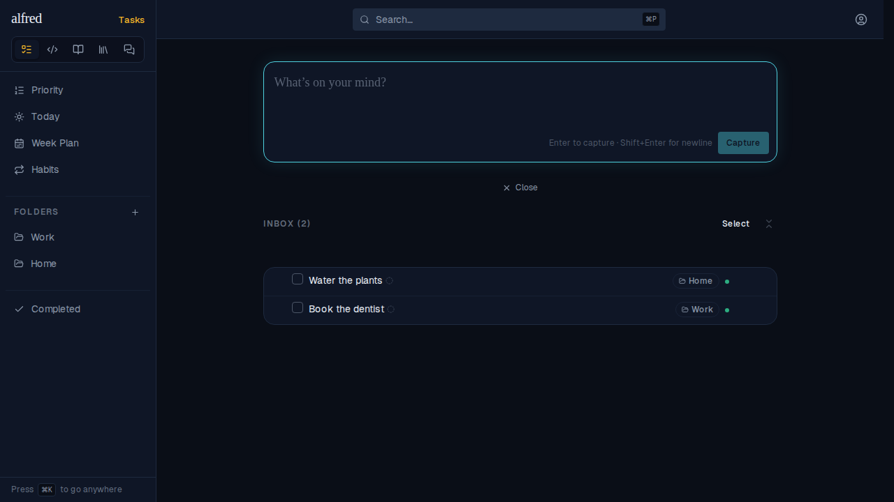
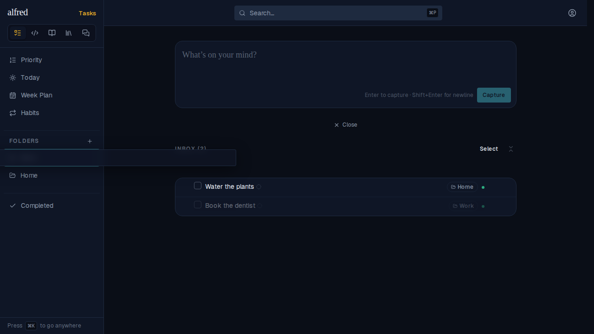
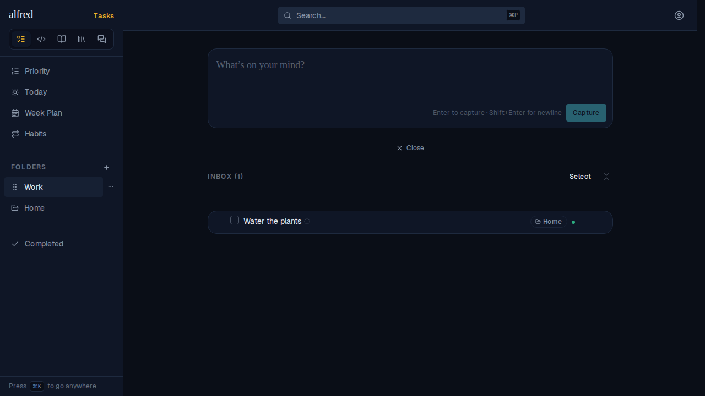
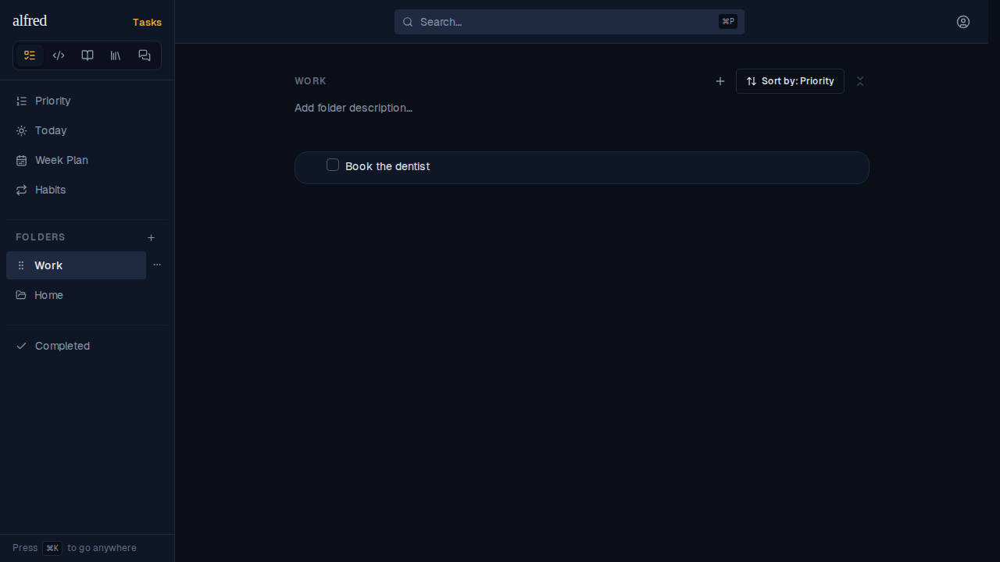

# ALF-216 — drag an inbox task onto the folder it's labelled with

*2026-10-04T18:48:00.676Z*

The classifier labels an Inbox row with the folder it WOULD land in (here: Book the dentist → Work, Water the plants → Home) without dispatching it, so both still live in the Inbox.

Dragging Book the dentist onto Work — its own labelled folder. Before the fix the drop compared Work against the row's raw folder_id, read it as 'dropped where it already lives', and silently did nothing. The drop now compares against where the row actually lives (the Inbox). (The translucent strip over the sidebar is the drag ghost, hovering the Work entry.)

On release the row leaves the Inbox immediately…

…and, after a full page reload (so this is the reconciled server row, not just the optimistic patch), it is filed in Work.

