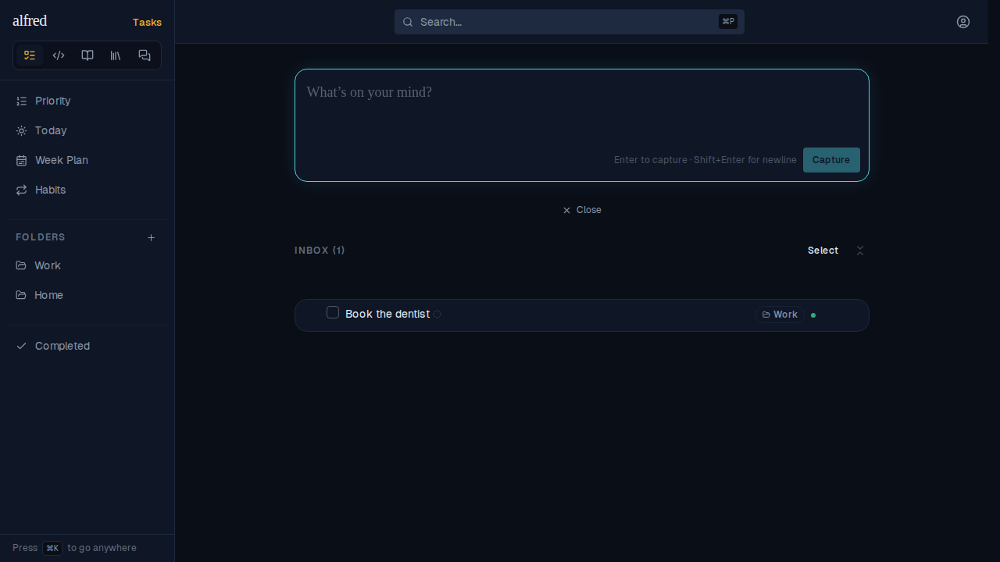
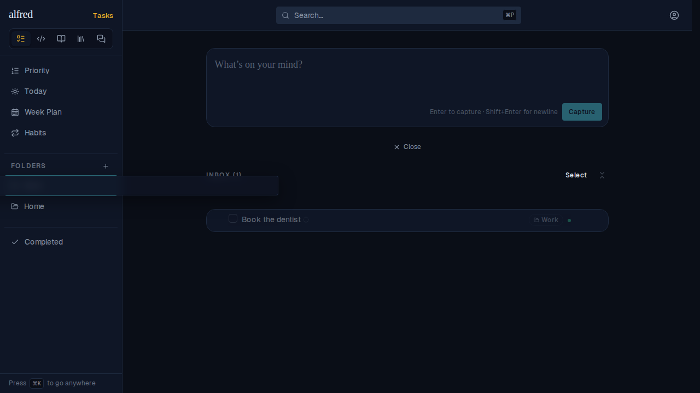
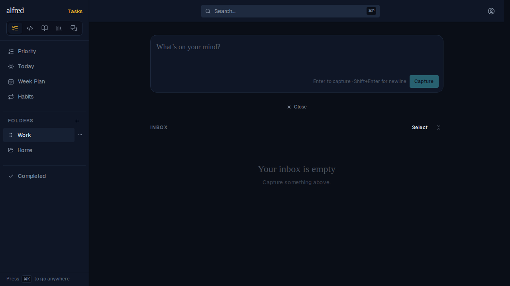
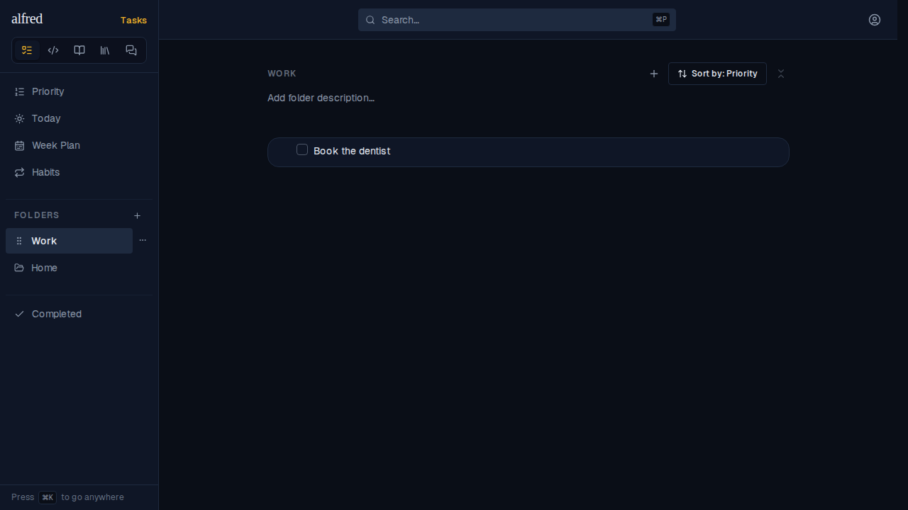

# An Inbox item can be dragged onto the folder the classifier labelled it with

*2026-10-04T18:31:51.742Z*

**ALF-216**: when the classifier had labelled an Inbox item with a folder, the item could be dragged onto any OTHER folder, but dropping it on the labelled folder did nothing. The drop resolver compared the target against `folder_id`, which since migration 0026 holds only where the item *would* land. The item still *lives* in the Inbox until a human dispatches it, so "already in Work" was a false read and the drop was discarded as a no-op.

Fix: `resolveFolderDrop` now compares the target against the item's residency (`residentFolderId`: `null` until dispatched). Dropping a labelled Inbox item on its label now files it, and dropping it back on the Inbox stays a no-op, where before it also wiped the label.

Seed: one Inbox task labelled **Work** by the classifier (`folder_id` = Work, `dispatched_at` = null), plus a second folder, Home.

**1. Before**: "Book the dentist" sits in the Inbox, showing the classifier's **Work** label chip.

**2. Mid-gesture**: the row is lifted and held over **Work** in the sidebar, which shows the teal drop highlight. Before the fix, releasing here left the row in the Inbox.

**3. After releasing**: the item is filed (dispatched) and leaves the Inbox.

**4. The Work folder**: the item is now filed there as a task.

