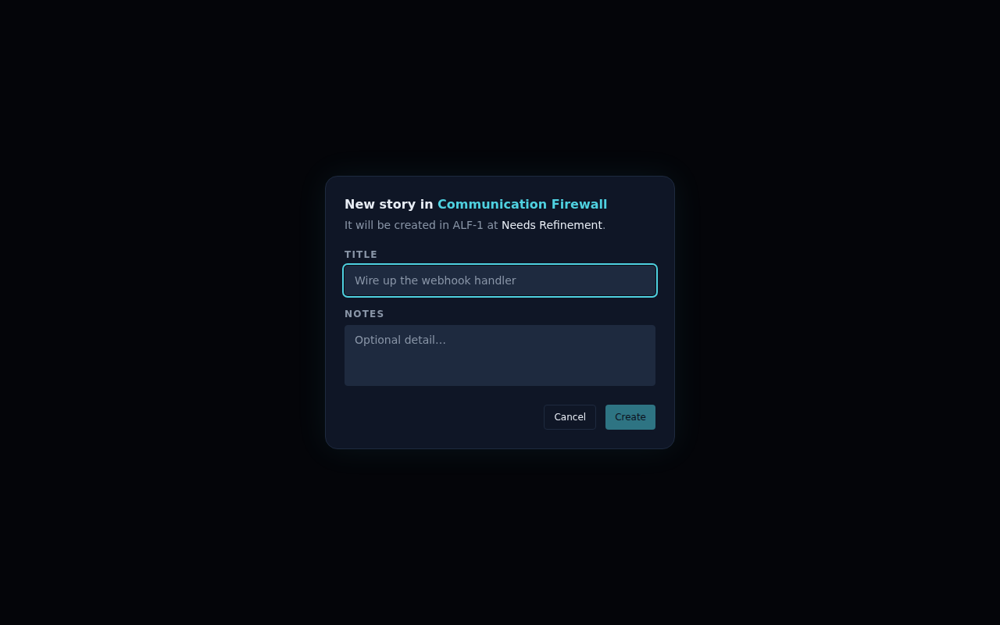

# Create code stories directly from the project view (ALF-22)

*2026-06-23T17:24:15.813Z*

ALF-22 adds a way to mint a brand-new code story straight from the board — no inbox round-trip. Each epic header now carries a `+` button immediately to the left of the three-dots actions menu; it opens a small modal scoped to that epic. Submitting creates a fresh `items` row **and** its `code_items` sidecar in one atomic step (a new `create_code_story` RPC), landing the story in that epic at **Needs Refinement** with a server-allocated ref.

## The board: a `+` on every epic header

Each epic header shows a `+` button (aria-label "New story in {epic name}") sitting just left of the `…` actions menu, matching its size and spacing. It's hidden while the epic title is being renamed.


## The new-story modal

Clicking the `+` opens a modal scoped to that epic: a required **Title** field (autofocused) and an optional **Notes** field. It states the story will be created at Needs Refinement, and **Create** stays disabled until the title is non-empty. Empty notes persist as `null`. Cancel / Escape / overlay-click close without writing; a server error shows an inline message and keeps the modal open.



## The data path: a `create_code_story` RPC (migration 0004)

Unlike the gate's `enter_code_module` (which *flips* an existing item), this inserts a fresh item AND its sidecar in one transaction, allocating the per-project ref — there is no inbox row to admit:

```bash
cat database/migrations/0004_create_code_story.sql
```

```output
-- Create a brand-new code story from the project view: insert the item AND its
-- code_items sidecar in one transaction, landing at needs_refinement. Mirrors
-- enter_code_module (0002 §7) but inserts a fresh item instead of flipping an
-- existing one — there is no inbox row to admit. notes is optional (NULL).
create or replace function create_code_story(
  p_project uuid, p_epic uuid, p_title text, p_notes text default null
) returns code_items language plpgsql security invoker as $$
declare n int; k text; v_item uuid; row code_items;
begin
  select key into k from projects where id = p_project;
  n := next_code_ref(p_project);
  insert into items (title, notes, item_type)
  values (p_title, p_notes, 'code')
  returning id into v_item;
  insert into code_items (item_id, project_id, epic_id, ref_number, ref)
  values (v_item, p_project, p_epic, n, k || '-' || n) returning * into row;
  return row;
end; $$;

grant execute on function create_code_story(uuid, uuid, text, text)
  to anon, authenticated, service_role;
```

`POST /api/code` now accepts two discriminated shapes on one route — the existing **gate** (`{ item_id, project_id, epic_id }` → `enter_code_module`) and the new **from-scratch** shape (`{ title, notes?, project_id, epic_id }`, no `item_id` → `create_code_story`). Both return the `code_items` sidecar at `needs_refinement`. The handler branches on the presence of `item_id`:

```bash
sed -n '/const rpc =/,/rpc.single/p' frontend/app/api/code/route.ts
```

```output
  const rpc =
    'item_id' in input
      ? supabase.rpc('enter_code_module', {
          p_item: input.item_id,
          p_project: input.project_id,
          p_epic: input.epic_id,
        })
      : supabase.rpc('create_code_story', {
          p_project: input.project_id,
          p_epic: input.epic_id,
          p_title: input.title,
          // p_notes is `string | undefined` (the RPC defaults a missing arg to NULL), so an
          // absent / null notes value omits the arg rather than passing null.
          ...(input.notes === null || input.notes === undefined
            ? {}
            : { p_notes: input.notes }),
        });

  const { data, error } = await rpc.single();
```

The optimistic `createStory` store action mints a **temporary** item id for the card (the real `item_id` is server-allocated), drops it into the epic's Needs Refinement lane immediately, then reconciles by swapping in the saved row's real `item_id` + `ref` — rolling the card back if the create fails. End-to-end persistence runs against live Supabase (the migration is already applied); the screenshots above are captured from Storybook seeds.
