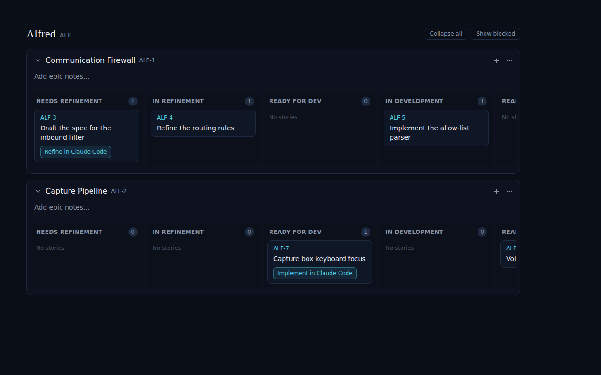
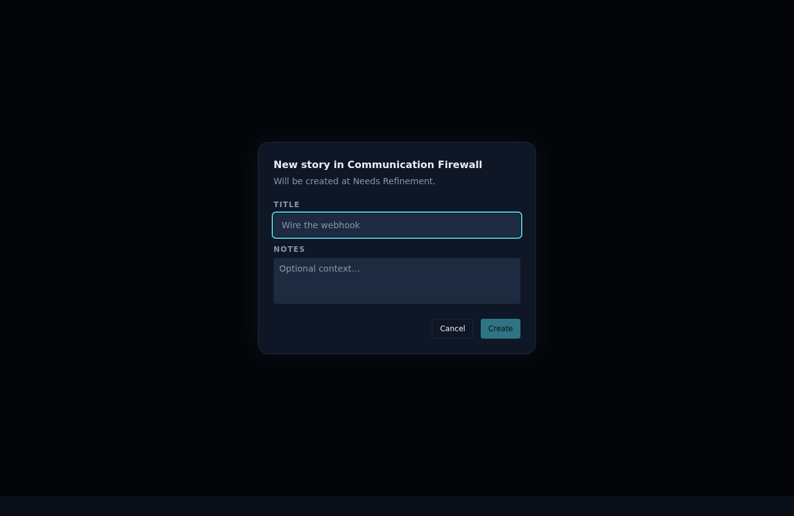
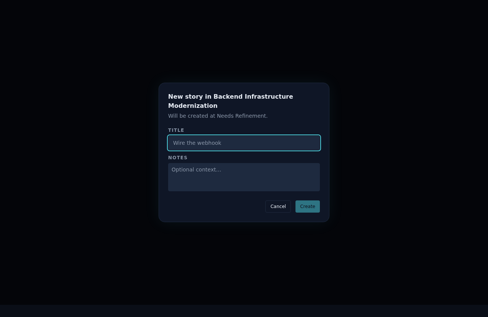

# Add ability to create stories directly from the project view

*2026-06-17T21:30:49.512Z*

ALF-22 adds a + button to every epic header in the code board. Clicking it opens a NewStoryDialog where the user types a title and optional notes. On submit, the story is inserted optimistically into the Needs Refinement lane and a POST /api/code request mints it in the database via the create_code_story RPC.

The board now shows a + button left of the 3-dots menu in every epic header:

Clicking the + opens the NewStoryDialog with the epic name in the title and a Needs Refinement hint:

The dialog also handles long epic names without layout issues:

