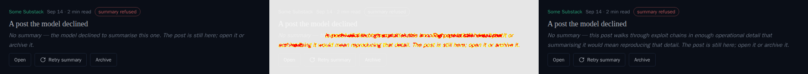
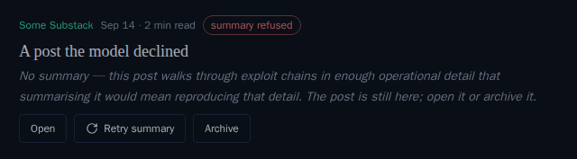
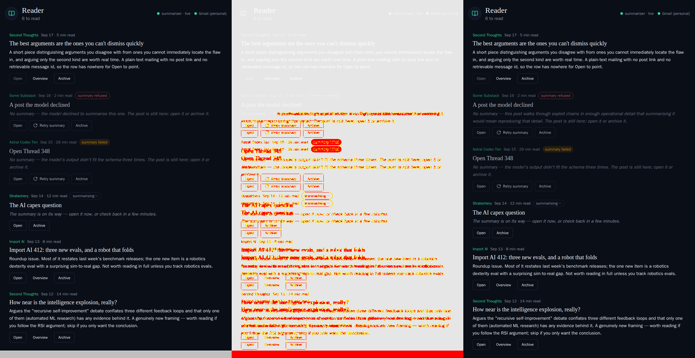

# Refusal explanations reach the reader and comms UI

*2026-09-21T03:35:06.413Z*

When the model refuses to summarise a reader article or judge a comms message, the Anthropic API's `stop_details.explanation` carries a human-readable reason — but neither call site read it. The reader summariser filed a refusal with `last_error: 'refused'`, a bare sentinel the row never even showed; the comms classifier filed it with a fixed line, `REFUSAL_ASK`. Both now carry the model's own explanation through to the row that already reads it.

Evidence: a Storybook snapshot diff (the reader row already reads `last_error`; the comms row already reads `ask` — this ships the value, not new render code) and the worker unit tests that pin the mapping end to end.

## The Storybook baseline that moved

One committed baseline moved far enough for the snapshot gate to fail and write its three-panel diff — baseline | changed pixels | received:

That is the intended change and nothing else: the refused row's italic line now reads the model's own explanation from `last_error` — the same field a `failed` row already draws its reason from — instead of the fixed "the model declined to summarise this one". Approved by regenerating, and here is the baseline now committed:

Three more committed baselines moved the same way, by height alone: the reading list's `readerFixtureSet()` seed carries this same refused post, so its longer explanation wraps to a second line and pushes every row below it down. Representative diff — `Populated`, before | changed | after (the two `SelectedCollapsed`/`SelectedExpanded` baselines shifted identically and are committed but not shown here):

## The comms half: no new render code, just the value

The comms message row already renders whatever `ask` holds — `askLine()` in `frontend/lib/comms/ask.ts` — so there is no Storybook baseline to move there. What changed is what the Worker writes: `workers/src/comms/sweep.ts`'s refusal branch used to file every refusal with the same fixed line, `REFUSAL_ASK`. It now files `failed.detail ?? REFUSAL_ASK`, so a message the model explains gets the model's own words on its row instead of "The model declined to judge this message." Pinned end to end by `workers/src/comms/sweep.test.ts` ("shelves a refusal's own explanation as the ask, when the API supplied one") and `workers/src/classifier.test.ts` ("carries stop_details.explanation as the refusal failure's detail"), the same shared `classifyJson` call the Inbox classifier also goes through — the Inbox has no per-item failure surface to show it on, so the added `detail` field simply rides along unused there.

The reader side is pinned the same way, in `workers/src/reader/summarize.test.ts` and `workers/src/reader/scheduled.test.ts` ("files a refusal as terminal, uncounted, carrying the explanation into last_error" / "nulls out last_error on a refusal with no explanation, rather than leaving a stale one").
