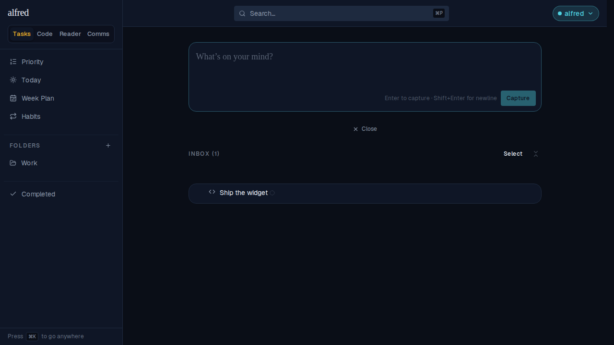
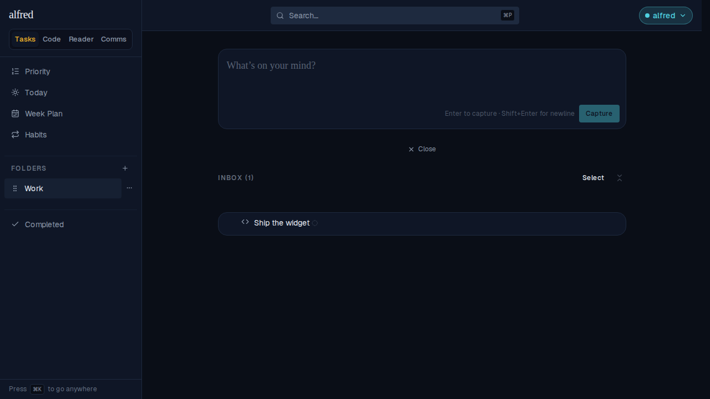
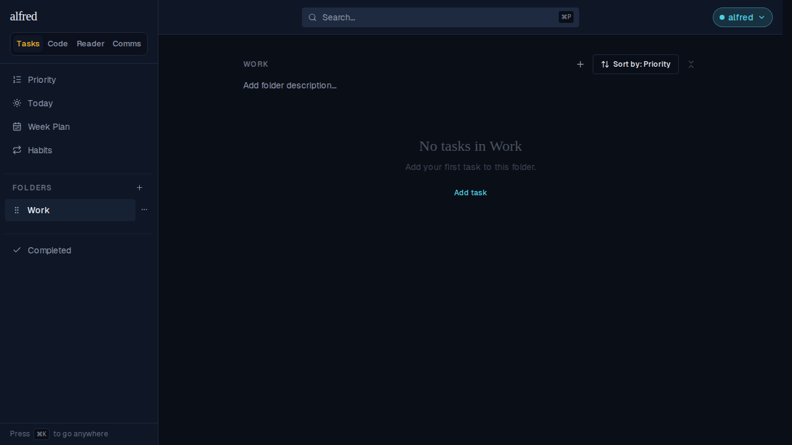

# Code-classified inbox items are no longer draggable into a folder

*2026-09-21T03:52:20.840Z*

**ALF-239**: an Inbox item classified as `code` could be dragged onto a sidebar folder — the same gesture that files an ordinary task. The drop silently ran `moveTask`, stamping `folder_id`/`dispatched_at` on a row that was never converted into a real dispatched code story: it vanished from the Inbox and reappeared, stranded, inside a task folder that has none of the affordances (Dispatch, completion) it needs.

Fix: a top-level (Inbox root) row classified as `code` is no longer a drag source at all — `useDraggable` is disabled for it, the same way it already is for a completed or unreconciled row. A code STORY nested under an in-progress epic stays draggable (that's a real feature — reordering it among siblings, even across sibling epics), so only the root case changes.

Seed: one Inbox item classified `code` ("Ship the widget") and one sidebar folder ("Work"). Before the fix this whole journey ended with the item filed under Work; after the fix it never leaves the Inbox.

**1. Before** — "Ship the widget" sits in the Inbox, tagged with the code glyph, next to the empty "Work" folder.

**2. Mid-gesture** — the same press-8px-move-glide-onto-the-folder sequence that files an ordinary task, held over "Work" with the mouse still down. Nothing lifted (no dimmed row, no floating clone) and the folder never lit up: the row simply isn't a drag source.

**3. After releasing** — the Inbox is unchanged; the item never left.

**4. The Work folder** — still empty. Before the fix this is where the item would have been silently stranded.

