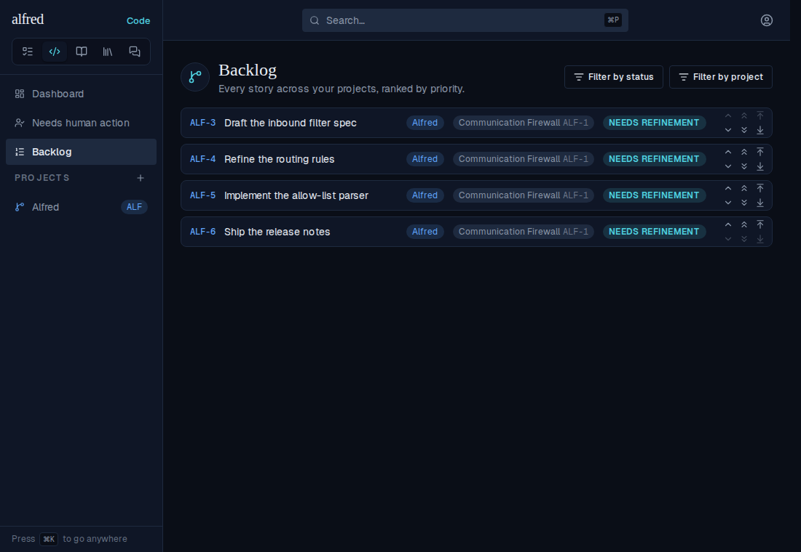
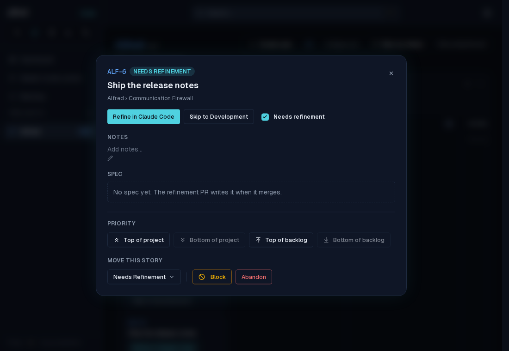
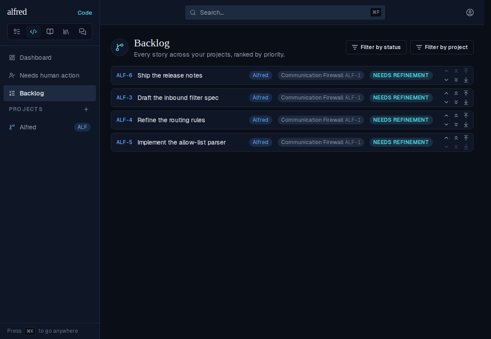
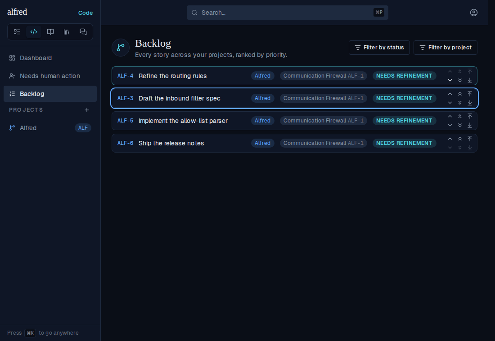
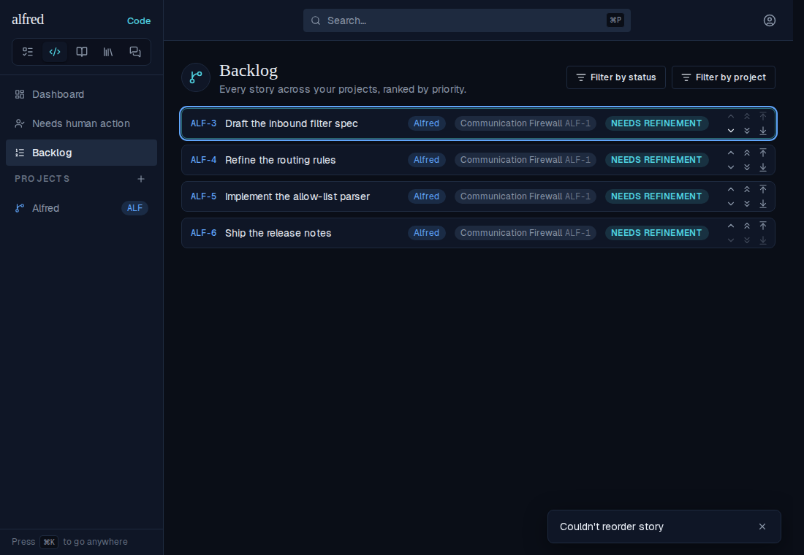
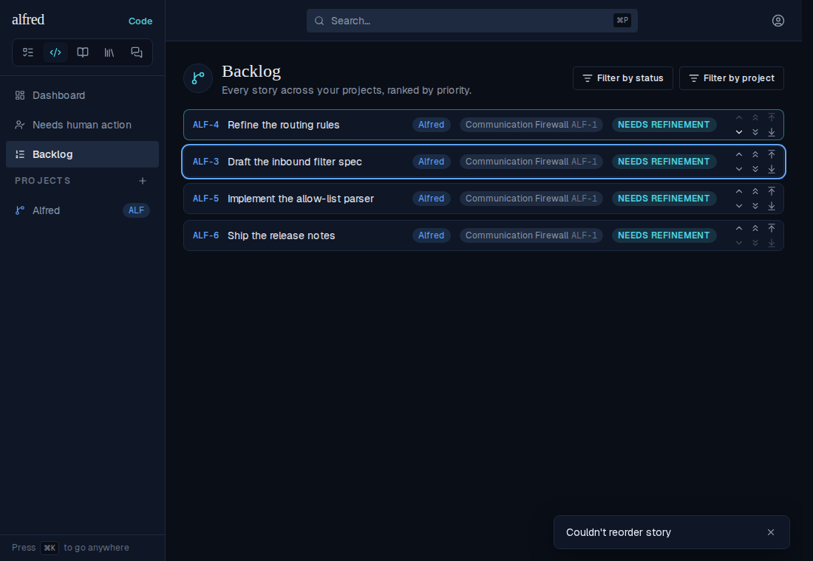
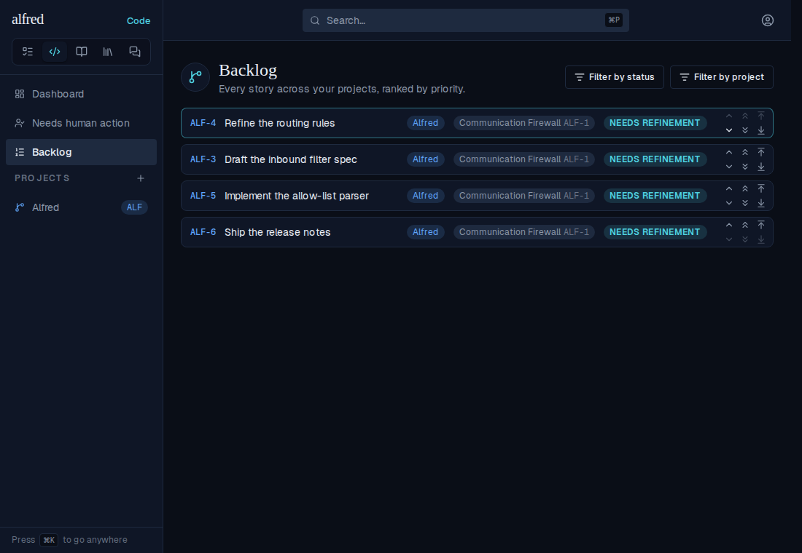

# Backlog nudges stay where you put them (ALF-250)

*2026-09-30T04:41:32.381Z*

Nudging a story down with the single chevron made it jump back up and slide down again, and past a point the chevron seemed to stop working. Every priority write is relative to the order the server holds when it runs (a swap trades the two stories' current ranks), but the Backlog let the reply to an earlier nudge overwrite the row the owner had already moved on, sent overlapping swaps that could land out of order, and applied every realtime echo, including the swap's own parked sentinel rank.

The journeys below run the real app against the in-memory mock, on the Backlog filtered to the Alfred project (Relay stories rank between the visible rows), with every swap slowed to 1.5 s: ALF-238 is nudged down four times, 650 ms apart.

**Before** — ALF-238 steps down, then the late replies drag it back: four clicks leave it third, not fifth.


**After** — the store sends the four swaps one at a time, in click order, and holds ALF-238 where the clicks put it until they settle: fifth, and it stays there.


**The database half.** `code_items` is published to Realtime, so every row change a swap makes is sent to every open Backlog. The swap used to park the nudged story on a sentinel rank above everything before landing it, and that parked rank went out too: the row flashed to the top of the list and slid back. Migration `0043` swaps in one statement (the uniqueness constraint has been deferrable since `0031`, so it is checked at the end of the statement). The swap also locks both rows before reading their ranks, and migration `0044` stamps every rank with a rising `priority_rev`: an open Backlog lands a server rank only if it is newer than the last one it landed, so a late reply or a trailing echo can never pull a row back. This script boots a throwaway Postgres, applies the migrations, nudges a story down, and prints the row changes the swap made.

Without `0043`, three changes, the first putting ALF-3 above everything:

```bash
node docs/demos/ALF-250-priority-swap/swap-writes.mjs 0043_swap_priority_in_one_write
```

```output
Backlog: ALF-3 @ -2, ALF-2 @ -1
Nudge ALF-3 down: swap_code_priority('ALF-3', 'ALF-2')
Row changes Realtime broadcasts:
  1. ALF-3 → -3 (priority_rev 3)
  2. ALF-2 → -2 (priority_rev 4)
  3. ALF-3 → -1 (priority_rev 5)
```

With `0043`, each story is written once, straight to its final rank:

```bash
node docs/demos/ALF-250-priority-swap/swap-writes.mjs
```

```output
Backlog: ALF-3 @ -2, ALF-2 @ -1
Nudge ALF-3 down: swap_code_priority('ALF-3', 'ALF-2')
Row changes Realtime broadcasts:
  1. ALF-2 → -2 (priority_rev 3)
  2. ALF-3 → -1 (priority_rev 4)
```

**A respacing jump replies with every row it renumbered.** A jump to the top or bottom of a project takes the midpoint between two ranks. When a project's top story and the rank above it are neighbouring doubles there is no midpoint, so `move_code_priority_in_project` first respaces every story in the Backlog to 1..N, then places the jumped story. Its reply carried only the jumped story's row. The open Backlog heard every other story's new rank from Realtime, which usually trails the reply, so for that window it showed the jumped story on the new rank scale and every other story on the old one: the Backlog misordered, and a click in that window hit the wrong neighbour. Migration `0045` makes a respacing jump reply with every row it renumbered, each at its final rank and `priority_rev`. A jump that didn't respace still replies with just its own row.

This script boots a throwaway Postgres, applies the migrations, and seeds five stories: the Relay story REL-2 at 60000 and Alfred's top story ALF-2 at 60000 + 2^-37 (printed as 60000.00000000001), the next double up, with ALF-3 to ALF-5 well below. It then jumps ALF-5 to the top of Alfred as the `authenticated` role and prints what the reply carried.

Without `0045`, the respace renumbered the four other stories in the database, and the reply carried only ALF-5:

```bash
node docs/demos/ALF-250-priority-swap/jump-reply.mjs 0045_jump_returns_respaced_rows
```

```output
Backlog: REL-2 @ 60000, ALF-2 @ 60000.00000000001, ALF-3 @ 61000, ALF-4 @ 62000, ALF-5 @ 63000
The two top ranks are adjacent doubles: their midpoint is 60000, one of them
Jump ALF-5 to the top of Alfred: move_code_priority_in_project('ALF-5', true)
Stories that exist: 5
Rows the reply carried: 1 (ALF-5)
Other stories the respace renumbered: 4 of 4
Renumbered stories in the reply: 0 of 4
Reply rows at their stored rank and revision: 1 of 1
Ranks now: REL-2 @ 1, ALF-5 @ 1.5, ALF-2 @ 2, ALF-3 @ 3, ALF-4 @ 4
Jump ALF-3 to the top of Alfred (no respace needed): reply carried 1 row (ALF-3), other stories re-stamped: 0
```

With `0045`, the reply carries all five rows, each at the rank and revision the database holds. The ranks are whole again afterwards, so the follow-up jump takes a plain midpoint: it replies with just its own row and re-stamps no other story.

```bash
node docs/demos/ALF-250-priority-swap/jump-reply.mjs
```

```output
Backlog: REL-2 @ 60000, ALF-2 @ 60000.00000000001, ALF-3 @ 61000, ALF-4 @ 62000, ALF-5 @ 63000
The two top ranks are adjacent doubles: their midpoint is 60000, one of them
Jump ALF-5 to the top of Alfred: move_code_priority_in_project('ALF-5', true)
Stories that exist: 5
Rows the reply carried: 5 (ALF-2, ALF-3, ALF-4, ALF-5, REL-2)
Other stories the respace renumbered: 4 of 4
Renumbered stories in the reply: 4 of 4
Reply rows at their stored rank and revision: 5 of 5
Ranks now: REL-2 @ 1, ALF-5 @ 1.5, ALF-2 @ 2, ALF-3 @ 3, ALF-4 @ 4
Jump ALF-3 to the top of Alfred (no respace needed): reply carried 1 row (ALF-3), other stories re-stamped: 0
```

**A jump made in the story modal still reaches the server when the modal closes inside the sync pause.** Every priority click re-ranks the screen at once and syncs 200 ms later, once the clicks pause. The modal's priority controls used to own that pause, so closing the modal inside it unmounted them and cancelled the write: the story looked re-ranked, then sat back where it was on the next load. The store owns the pause now, so the write outlives the modal. The journeys below run the real app against the in-memory mock, on a four-story Alfred Backlog where ALF-6 (Ship the release notes) starts last. Its row opens the story's modal, Top of project is clicked, and Close is pressed straight after (about 100 ms later, well inside the pause). The Backlog is then reopened in-app, and reloaded a second later.

**Start.** ALF-6 is last in the Backlog:



Its row opens the story's modal on its board. The Priority section holds the jump buttons: Top of project is clicked next, then Close.



**Before**, on the older component-owned debounce (main's store, Backlog list and row, and priority controls, restored for this capture). Top of project, then Close straight away. The Backlog reopened in-app still shows ALF-6 on top, because the store re-ranked it on screen, but no `move-project` request ever left the browser:



A second later, after a reload, the server has never heard of the jump and ALF-6 is back at the bottom:


**After**, the same clicks on this branch. The Backlog reopened in-app shows ALF-6 on top:


After the reload it is still on top, because the store sent the write after the modal had closed: one `move-project` request, `{"ref":"ALF-6","to_top":true}`:


**A hung priority write gives up after 15 seconds.** The store sends Backlog priority writes one at a time, so a request that never answers would hold every later nudge behind it. Each write now aborts after 15 s: the row rolls back to the rank it held, a "Couldn't reorder story" toast says so, and the next nudge syncs as normal. Before this PR there was no timeout: a request that never answered left the row on its optimistic rank, pending forever. The journey runs the live app; a Playwright route never answers the first `/api/code/reorder` request and lets every later one through to the mock. ALF-3 is nudged down twice with its Down chevron.

**1. Pending.** ALF-3's Down chevron: it drops below ALF-4 at once, and the swap request is in flight, unanswered:



**2. Gives up.** 15 s after the request left, the browser aborts it. ALF-3 is back on top and the "Couldn't reorder story" toast appears:



**3. The next nudge syncs.** The Down chevron on ALF-3 again: this request is answered (200) and ALF-3 sits below ALF-4. The earlier toast is still on screen:



**4. Persisted.** After a reload the server holds that order, so the second write landed and the first, never answered, changed nothing:


