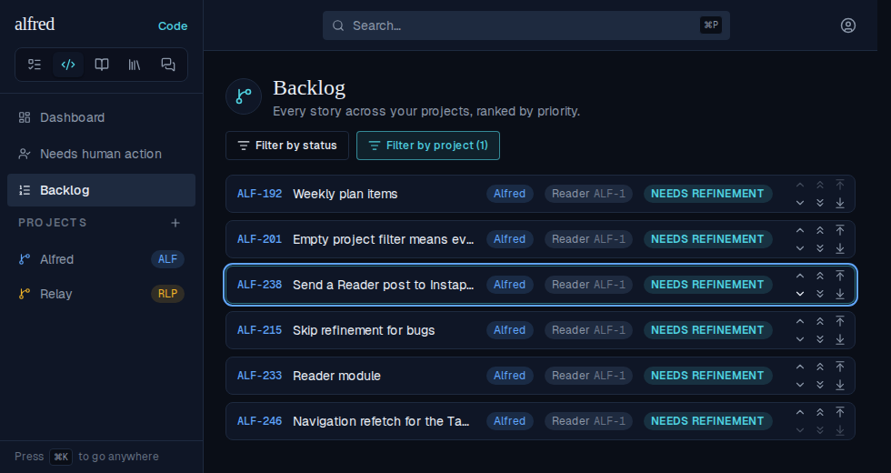
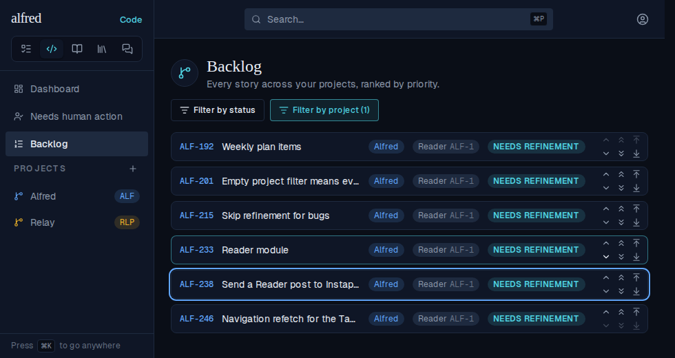

# Backlog nudges stay where you put them (ALF-250)

*2026-09-30T04:41:32.381Z*

Nudging a story down with the single chevron made it jump back up and slide down again, and past a point the chevron seemed to stop working. Every priority write is relative to the order the server holds when it runs (a swap trades the two stories' current ranks), but the Backlog let the reply to an earlier nudge overwrite the row the owner had already moved on, sent overlapping swaps that could land out of order, and applied every realtime echo, including the swap's own parked sentinel rank.

The journeys below run the real app against the in-memory mock, on the Backlog filtered to the Alfred project (Relay stories rank between the visible rows), with every swap slowed to 1.5 s: ALF-238 is nudged down four times, 650 ms apart.

**Before** — ALF-238 steps down, then the late replies drag it back: four clicks leave it third, not fifth.




**After** — the store sends the four swaps one at a time, in click order, and holds ALF-238 where the clicks put it until they settle: fifth, and it stays there.




**The database half.** `code_items` is published to Realtime, so every row change a swap makes is sent to every open Backlog. The swap used to park the nudged story on a sentinel rank above everything before landing it, and that parked rank went out too: the row flashed to the top of the list and slid back. Migration `0042` swaps in one statement (the uniqueness constraint has been deferrable since `0031`, so it is checked at the end of the statement). The swap also locks both rows before reading their ranks, and migration `0043` stamps every rank with a rising `priority_rev`: an open Backlog lands a server rank only if it is newer than the last one it landed, so a late reply or a trailing echo can never pull a row back. This script boots a throwaway Postgres, applies the migrations, nudges a story down, and prints the row changes the swap made.

Without `0042`, three changes, the first putting ALF-3 above everything:

```bash
node docs/demos/ALF-250-priority-swap/swap-writes.mjs 0042_swap_priority_in_one_write
```

```output
Backlog: ALF-3 @ -2, ALF-2 @ -1
Nudge ALF-3 down: swap_code_priority('ALF-3', 'ALF-2')
Row changes Realtime broadcasts:
  1. ALF-3 → -3 (priority_rev 3)
  2. ALF-2 → -2 (priority_rev 4)
  3. ALF-3 → -1 (priority_rev 5)
```

With `0042`, each story is written once, straight to its final rank:

```bash
node docs/demos/ALF-250-priority-swap/swap-writes.mjs
```

```output
Backlog: ALF-3 @ -2, ALF-2 @ -1
Nudge ALF-3 down: swap_code_priority('ALF-3', 'ALF-2')
Row changes Realtime broadcasts:
  1. ALF-2 → -2 (priority_rev 3)
  2. ALF-3 → -1 (priority_rev 4)
```
