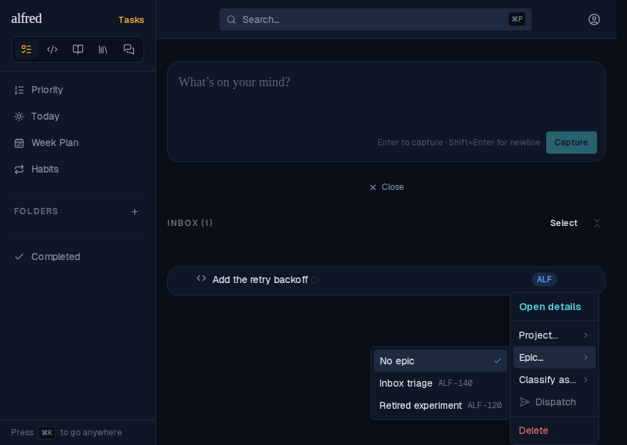
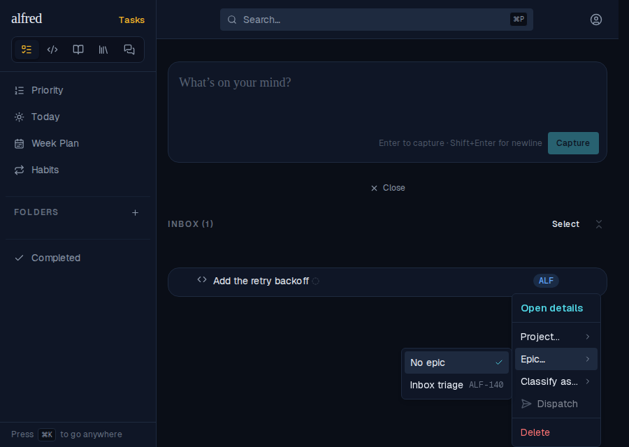
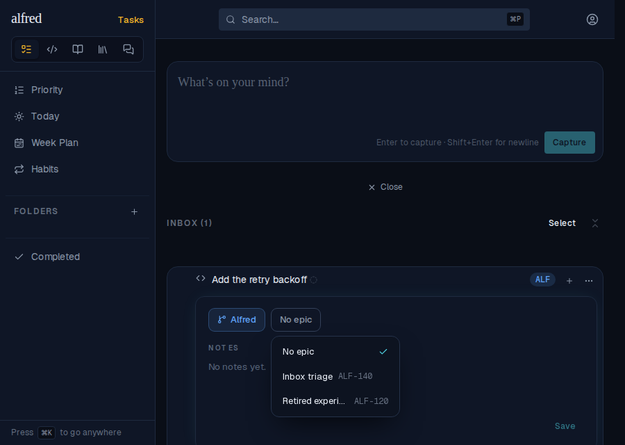
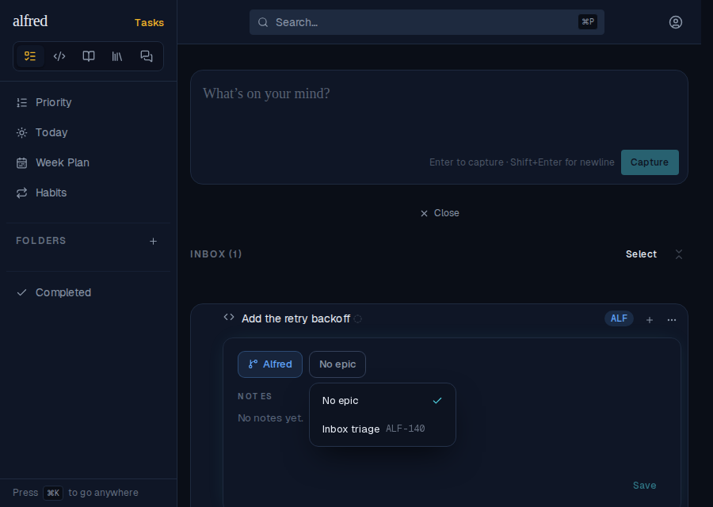
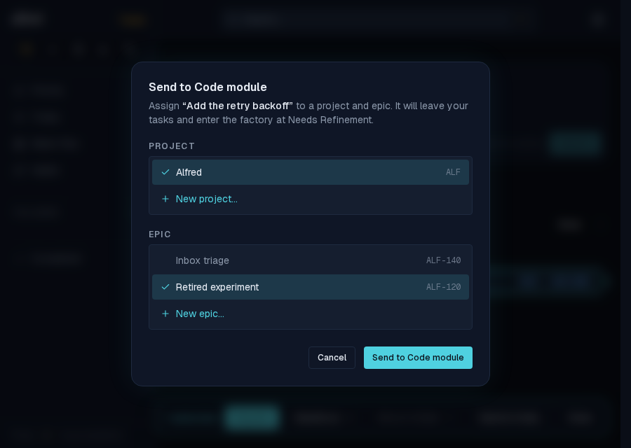
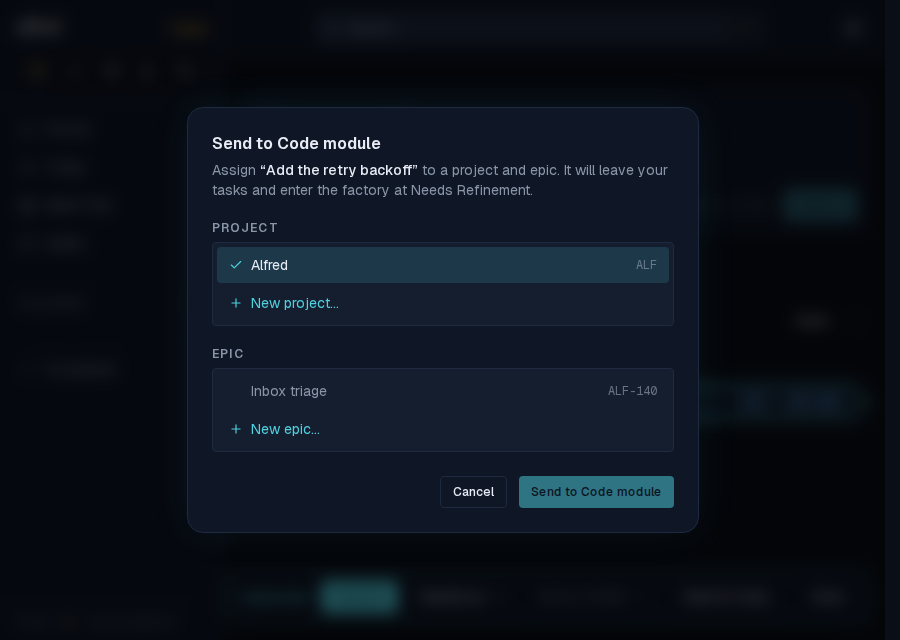

# Archived epics no longer offered as destinations in the inbox

*2026-09-30T02:59:08.569Z*

Setup: one project (ALF) with two epics: **Inbox triage** (active) and **Retired experiment** (archived). One code row sits in the Inbox. Each pair below is the same journey, before the fix and after it.

### 1. Row ⋯ menu → Epic…

Before: the archived epic is listed and can be picked.



After: only the active epic is offered.



### 2. Detail panel → Epic chip

Before: the chip's popover offers **Retired experiment** too.



After: only the active epic is offered.



### 3. Select → Send to Code (the gate dialog)

Here the row carries an intended-epic hint that points at the now-archived epic. Before: the archived epic is listed **and pre-ticked**, so Confirm is live on a destination the epic list should never have offered.



After: the archived epic is not listed and the stale hint is not pre-selected, so nothing is ticked and Confirm stays disabled until an active epic is chosen.



### The classifier

No screenshot: the LLM classifier's epic set is read by `fetchClosedWorld`, which already filters `archived_at=is.null` (pinned in `workers/src/supabase.test.ts`). The request it sends for epics:

```bash
grep -B1 -A3 "restQueryUrl(env, 'epics'" workers/src/supabase.ts
```

```output
  });
  const epicsUrl = restQueryUrl(env, 'epics', {
    select: 'id,ref,name,project_id',
    archived_at: 'is.null',
    order: 'ref.asc',
```
