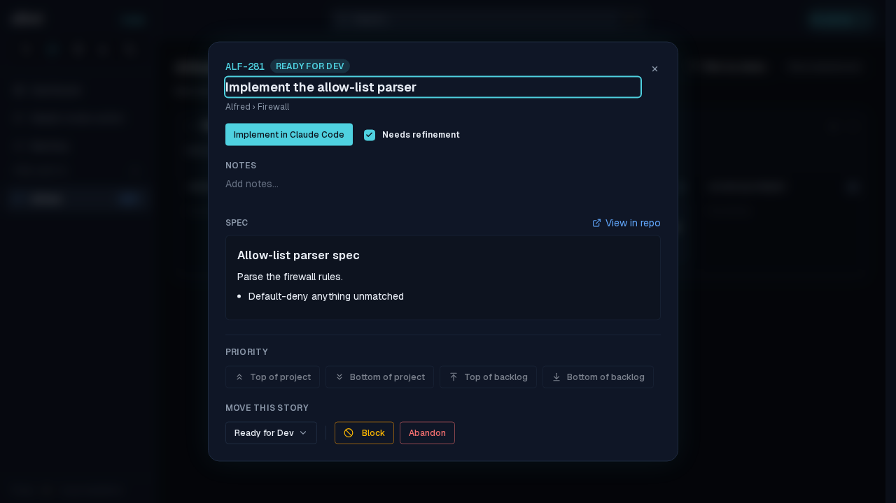
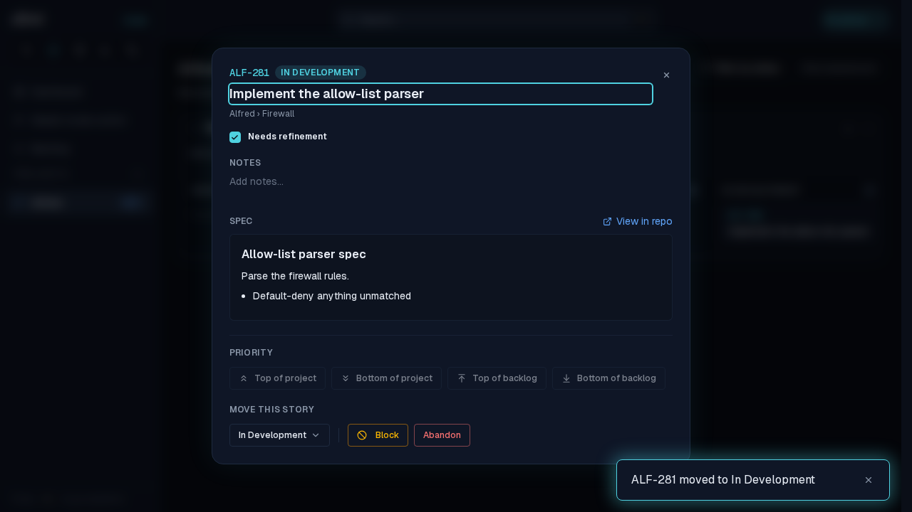

# ALF-277: a realtime echo without the spec no longer crashes the board

*2026-10-04T18:31:36.303Z*

Launching a story writes its factory_state; Supabase Realtime echoes that UPDATE back, but Postgres logical decoding leaves an unchanged TOASTed column (a long spec_markdown) out of the record. The store patched the absent column in as undefined, and the open detail modal crashed on spec.trim(). Captured through the Playwright mock backend: open ALF-281's modal, then push the echo with spec_markdown omitted.

Before the fix — the echo takes the whole page down (the owner's report):

After the fix — the modal open before the echo:

…and after it: the state moves to In Development, the move toast fires, and the spec the payload omitted is kept.

