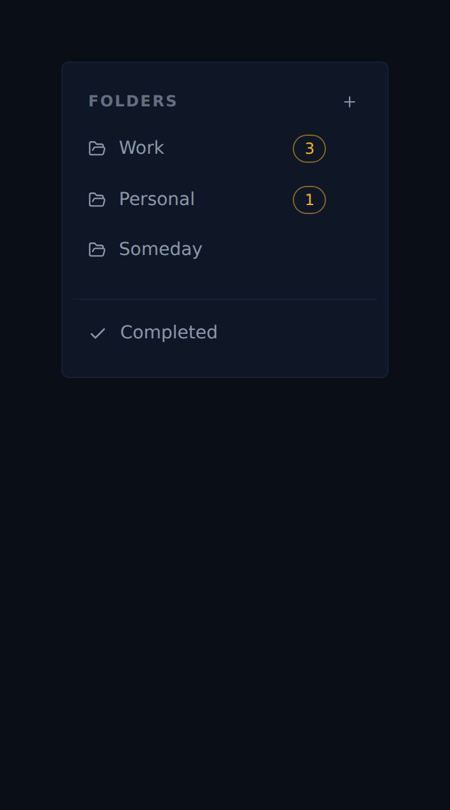

# Folder due-today / past-due badges (ALF-28)

*2026-06-23T18:35:50.934Z*

Each folder link in the sidebar now surfaces, at a glance, how many of its active tasks are due **today or earlier** (today + past-due, combined). The count is derived client-side from the shared task store via a new `useDueCountsByFolder()` selector, so it updates optimistically with every capture, completion, due-date edit, and drag-to-folder — no new fetch or endpoint. The chip reuses the shared `Badge` atom (amber `overdue` tone, mirroring a task row's overdue due chip) and is right-aligned at the trailing edge so a long folder name truncates before it. Folders with nothing due stay clean (no "0" chip).

As part of the same change we DRY'd up our badges onto one primitive: the `Badge` atom is now the single source of the pill geometry (used by the type badge, the row count chips, the factory-state chip, the due-date chip, and this folder badge), gained `due`/`overdue` bordered tones plus an `interactive` hover axis, and can render a clickable `<button>` via `asButton`. `DueDateChip` was rewritten to compose `Badge` (dropping its duplicated base classes) and moved into the tasks feature dir.

The sidebar above: **Work** holds 3 active tasks due today or earlier (one three days past, one yesterday, one today — a task due next week is excluded), **Personal** holds 1 (due today), and **Someday** (only a future-dated task) shows no badge.
