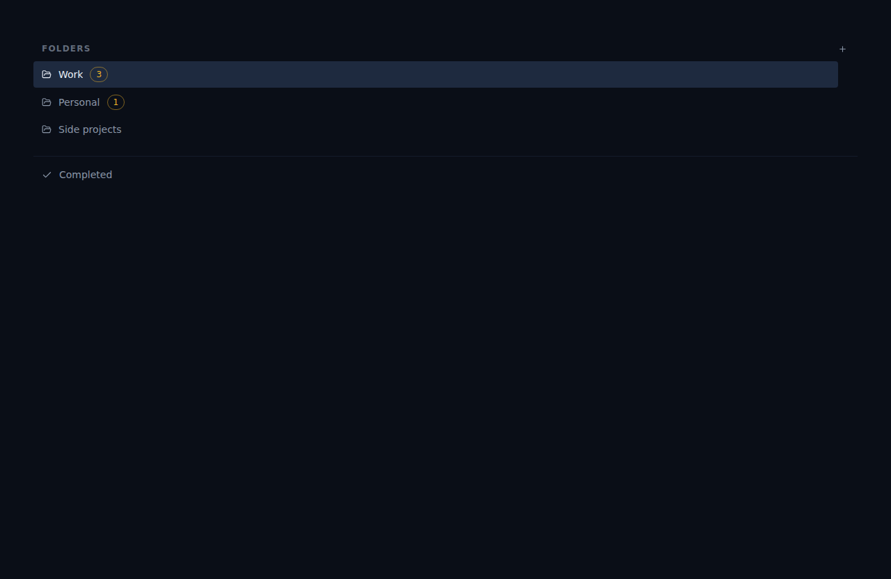

# ALF-28: Due-count badges on sidebar folders

*2026-06-23T16:57:44.282Z*

Each folder link in the sidebar now shows an amber badge with the count of active task items due today or earlier. The badge is hidden when the count is zero.

The implementation adds: (1) isDueTodayOrOverdue helper in date-utils.ts; (2) useDueCountsByFolder selector in tasks-store.tsx; (3) DueCountBadge presentational component; (4) badge rendered in FolderNav. All counts derive from the shared store — updates are optimistic.

Work has 3 past-due tasks (badge shows 3), Personal has 1 past-due task (badge shows 1), Side projects has no qualifying tasks (no badge). The amber chip matches the per-row due styling and is shrink-0 so long folder names truncate first.

The DueCountBadge component in isolation (Storybook story tasks-duecountbadge--single). The amber chip is a small rounded-full pill using accent-amber tokens.

