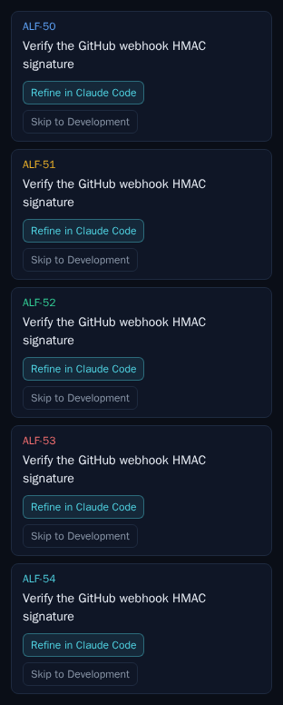
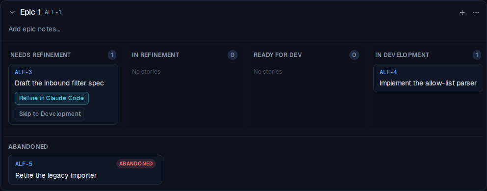
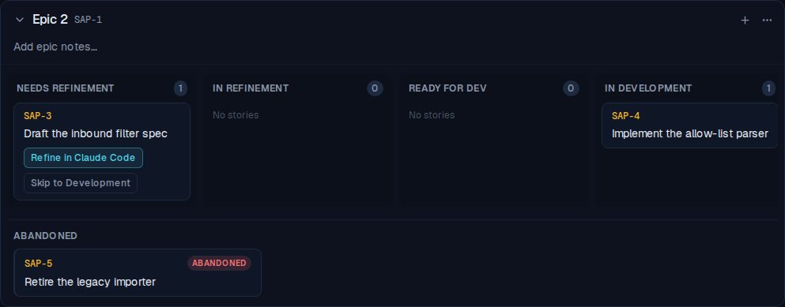
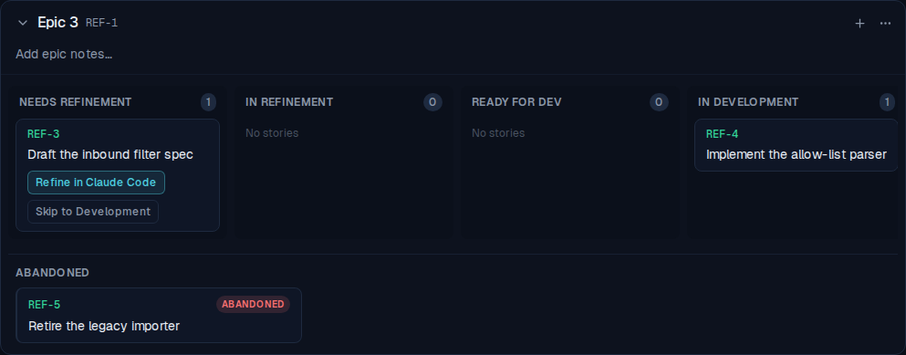
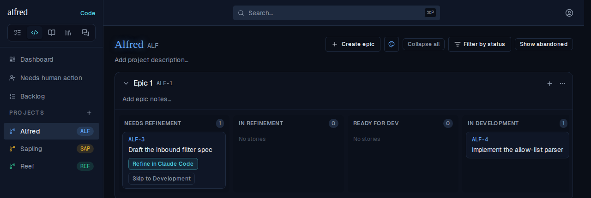
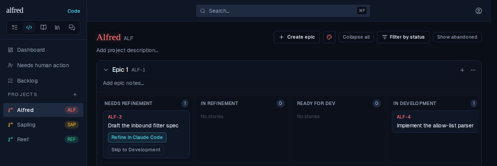
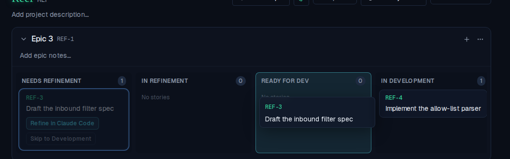
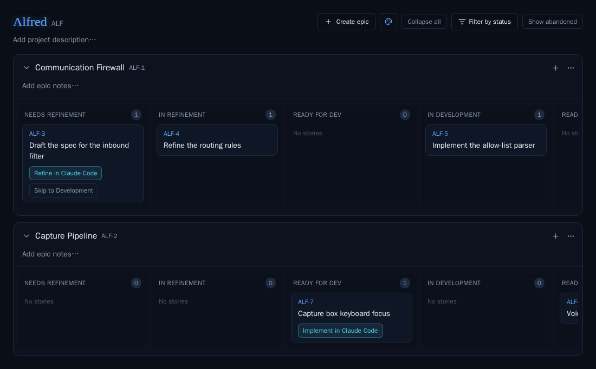

# ALF-299: ticket slug on each card matches the project colour

*2026-09-29T19:16:20.660Z*

Every story card on a project board now tints its ticket slug (the ref, e.g. ALF-3) with that project's colour — the same colour the board title, the ProjectNav icon and the Backlog badge already wear. Until now the slug was a fixed teal on every board. The title and the rest of the card stay neutral.

**The palette, on one card each** — the new `ProjectColors` Storybook story (a committed visual baseline): blue, amber, green, red and teal slugs over unchanged neutral titles.

**In the live app, with no pick** — three seeded projects. The first-created project (Alfred) is blue by creation slot, so its slugs are blue, abandoned bucket included.

The second-created project (Sapling) resolves to amber, so *its* board's slugs are amber — the slug tells you which project a card belongs to.

**With the owner's pick** — Reef has a stored green pick, which wins over its creation slot; the slugs follow it.

**Recolouring from the toolbar** — before: Alfred at rest, blue title, blue sidebar pill, blue slugs.

After picking Red from the palette button (saved through the real PATCH): the title, the sidebar pill and every card slug turn red together.

**The drag ghost** — lifting a card on Reef's board: the floating ghost's slug is green like the card it came from (dimmed in place behind it), over the teal-highlighted drop lane.

**The committed board baselines moved** (`code-board--seeded` and four siblings). The change sits under the snapshot gate's 1% threshold, so no diff image was emitted; the baselines were removed and regenerated instead. Before — slugs ALF-3, ALF-4, ALF-5, ALF-7 in the old fixed teal:

After — the same board, slugs in the project's blue, matching the title:

