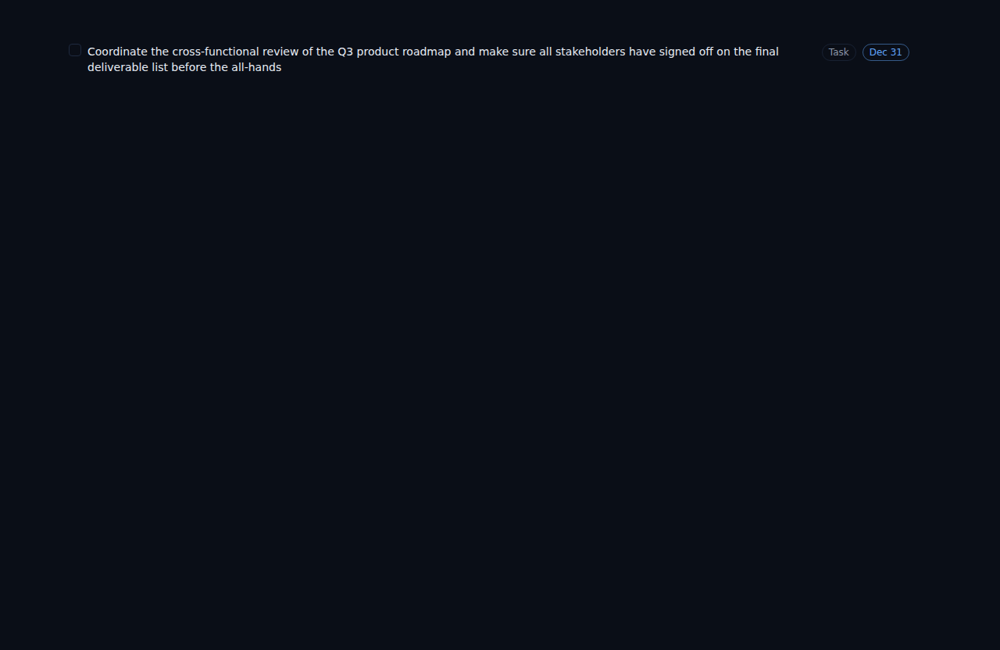
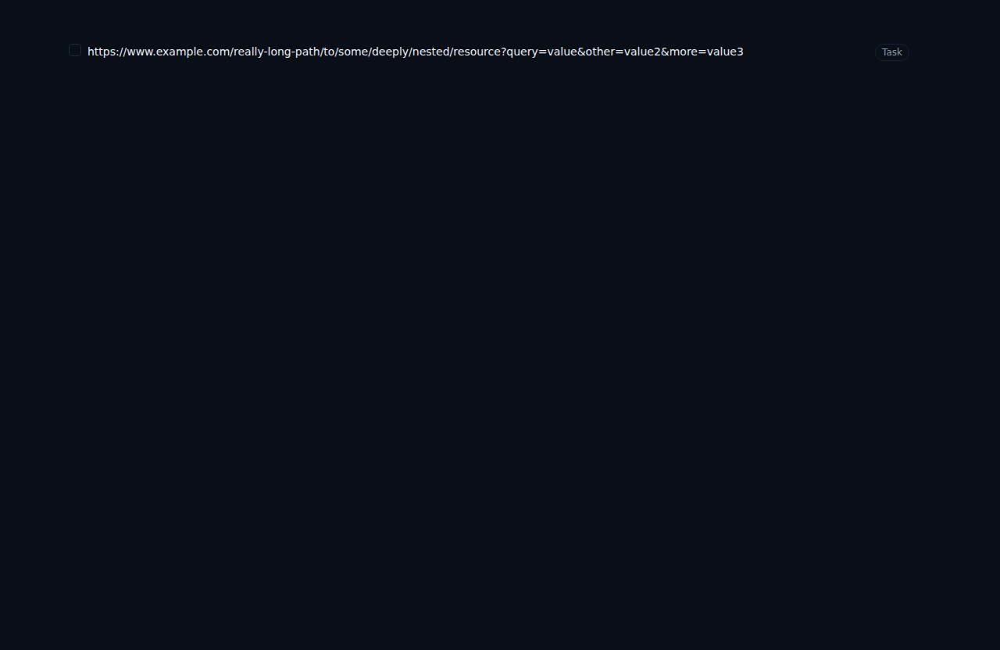

# ALF-31: Task title wraps instead of truncating

*2026-06-22T20:30:10.121Z*

Long task titles previously truncated with an ellipsis, hiding the row controls (type badge, due-date chip, action buttons) off to the right. This fix removes the truncate class and adds break-words so titles wrap to multiple lines, with the controls remaining visible and top-aligned.

Long title with due-date chip and Task badge — title wraps to two lines, controls remain visible top-right:

Long unbroken string (URL) — break-words prevents horizontal overflow; Task badge remains visible:

