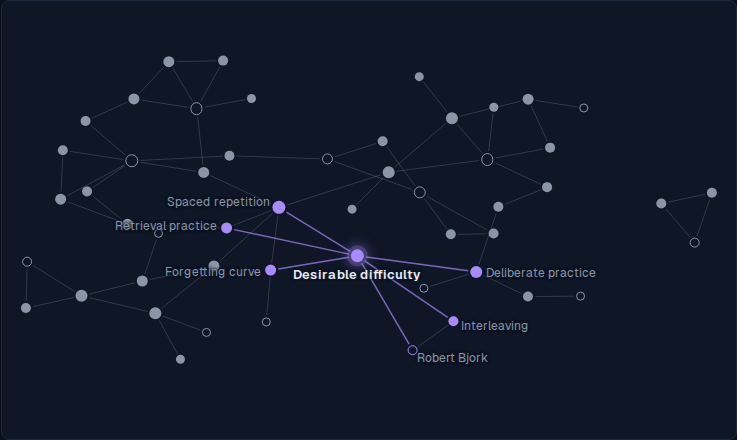
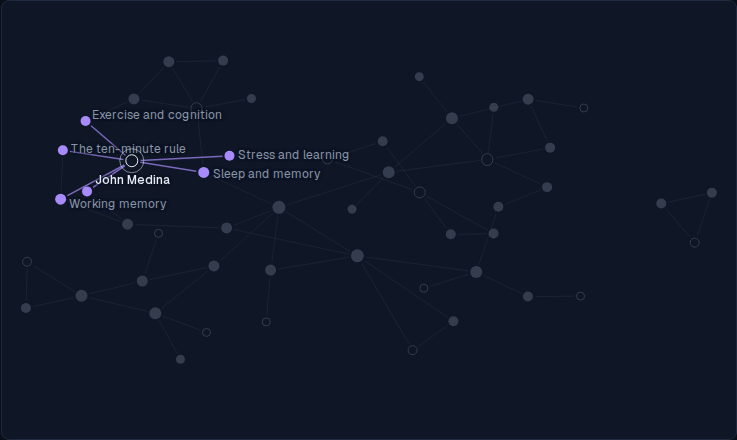
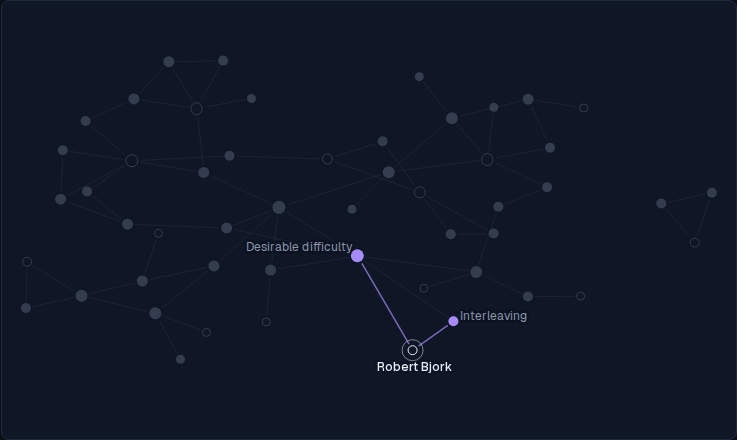
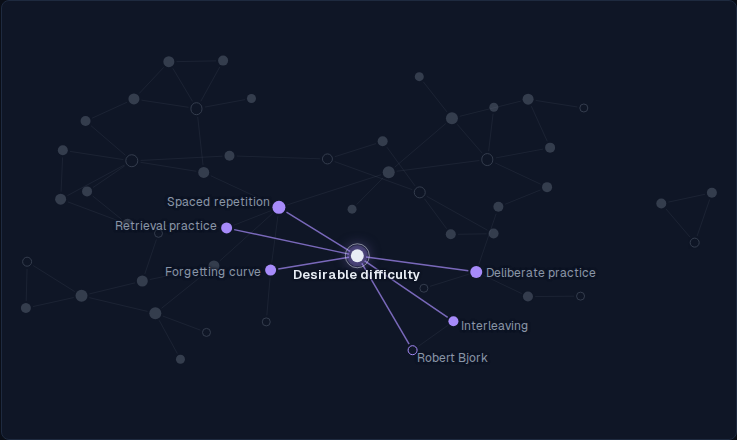
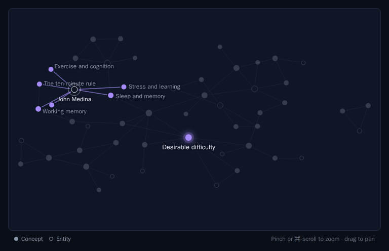
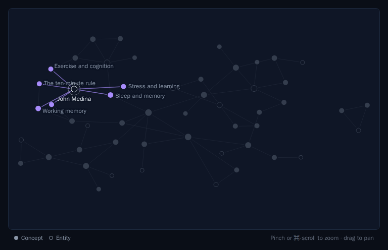

# ALF-311: the day's concept steps back while another node is lit

*2026-10-03T12:49:21.236Z*

While a node other than the day's concept is hovered or reached from the keyboard, the concept of the day is now an ordinary dot: no violet halo, no bold name, dimmed when unrelated, or lit and named outward like any neighbour when it links to the lit node. At rest, and while the concept itself is lit, it looks as before. Every shot is the real app through the Playwright harness against the in-memory Supabase mock, seeded with the 52-page sample (`wikiWebFixtureSet`), the clock pinned to 2026-10-03 (concept: Desirable difficulty) and reduced motion on.

## At rest

Unchanged: Desirable difficulty wears its halo and bold name, its neighbours lit and named.

## Hovering an unrelated node

Hovering John Medina, who doesn't link to it: Desirable difficulty dims with the rest, and loses its halo and its name. Before this change it stayed lit and named in the middle of the web.

## Hovering one of its neighbours

Hovering Robert Bjork, who links to it: Desirable difficulty is just one of his two neighbours, violet and named outward from him in the ordinary weight, without its halo.

## Hovering the concept itself

Not another node, so it keeps its halo and bold name, lit like any hovered node.

## The keyboard does the same

Tabbing into the web lands on the day's concept; End walks to the last node, Tiago Forte, and the concept steps back exactly as on hover.

Tabbing out of the web restores the resting look.

## The Storybook baseline moves

The `Wiki/WikiWeb › Hovering` snapshot (hovering John Medina) changes accordingly. The move sits under the gate's 1% threshold, so no diff image was emitted; the old baseline, then the approved new one:

