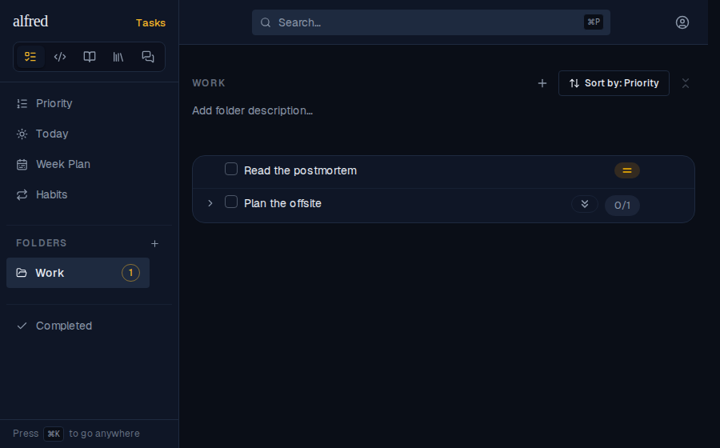
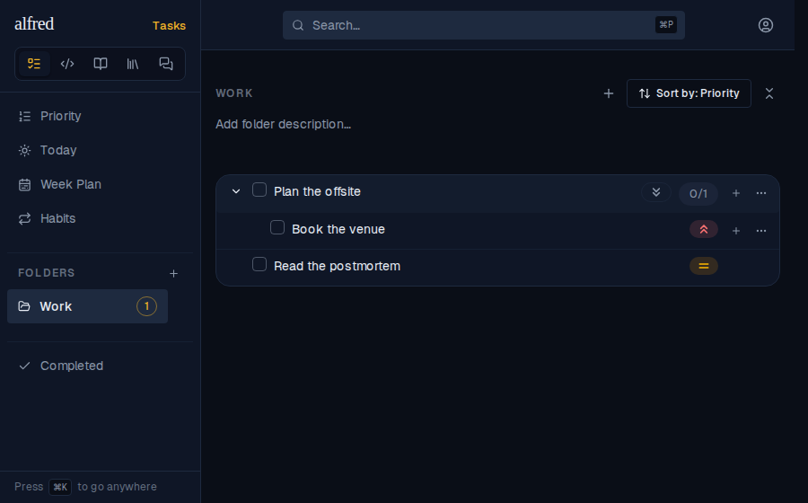

# ALF-314: a folder ranks a task by its highest-priority active subtask

*2026-10-04T18:32:15.851Z*

A folder sorted by Priority holds a Medium task ("Read the postmortem") and a Low task ("Plan the offsite") whose active subtask "Book the venue" is High. The By-Priority screen already ranks a task by the best of its active descendants; the folder sort ranked by the task's own level only.

**Before** — the Low parent sinks below Medium, hiding its High subtask:

**After** — the parent ranks as High via its subtask (expanded here to show why), mirroring the By-Priority screen. The rollup now lives in one function, `effectiveKey` in `frontend/lib/priority.ts`, shared by the folder sort (both modes), By-Priority, and Today.

