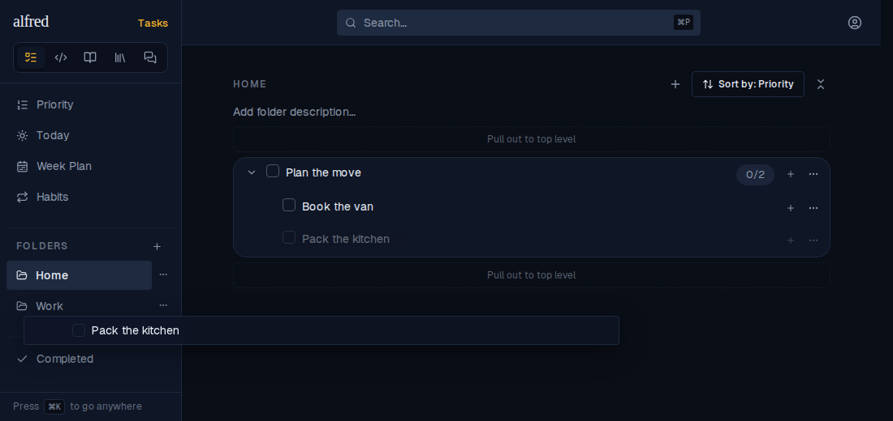
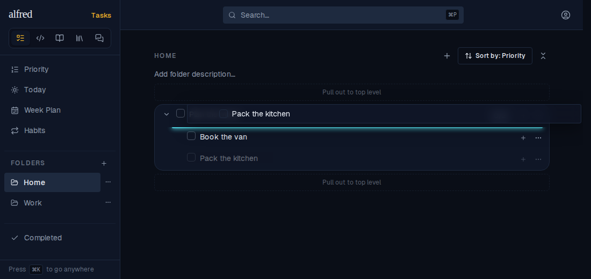
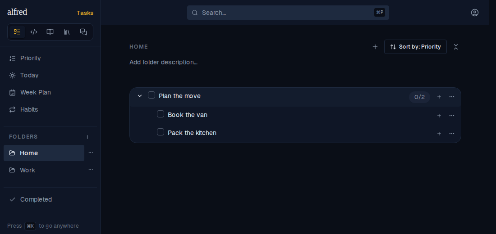
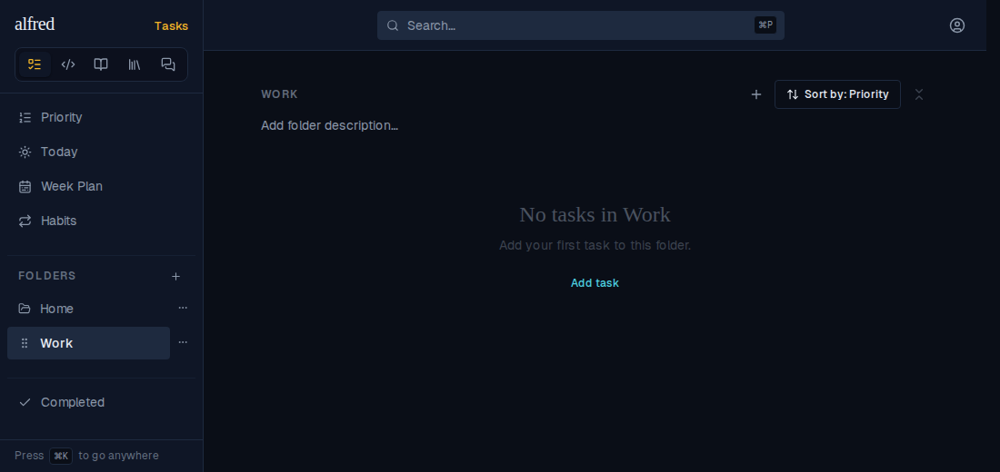
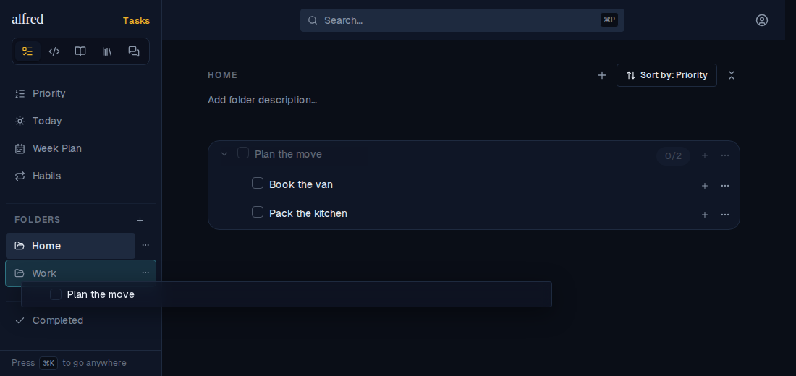

# Subtasks are no longer droppable onto a folder

*2026-10-02T18:40:43.236Z*

**ALF-315**: a subtask could be dragged onto a sidebar folder; the drop ran `moveTask` and filed it there, tearing it out of its parent's tree. A subtask now moves only between/inside other subtasks: the reorder gaps, re-parenting onto another task, and the existing pull-out-to-top-level zones all still work, but a sidebar folder never lights up for a subtask drag and a drop there is a no-op. Top-level tasks still file into folders exactly as before.

Seed: folder **Home** holding "Plan the move" with two subtasks ("Book the van", "Pack the kitchen"), and an empty folder **Work**.

**1. Before** — the parent expanded in Home; Work sits in the sidebar.

**2. Mid-drag, over Work** — "Pack the kitchen" is lifted (dimmed in place, ghost under the pointer) and the pointer sits on Work, mouse still down. Work does **not** light up: filing isn't on offer.

**3. Still reorderable** — the same subtask held over the boundary above "Book the van" shows the teal insertion line: moving between subtasks is unchanged.

**4. After releasing over Work (and reloading the saved rows)** — the subtask is still nested under "Plan the move" in Home.

**5. The Work folder** — still empty. Before the fix the subtask would have been filed here.

**6. Contrast: a top-level task** — dragging "Plan the move" itself over Work lights the folder up (teal outline), so filing a root task by drag still works.

