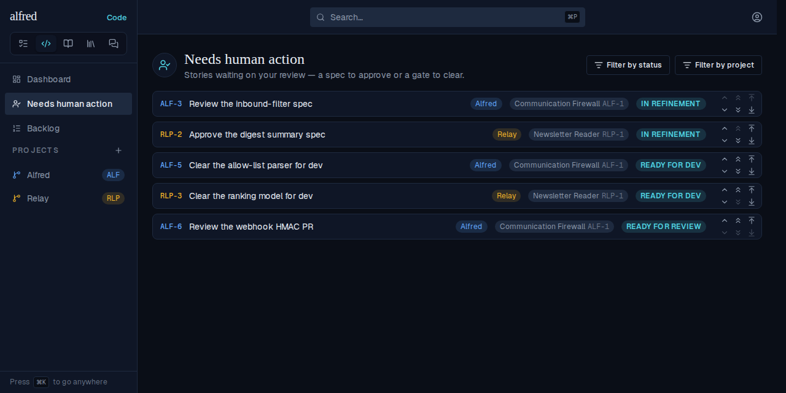
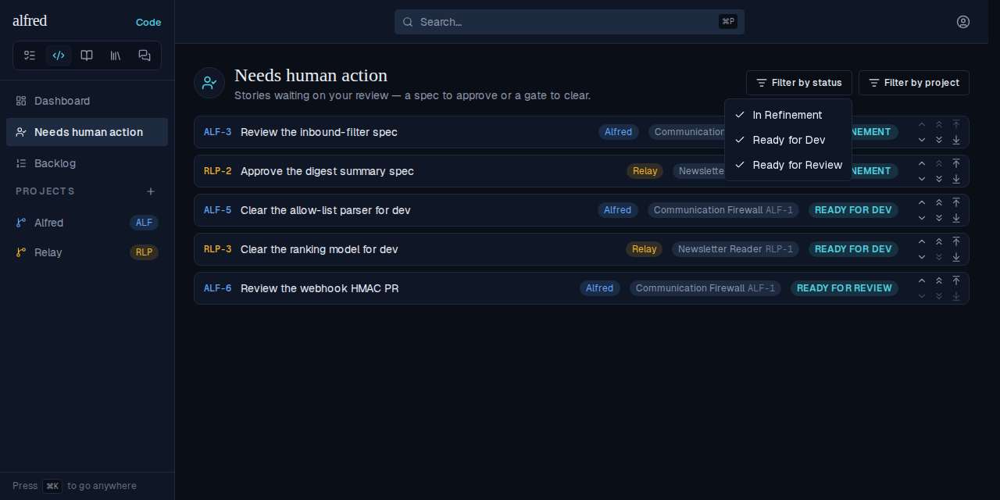
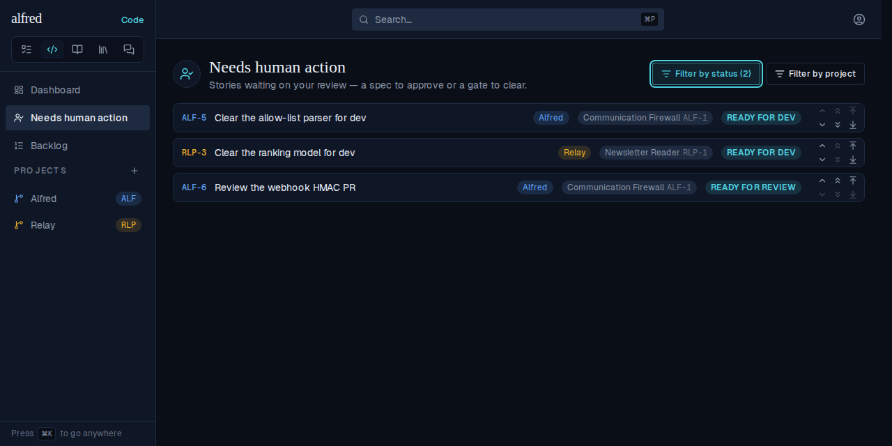
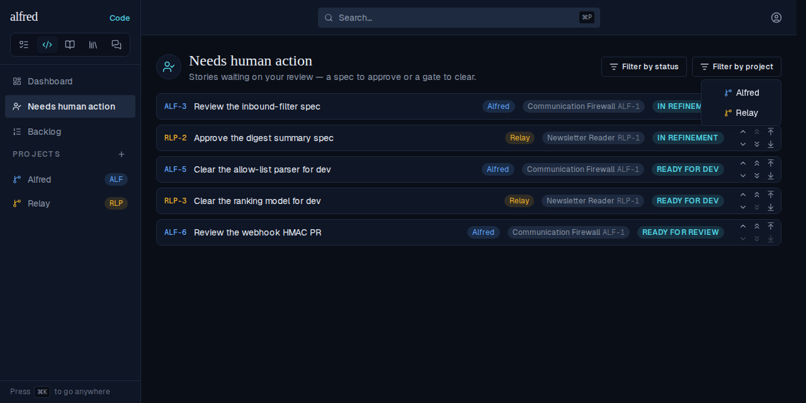
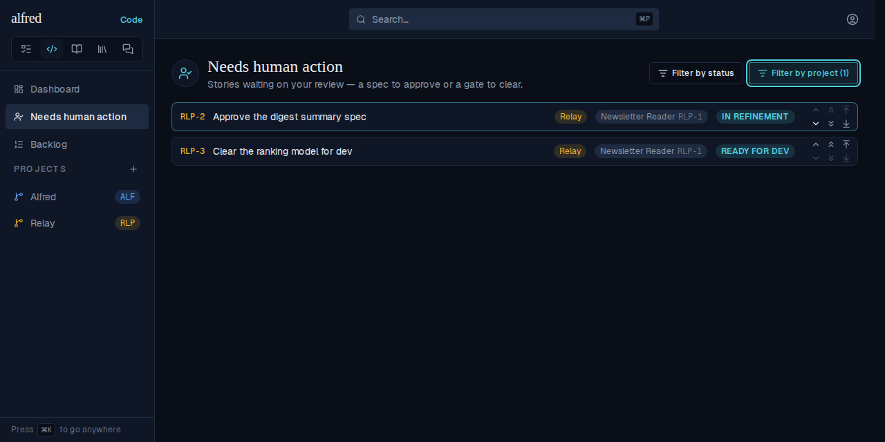
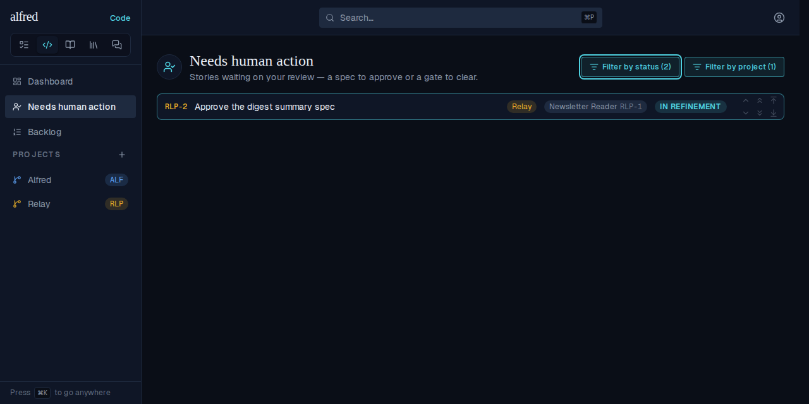
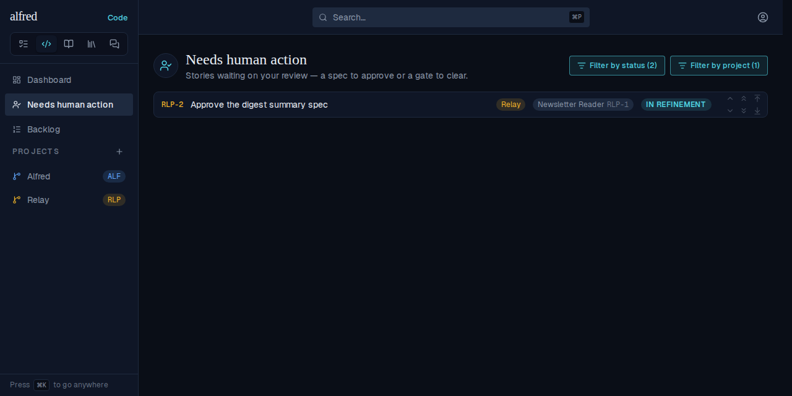
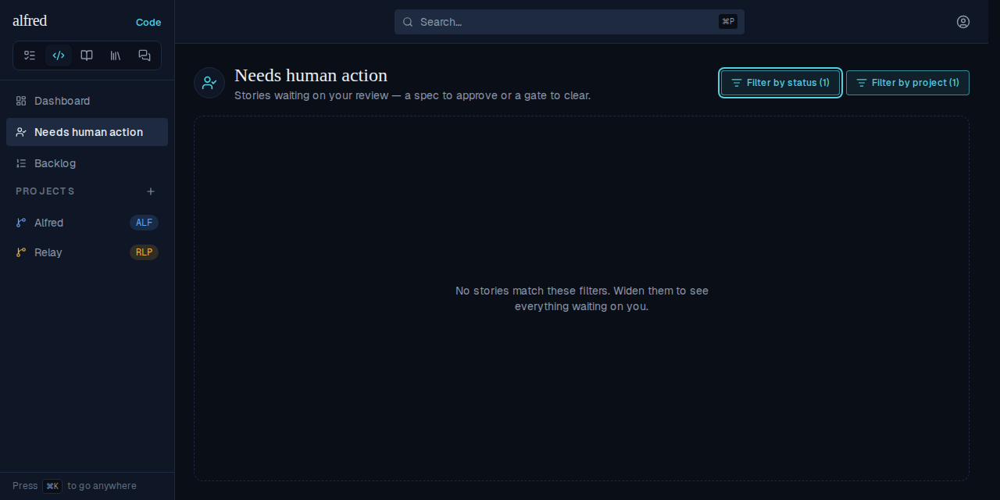

# Needs human action: filter by status and by project

*2026-10-02T19:17:56.414Z*

Setup: two projects (**Alfred**, **Relay**) with five stories in the three human-review states, interleaved in the global ranking, plus one `in_development` story the view never lists. Every shot is the live app against the e2e Supabase mock, taken after motion settles.

### 1. At rest — both dropdowns in the header, no counts, the whole cross-project queue

### 2. Filter by status offers only the three human-review states, all checked at rest

Unchecking **In Refinement** drops both spec reviews; the trigger counts the narrowed selection.

### 3. Filter by project lists every project in creation order, none checked at rest (= every project)

Picking **Relay** (status restored) narrows to Relay's two stories, still in global priority order.

### 4. The two filters combine — Relay only, Ready for Dev unchecked

### 5. The selections are this view's own. The Backlog is untouched by either pick (no counts, every outstanding story listed)…

…and coming back to Needs human action (SPA navigation via the sidebar) restores both picks.

### 6. When the filters hide every waiting story, the empty state blames the filters instead of claiming nothing needs attention

