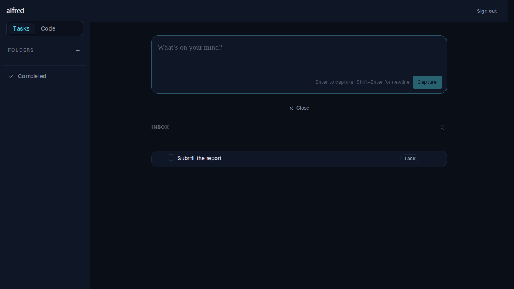
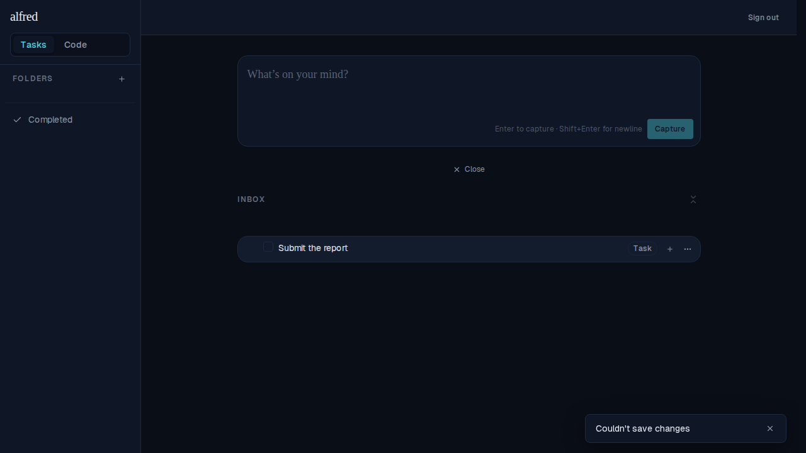

# ALF-33 — Surface API errors as toasts

*2026-06-24T05:29:36.795Z*

Every mutating action in alfred follows the optimistic + reconcile/rollback recipe: it applies the change instantly, calls the API, and on failure **rolls the change back and re-throws**. Before ALF-33 the component `catch` swallowed that error silently, so a failed write just snapped back with **no explanation** — the work looked saved, then quietly undid itself.

ALF-33 fires a **centralized error toast at the single rollback point inside each store action** — one source of truth, so no component `catch` can forget it and new actions inherit the behavior. `ToastProvider` was lifted to be the outermost provider in the shell layout so all three stores (Folders / Tasks / Code) sit inside it and can reach `useToastActions()`. Coverage: every optimistic write action in `tasks-store`, `folders-store`, and `code-store`. The client-only `removeGatedItem` (no API call) fires no toast.

**Before** — the inbox with one task, no toast. A title edit is about to be made while the API is forced to return 500.

**After** — the title save failed (500). The optimistic title **reverts** to "Submit the report", and a toast reads **"Couldn't save changes"** in the bottom-right `aria-live` viewport. The raw HTTP error (status + body) is never shown — the toast uses the human-readable message.

The store still **re-throws** after the toast, so component-local UI reset (the title draft, an `isConfirming` flag, etc.) is preserved exactly as before — this change adds the toast, it does not alter control flow. The same path covers all stores: a failed folder rename → "Couldn't rename folder", a failed code-state transition → "Couldn't update story", a failed launch → "Couldn't start session", and so on.
