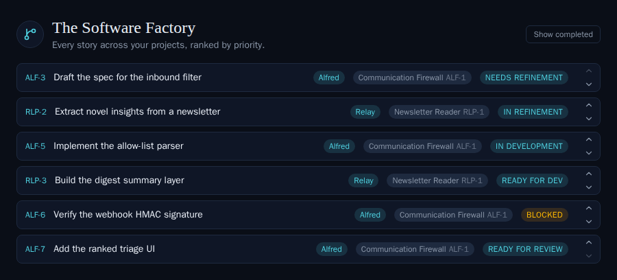

# Cross-project Backlog by priority (ALF-35)

*2026-06-23T21:09:34.090Z*

The Code module was project-scoped with no notion of priority — there was no way to answer "across every project and epic, what should I work on next?". This change adds a **Backlog**: one global, re-orderable, priority list of every outstanding story spanning all projects and epics (the default Code view), and makes the per-project board reflect that one global order. Priority is a single `code_items.priority` column (a global sequence); the Backlog, the board's epic order, and within-lane order all derive from it.

## 1. A global priority column (migration 0005). Priority is a *global* total order, so it uses one sequence (not the per-project ref counter); a unique index makes the order strict. Stories reorder by exchanging two rows' priority via the `swap_code_priority` RPC.

```bash
sed -n '1,40p' database/migrations/0005_story_priority.sql
```

```output
-- Alfred — Global story priority for the cross-project Backlog (ALF-35).
--
-- Adds a single global total order across all code stories so the Backlog
-- can rank them and the project board can reflect that order. Three parts:
--   1. priority column + sequence on code_items
--   2. Atomic swap RPC (swap_code_priority) for the chevron reorder
--   3. v_code_stories recreated with priority appended

-- ── 1. Global priority sequence + column ─────────────────────────────────────
-- A global story-priority order for the cross-project Backlog (ALF-35).
-- Lower = higher priority. One sequence (NOT the per-project ref counter) because the
-- Backlog ranks every story across every project in a single list. New stories append to
-- the bottom (largest priority) until the owner ranks them up.
create sequence code_priority_seq;

alter table code_items
  add column priority bigint not null default nextval('code_priority_seq');

comment on column code_items.priority is
  'Global cross-project Backlog rank (ALF-35). Lower = higher priority. Allocated from '
  'code_priority_seq; reordered by swap_code_priority(). Distinct across all stories.';

-- Seed priority from existing creation order (ref_number) — a stable starting rank.
with ranked as (
  select item_id, row_number() over (order by ref_number) as rn from code_items
)
update code_items c set priority = ranked.rn from ranked where ranked.item_id = c.item_id;

-- Park the sequence above every backfilled value so appends land at the bottom.
select setval('code_priority_seq', coalesce((select max(priority) from code_items), 0) + 1, false);

create unique index code_items_priority_key on code_items (priority);

-- ── 2. Atomic swap RPC ────────────────────────────────────────────────────────
-- Swap the global priority of two stories (the Backlog chevron reorder). One UPDATE so the
-- unique(priority) index never sees a duplicate mid-swap. Returns both updated rows.
create or replace function swap_code_priority(p_a text, p_b text)
returns setof code_items language plpgsql security invoker as $$
declare a_pri bigint; b_pri bigint;
begin
```

## 2. The reorder swaps priority while respecting the unique index. 0005's one-statement CASE swap actually **409'd** in production — a non-deferrable unique index checks uniqueness *per row*, so rewriting row A to B's priority while B still holds it momentarily duplicates. Migration 0007 fixes it: park one row at a negative sentinel, then assign, so every per-row step is unique. Below, two stories are seeded into the in-memory backend the e2e suite uses (priorities 1 and 2) — which now models that same immediate unique constraint — then `POST /rest/v1/rpc/swap_code_priority` (the RPC the `/api/code/reorder` route calls) exchanges their priority and the Backlog order flips. The store's `reorderStory` wraps it optimistically (rollback on failure).

```bash
cd frontend
export MOCK_SUPABASE_PORT=54399
node scripts/mock-supabase.mjs & MOCK=$!
trap "kill $MOCK 2>/dev/null" EXIT
until curl -s localhost:54399/__mock__/health >/dev/null 2>&1; do sleep 0.2; done
curl -s -X POST localhost:54399/__mock__/seed -H 'content-type: application/json' -d '{
  "projects":[{"id":"p1","name":"Alfred","key":"ALF","repo_owner":"ac","repo_name":"alfred"}],
  "epics":[{"id":"e1","project_id":"p1","name":"Firewall","ref":"ALF-1","ref_number":1}],
  "items":[{"id":"i1","title":"Draft the spec","item_type":"code"},
           {"id":"i2","title":"Build the parser","item_type":"code"}],
  "codeItems":[{"item_id":"i1","project_id":"p1","epic_id":"e1","ref":"ALF-3","ref_number":3,"priority":1},
               {"item_id":"i2","project_id":"p1","epic_id":"e1","ref":"ALF-4","ref_number":4,"priority":2}]
}' >/dev/null
order() { curl -s "localhost:54399/rest/v1/v_code_stories?select=ref,priority&order=priority.asc" \
  | node -e "let d='';process.stdin.on('data',c=>d+=c).on('end',()=>console.log(JSON.parse(d).map(r=>r.ref+' (priority '+r.priority+')').join(', ')))"; }
echo "Backlog order before: $(order)"
echo "POST /rpc/swap_code_priority {p_a: ALF-4, p_b: ALF-3} ->"
curl -s -X POST localhost:54399/rest/v1/rpc/swap_code_priority -H 'content-type: application/json' -d '{"p_a":"ALF-4","p_b":"ALF-3"}' \
  | node -e "let d='';process.stdin.on('data',c=>d+=c).on('end',()=>console.log('  swapped rows -> '+JSON.parse(d).map(r=>r.ref+': '+r.priority).join(', ')))"
echo "Backlog order after:  $(order)"
```

```output
mock-supabase listening on http://localhost:54399
Backlog order before: ALF-3 (priority 1), ALF-4 (priority 2)
POST /rpc/swap_code_priority {p_a: ALF-4, p_b: ALF-3} ->
  swapped rows -> ALF-4: 1, ALF-3: 2
Backlog order after:  ALF-4 (priority 1), ALF-3 (priority 2)
```

## 3. The Backlog view (the default `/code`). Every outstanding story across all projects, ranked by priority. Each row shows the **ref**, **title**, a **project badge**, an **epic badge**, and a **status chip labelled for the story's current factory state** (Needs Refinement, In Refinement, In Development, Ready for Dev, Blocked, … — every state, not just the escape ones). The landing's hero ("The Software Factory") is kept as the header, with a **Show completed** toggle that reveals done/abandoned. Two chevrons per row swap the story with its visible neighbour; the first row's Up and the last row's Down are disabled.



*(The shot above is the `Code/Backlog` Storybook story, rendered in the pinned Linux container — the committed image-snapshot baseline.)*

## 4. Click-through and the board falling in line. A chevron calls `reorderStory` (optimistic swap → the atomic RPC above → rollback on failure); the rows re-sort and the move is animated with a FLIP hook (`useFlipList`), honouring `prefers-reduced-motion`. A row's body deep-links to `/code/<projectId>?story=<ref>`, which opens that story's detail modal on its project board (cleared on close). Because the board's epic order and within-lane order derive from the **same** `priority`, a Backlog re-rank reorders the project board too. The Playwright suite (`e2e/code-backlog.spec.ts`) drives the full flow: default Backlog → chevron reorder (persisted) → deep-link a story modal onto its board.
