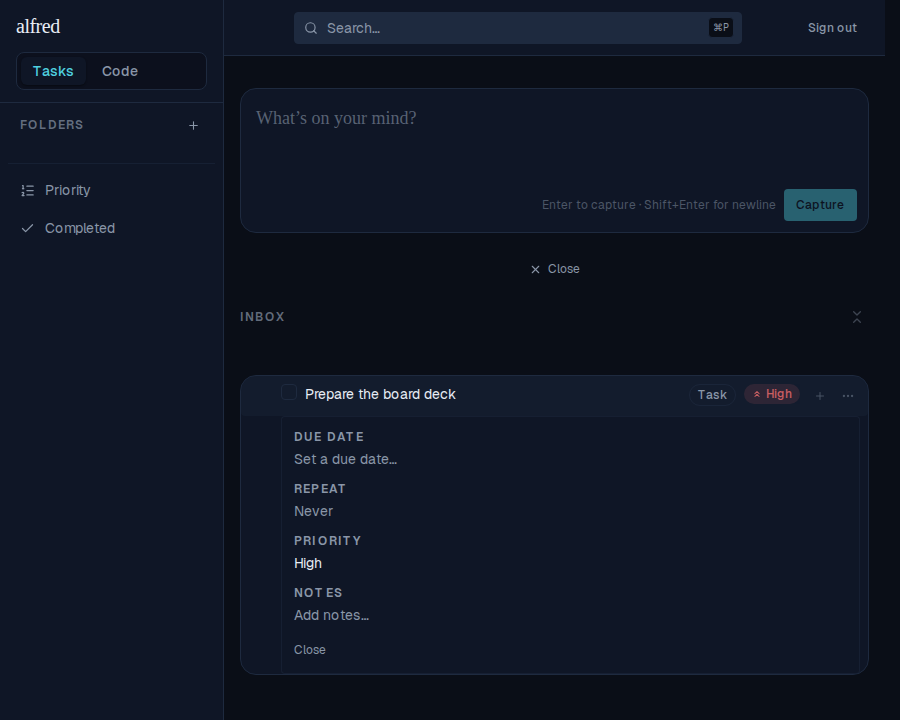
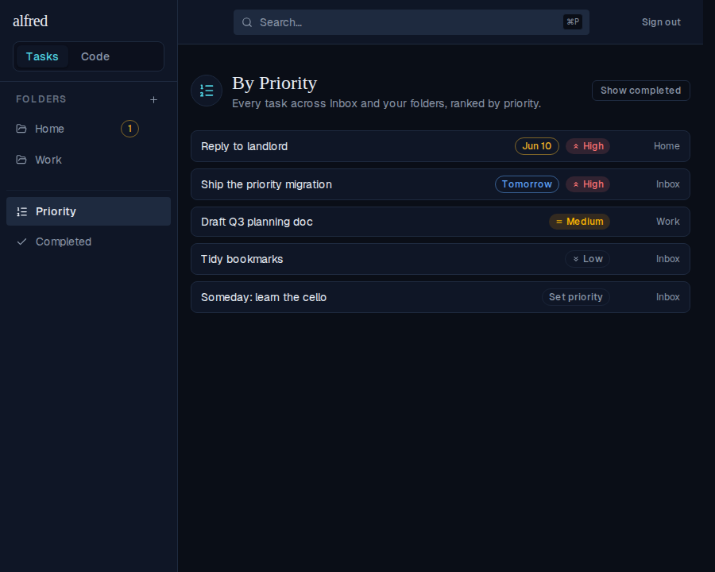
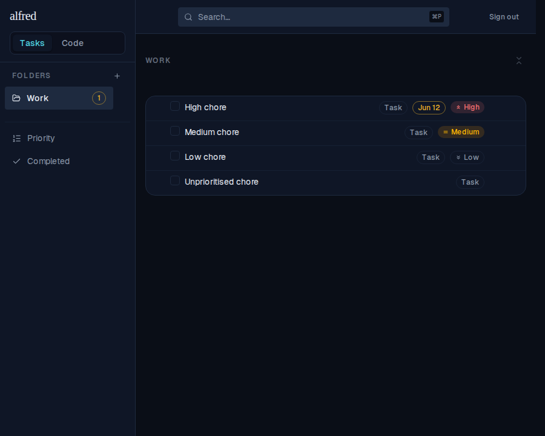

# View all tasks by priority (ALF-37)

*2026-06-24T21:34:16.767Z*

ALF-37 adds a discrete **priority level** (High / Medium / Low) to tasks — set from the task editor and shown as a colour-coded badge on each row — plus a new **By Priority** view at `/priority` that lists every top-level task across Inbox and all folders, ranked by priority (due date breaks ties within a level). The same ranking also orders tasks **inside each folder** (the Inbox stays capture-first).

## Setting a priority — the editor control and the row badge

A **Priority** dropdown sits in the task editor beside Due date, Repeat and Notes. Once set, the level shows as a clickable badge on the row (here, ⬆ High); clicking it reopens the control.

## The By Priority view (`/priority`)

A flat list of every top-level task across Inbox and all folders, ordered **High → Medium → Low → unprioritised**; within a level the earlier due date comes first (note both High tasks — *Reply to landlord* (Jun 10) ranks above *Ship the priority migration* (Tomorrow)). Each row shows where it lives (Home / Work / Inbox), and a **Show completed** toggle reveals completed tasks. A top-level task is ranked by the best priority/urgency across its active subtree, so a Low parent hiding a High, overdue subtask floats up.

## Ordering within a folder

Each folder now ranks its tasks by the same priority → due → created_at order, at every level (top-level rows and their subtasks). The Work folder below lists High → Medium → Low → unprioritised. The Inbox is unchanged (it stays capture-first, newest captured on top).

