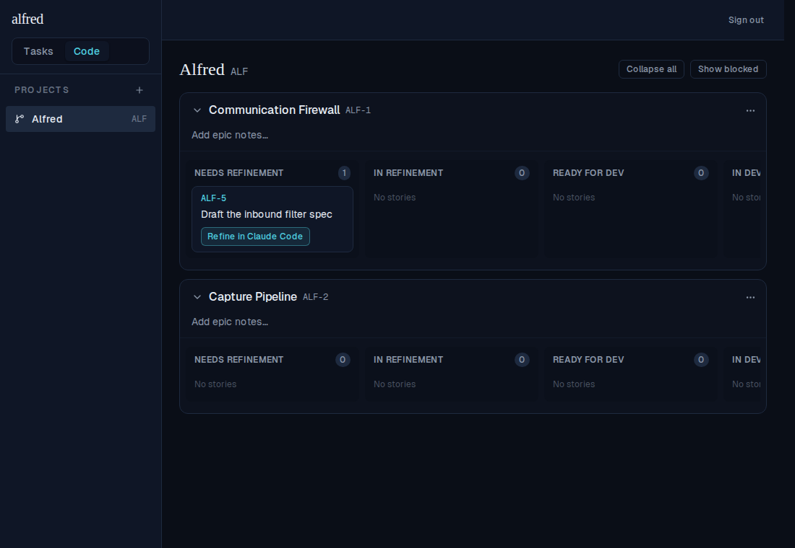
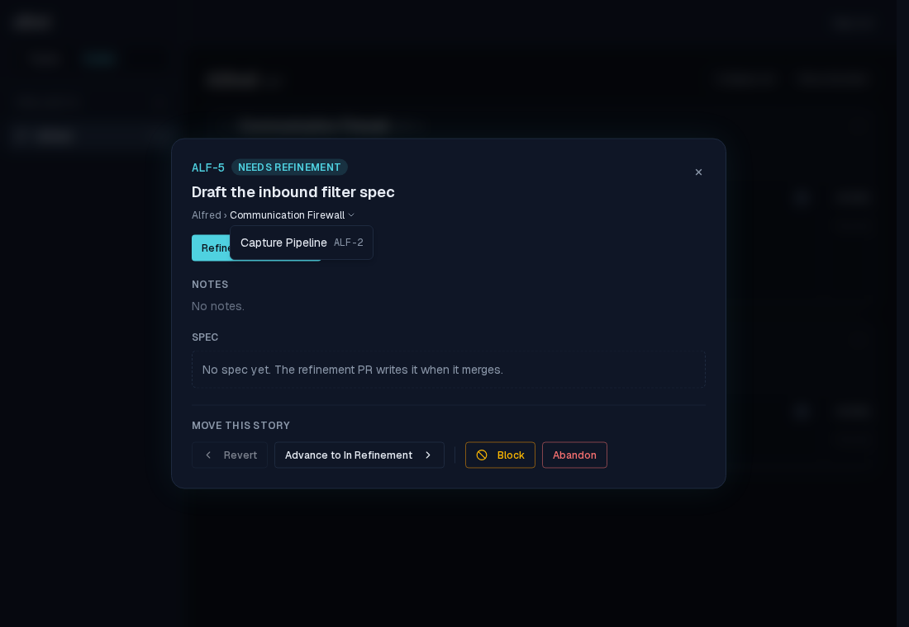
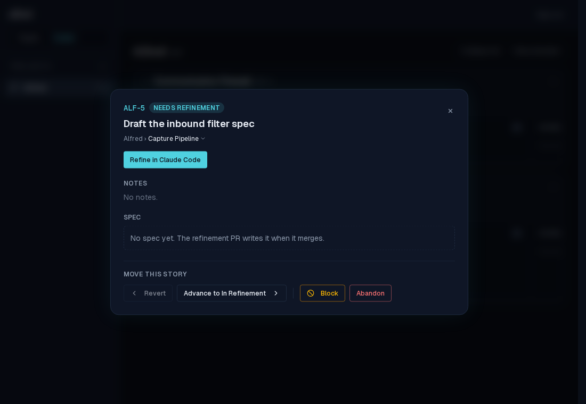
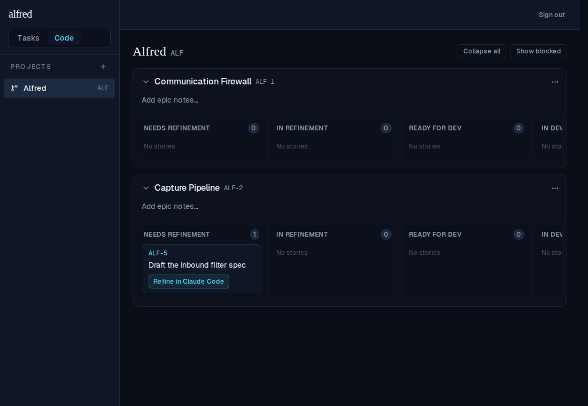
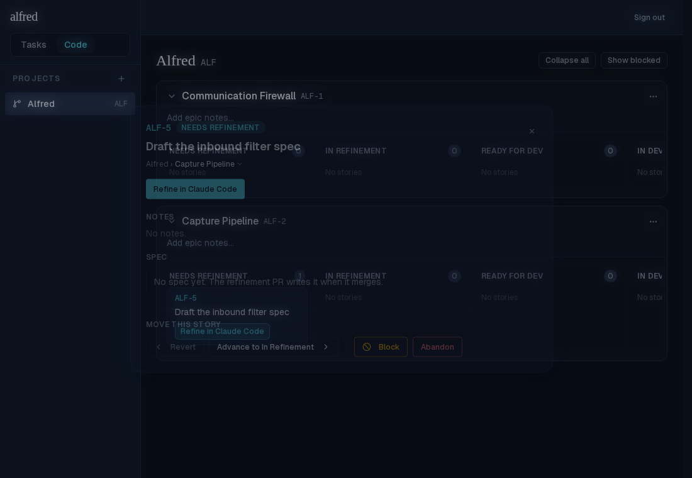

# ALF-39 — Move a story to a different epic

*2026-06-22T19:41:27.985Z*

A code story's epic was chosen once, at the gate, and frozen thereafter. ALF-39 makes it changeable from the story detail modal: the **Epic** half of the `Project › Epic` breadcrumb becomes a dropdown of the other active epics in the same project, and selecting one re-homes the card on the board — optimistically, via a new `moveStoryToEpic` store action backed by `PATCH /api/code/[ref]` carrying `{ epic_id }`.

**1. Before — the story sits under epic *Communication Firewall*.** `ALF-5` is in that epic's *Needs Refinement* lane.

**2. The breadcrumb epic is now a dropdown.** Opening the story modal and clicking the epic shows the project's other active epics — here just *Capture Pipeline* (`ALF-2`). The current epic is the trigger label, not a choice; archived and other-project epics are excluded.

**3. Selecting *Capture Pipeline* moves the story.** The breadcrumb updates live to the new epic — no manual refresh.

**4. The card has re-homed on the board.** Closing the modal, `ALF-5` now lives under *Capture Pipeline*'s *Needs Refinement* lane, and *Communication Firewall* is empty (0 stories).

**5. It persisted.** Reloading the page (a fresh server read) and reopening the modal, the breadcrumb still reads *Capture Pipeline* — the move was saved to `code_items.epic_id`, not just an optimistic UI change.

The route guards same-project moves server-side: a `PATCH` whose `epic_id` belongs to a different project (or no epic) is rejected **400**, and an empty body is **400**. The UI only ever offers same-project, non-archived epics, so a single-epic project shows the epic as plain text with no dead dropdown.
