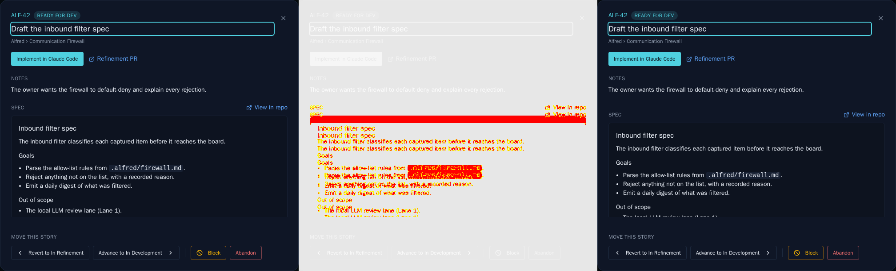
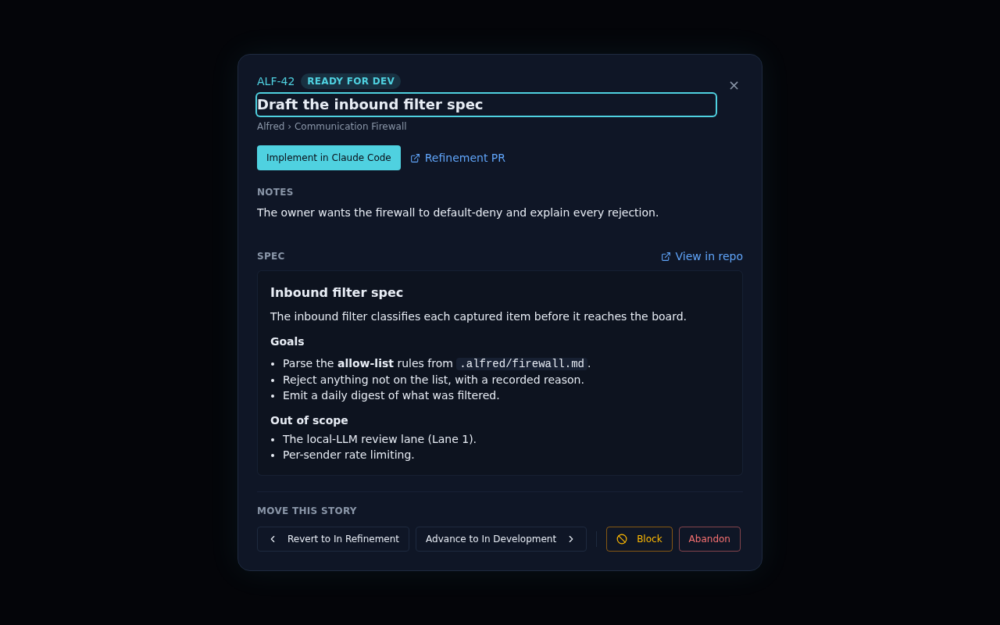
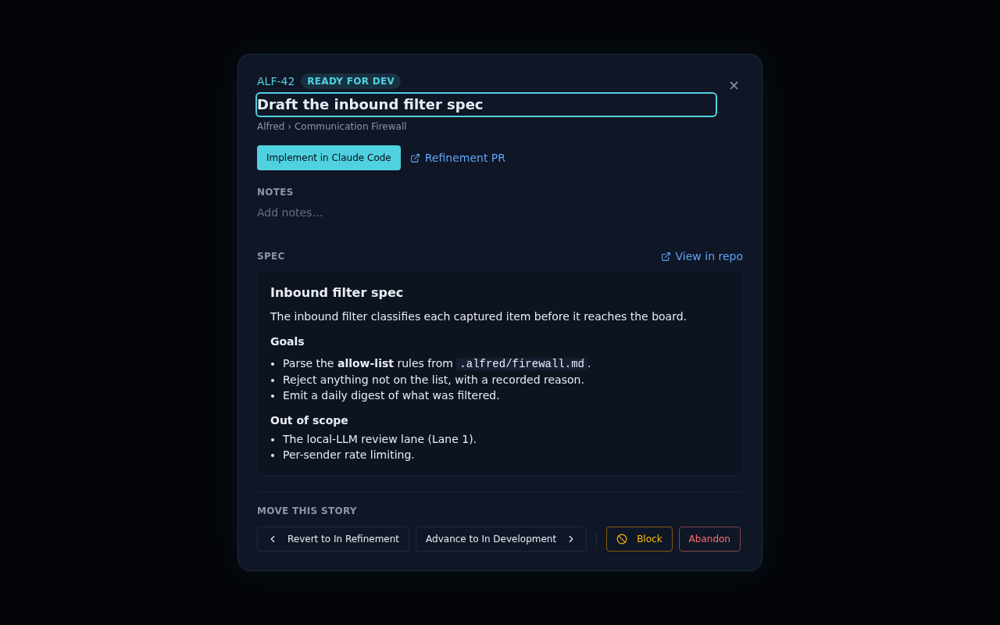

# ALF-40: Edit story notes in code module

*2026-06-23T16:45:11.862Z*

Story notes in the code module detail modal were read-only. This ticket adds inline editing — the same optimistic click-to-edit pattern used for the story title and epic notes on the board.

A new updateStoryNotes store action (mirroring updateStoryTitle) PATCHes items.notes via api.updateItem, with optimistic dispatch and rollback on failure. The Notes block in the detail modal becomes an EditableNotes component: an InlineEditTrigger (pencil on hover) in display mode and a TextareaField in edit mode.

The ReadyForDev Storybook snapshot moved: the Notes section now renders as an InlineEditTrigger button (with a hidden pencil icon) instead of a static paragraph. The new baseline shows the text in a clickable button; the diff (below) highlights the changed pixels.

Display mode: existing notes render as a clickable text area with whitespace preserved; a pencil icon appears on hover (hidden at opacity-0 in static screenshot). Clicking anywhere enters edit mode with a TextareaField (Save/Cancel/Escape).

Empty state: when notes is null, an 'Add notes...' affordance is shown in muted text, consistent with how other empty editable fields in the app handle absence of content.

