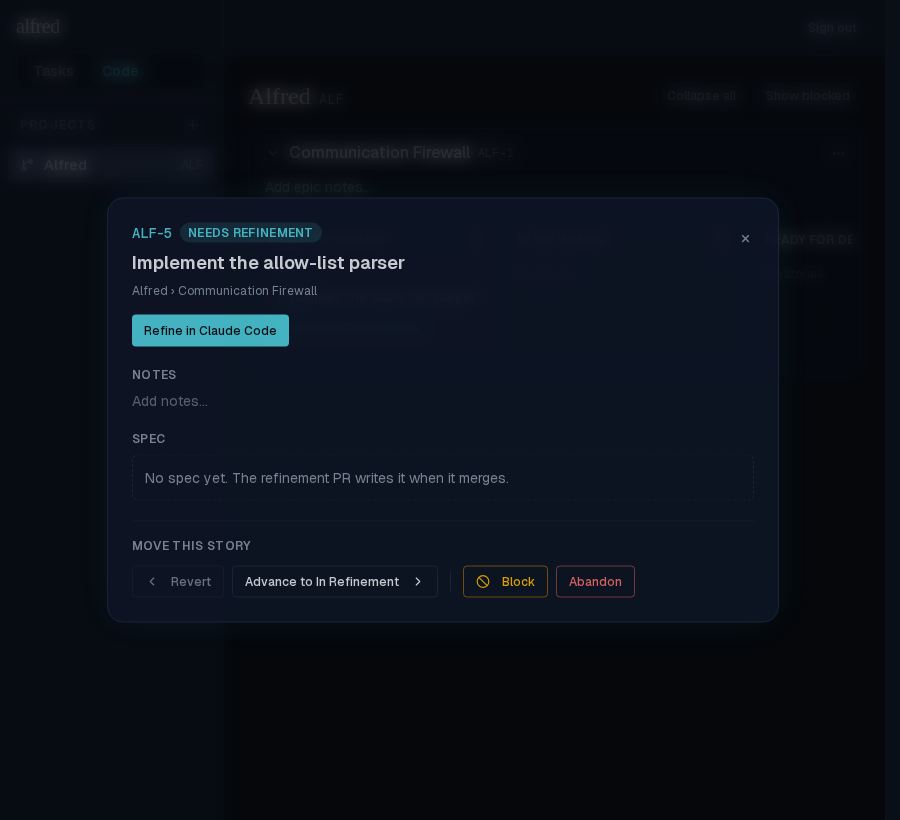
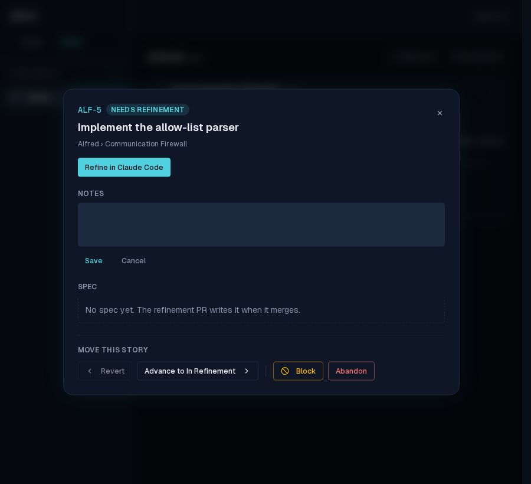
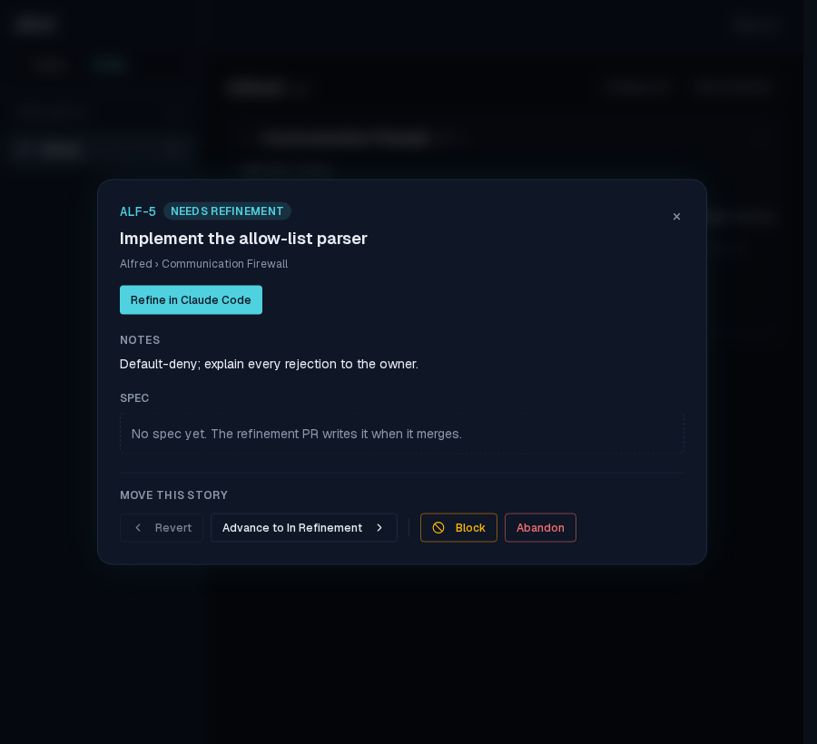
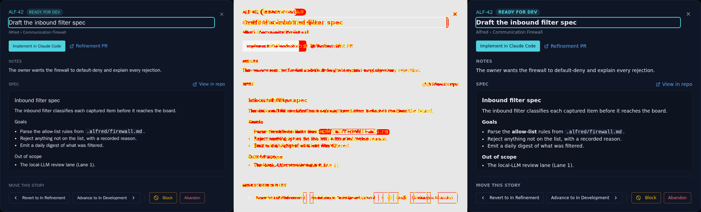

# Inline notes editing in story detail modal

*2026-06-17T21:12:52.958Z*

The story detail modal now lets you edit notes inline, matching the title editor and the epic-notes editor in the board. An empty story shows an 'Add notes…' affordance; clicking it (or clicking existing notes) opens a textarea with Save and Cancel. Save trims and persists via the new updateStoryNotes store action; Cancel and Escape revert without writing. Clearing to empty saves null.

**Step 1 — Empty story: 'Add notes…' affordance**

**Step 2 — Clicking 'Add notes…' enters edit mode with a textarea, Save, and Cancel**

**Step 3 — After saving: notes persist immediately via optimistic update**

**Storybook snapshot: ReadyForDev story notes area visual change.** The Notes section changed from a static paragraph to a clickable button (consistent with the title editor and epic-notes editor patterns). The diff below shows baseline | change | new render:

