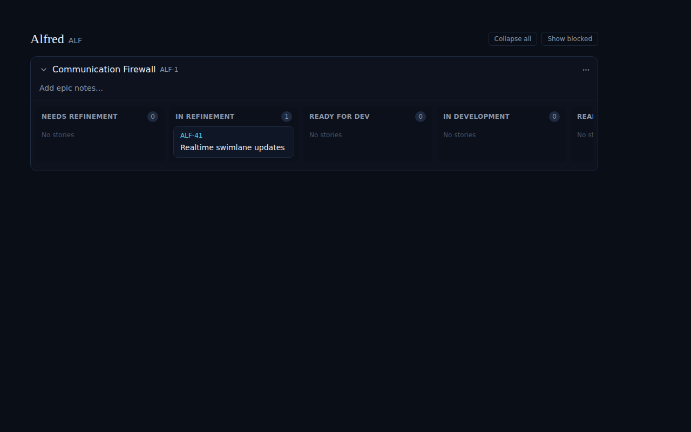
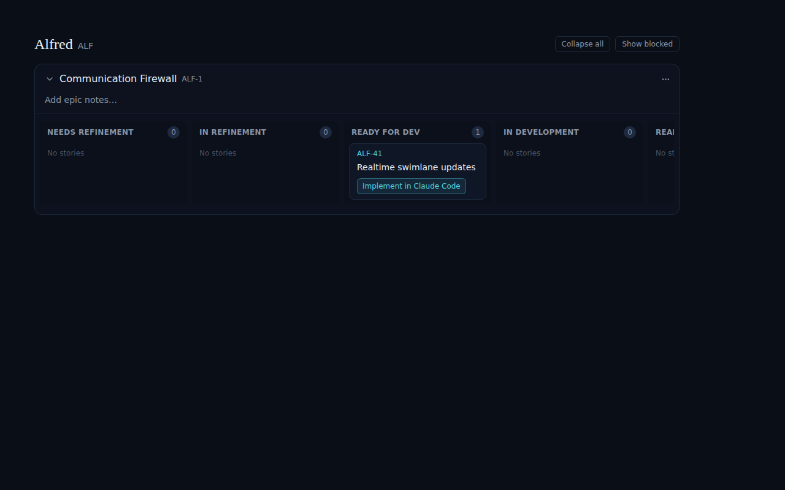

# Realtime swimlane updates (ALF-41)

*2026-06-22T20:13:10.253Z*

The Software Factory board renders each story in the swimlane for its `factory_state`. That column is written **out of band** by the webhook Worker (a refinement PR merge writes `ready_for_dev`, an implementation PR open writes `ready_for_review`, etc.), so an open browser tab never reflected those moves until a hard reload. This change subscribes the open board to Supabase Realtime on the base `code_items` table and applies each UPDATE through the same `codeItemToStoryPatch` projection the optimistic reconcile uses — so the card jumps to its new lane live, with no refresh.

## 1. Enable Realtime on the table (migration). Realtime delivers nothing until the table joins the `supabase_realtime` publication:

```bash
cat database/migrations/0003_realtime_code_items.sql
```

```output
-- Story swimlanes update live: stream code_items row changes to the open Code board.
-- factory_state is written out-of-band by the webhook Worker, so the browser needs a
-- push channel to reflect PR-driven transitions without a reload.
--
-- Realtime delivers nothing until a table joins the supabase_realtime publication. RLS
-- still governs the stream: code_items already has the `authenticated full access` policy
-- (using (true)) from 0002, so an authenticated browser (anon key + session) receives
-- changes; no new policy and no database.types.ts regeneration are required.
alter publication supabase_realtime add table code_items;
```

## 2. The card moves swimlanes live. Below, the board is open on the **Communication Firewall** epic with story **ALF-41** sitting in **In Refinement**. A second writer (the webhook Worker) then writes `factory_state = ready_for_dev` to that `code_items` row — exactly the out-of-band write the Worker performs when an implementation PR is ready. No reload, no navigation, no click on the board.

**Before** — ALF-41 in `In Refinement` (count 1; `Ready for Dev` empty):



**After** — the realtime `code_items` UPDATE arrived and the store re-grouped the card: ALF-41 is now under `Ready for Dev` (and shows its launch button), `In Refinement` is empty — all without a refresh:



These shots are the `Code/Board` Storybook stories `RealtimeMoveBefore` / `RealtimeMoveAfter`: the "after" story drives the **same realtime handler** the production subscription registers (the Storybook supabase stub routes `emitCodeItemsUpdate` to it), so this reproduces the live re-grouping deterministically with no credentials.

## 3. Notifications. A realtime UPDATE that **changes** `factory_state` also fires a toast (`"<ref> moved to <label>"`) and, when the tab is backgrounded, marks the browser tab title (e.g. `● ALF-41 → Ready for Dev`), restored on the next focus. Self-write echoes and non-state updates (e.g. `spec_markdown` only) notify nothing — the handler compares the prior state before dispatching. These paths are covered in `lib/stores/code-store.test.tsx` and `components/code/board.test.tsx`.

## Credentialed closeout (local). Applying `0003` (`supabase db push`) was done 2026-06-22 against the live project; verifying the **full** path end-to-end against the real Worker + Supabase Realtime needs live credentials a CI/web sandbox lacks, so it stays a local/high-touch step. The deterministic behavior above (the swimlane move + notifications) is reproducible here without them.
