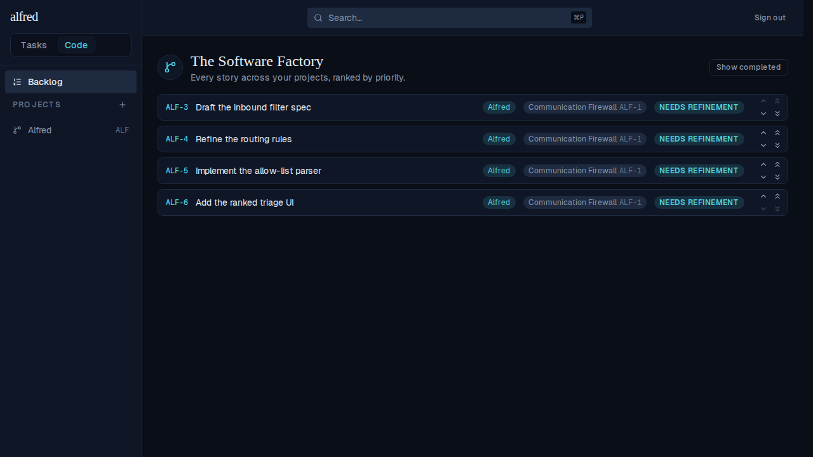
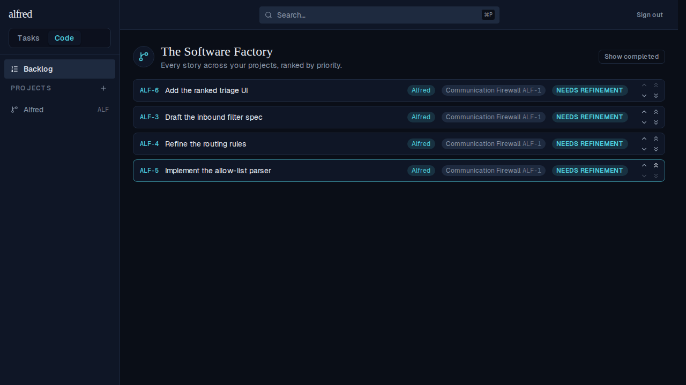
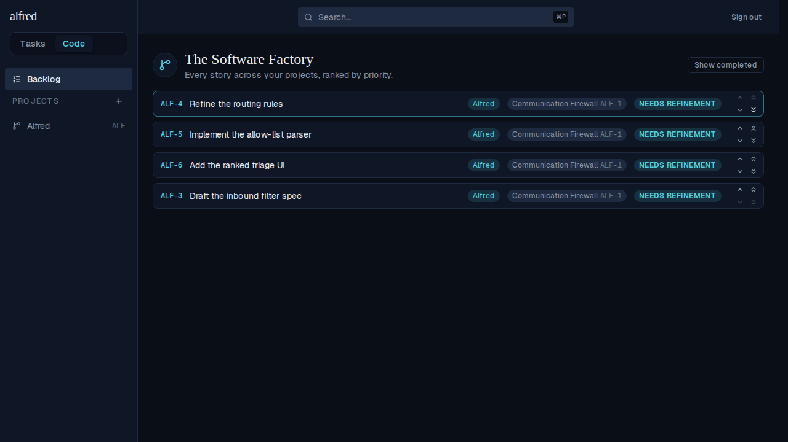

# Bump a story to the top or bottom of the Backlog (ALF-47)

*2026-06-24T16:59:08.906Z*

The Backlog's chevrons could only swap a story with its immediate neighbour, so dragging a story from the bottom to the top meant clicking up over and over. ALF-47 adds **double-chevron** buttons to every Backlog row that jump a story straight to the **top** or **bottom** of the global priority order in one click — beside the existing single-step chevrons.

## The journey: bump to top

The Backlog starts ranked ALF-3, ALF-4, ALF-5, ALF-6. Each row now carries two chevron columns — single chevrons (swap with a neighbour) on the left, double chevrons (jump to top/bottom) on the right. The top row's up/to-top buttons are disabled, the last row's down/to-bottom are disabled.

Clicking the **double-up** chevron on the last row (ALF-6) jumps it past all three rows above it, straight to the top — one click, not three swaps. The row animates into place via the existing FLIP reorder.





## The journey: bump to bottom

Symmetrically, clicking the **double-down** chevron on the first row (ALF-3) drops it below every other story in one click. Starting from the original ALF-3, ALF-4, ALF-5, ALF-6 order, ALF-3 lands at the bottom and the rest shift up.



## How it re-ranks: one atomic UPDATE (migration 0009)

Unlike the neighbour swap (which parks rows at a sentinel to dodge the unique-index 409), a jump re-ranks **one** row to a value no live row holds — `min(priority)-1` for the top, `max(priority)+1` for the bottom — so it's a single-row UPDATE strictly outside the live range. The store mirrors that math optimistically and reconciles from the returned row.

```sql
sed -n '17,33p' database/migrations/0009_move_code_priority.sql
```

```output
returns setof code_items language plpgsql security invoker as $$
declare target_pri bigint; new_pri bigint;
begin
  select priority into target_pri from code_items where ref = p_ref;
  if target_pri is null then
    raise exception 'move_code_priority: unknown ref (%)', p_ref;
  end if;
  if p_to_top then
    select coalesce(min(priority), 0) - 1 into new_pri from code_items where ref <> p_ref;
  else
    select coalesce(max(priority), 0) + 1 into new_pri from code_items where ref <> p_ref;
  end if;
  return query
    update code_items set priority = new_pri where ref = p_ref returning *;
end; $$;

grant execute on function move_code_priority(text, boolean)
```
