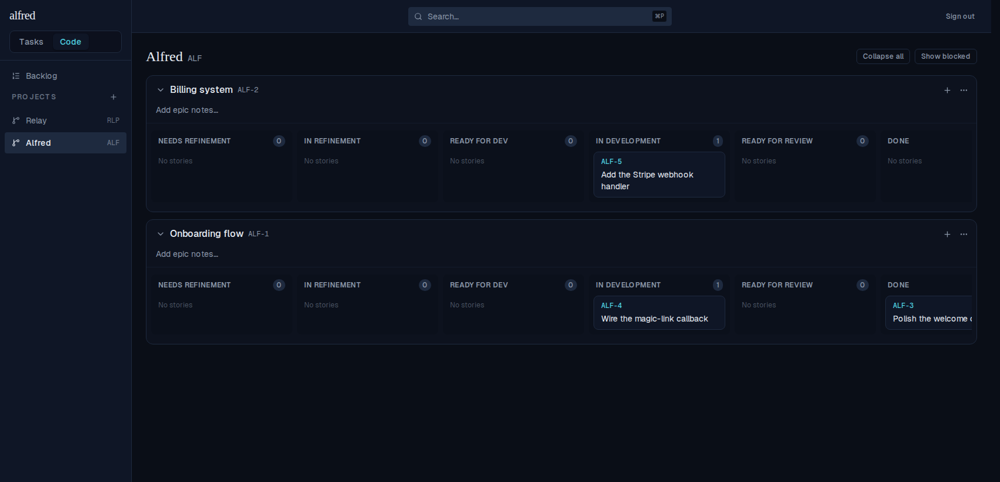

# Rank epics and projects by priority, ignoring done stories (ALF-49)

*2026-06-24T20:09:02.116Z*

Code-module ordering derives from each story's global Backlog `priority` (lower = higher priority). Two bugs are fixed here:

1. **Done stories were polluting the rank.** An epic's (or project's) rank was the best priority across *all* its stories — so a single high-priority **done** story kept a finished-up epic pinned to the top. The rank now considers only **outstanding** stories (everything except `done`/`abandoned`, mirroring the Backlog's own filter), so completed work no longer drags an epic up the board.
2. **Projects in the sidebar were unranked.** The sidebar listed projects in seed order. They're now ordered by each project's best **outstanding** story's priority — the same ranking the board applies to epics, one level up — so the project holding the highest-priority open work leads.

**The seeded scenario** (two projects). *Alfred* has two epics: **Onboarding flow** holds a top-priority story `ALF-3` (priority 1) that is **Done**, plus one open story `ALF-4` (priority 30); **Billing system** holds one open story `ALF-5` (priority 10). *Relay* holds one open story `RLP-2` (priority 8).

The screenshot below (Alfred's board, with the project sidebar) shows the result:

- **Sidebar:** *Relay* (best open priority 8) sorts **above** *Alfred* (best open priority 10) — Alfred's done `ALF-3` (priority 1) is ignored, so it no longer wins the sidebar.
- **Board:** **Billing system** (ALF-2, open priority 10) sorts **above** **Onboarding flow** (ALF-1) — even though Onboarding's `ALF-3` sits in the **Done** lane at priority 1. Done work doesn't rank the epic.

