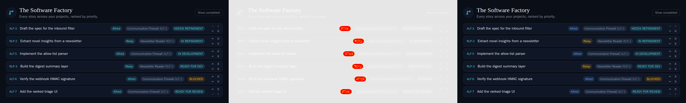

# ALF-50: Code project colors

*2026-06-24T20:19:41.090Z*

ALF-50 gives each code project a distinct colour from the glowing accent palette so they're easy to tell apart at a glance — most importantly on the cross-project **Backlog**, where every row's project badge was previously the same teal.

Colours are assigned **positionally**: a project's slot in the ProjectNav order (oldest-first) round-robins through the palette — project #1 blue, #2 amber, #3 green, #4 teal, then it repeats. There's no stored colour column and no per-project config; the mapping is a pure function (`frontend/lib/code/project-color.ts`) reused by both the Backlog badge and the ProjectNav branch icon, so a project wears one colour everywhere.

**The change, shown by the Backlog visual snapshot.** The seeded Backlog story spans two projects — Alfred (#1 → blue) and Relay (#2 → amber) — whose badges were both teal before. The committed snapshot's 3-panel diff (baseline · changed pixels · new render) shows the recolouring lands on exactly the project badges and nothing else (1.14% of pixels moved):

