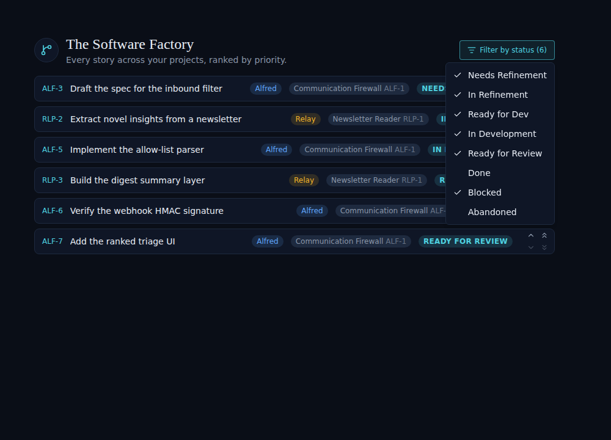
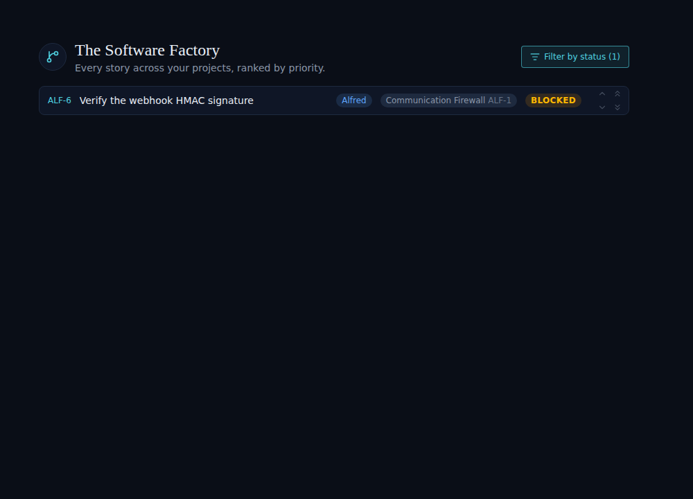
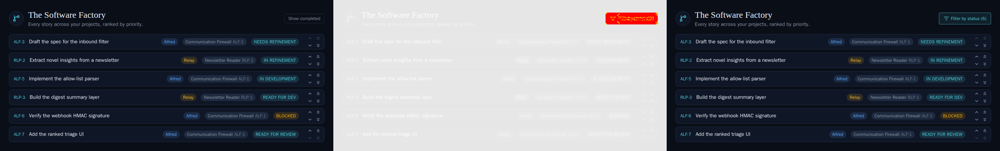

# ALF-52: Filter the backlog by status

*2026-06-26T19:16:16.142Z*

The Backlog header's old **Show completed** toggle is replaced by a **Filter by status** dropdown: a multi-select checkbox menu with one entry per factory state (the six happy-path lanes plus the off-board Blocked/Abandoned). The selection drives `useBacklog({ statuses })`, which lists only the stories whose status is checked. It defaults to the outstanding states, so `done`/`abandoned` stay hidden until the owner checks them — preserving the prior default while making every other status filterable. The trigger turns teal and shows a count whenever the selection narrows the list.

Default view: the trigger reads **Filter by status (6)** and the menu shows the six outstanding states checked, with **Done** and **Abandoned** unchecked.

Narrowing the selection to a single status (here only **Blocked**) instantly reduces the list to the matching stories; the trigger reflects the count **(1)**.

The committed Storybook visual baseline moved with the header control. Three-panel diff — **baseline** (old *Show completed* pill) · **changed pixels** · **received** (new *Filter by status* button). The new baseline was approved with `npm run test:storybook:update -w frontend`.

