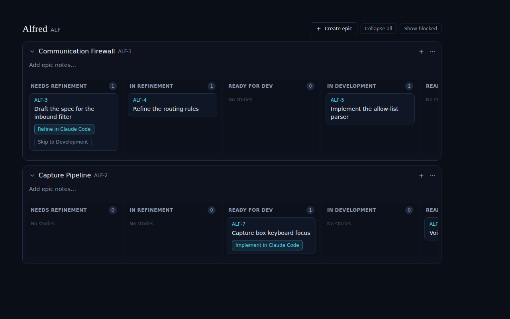
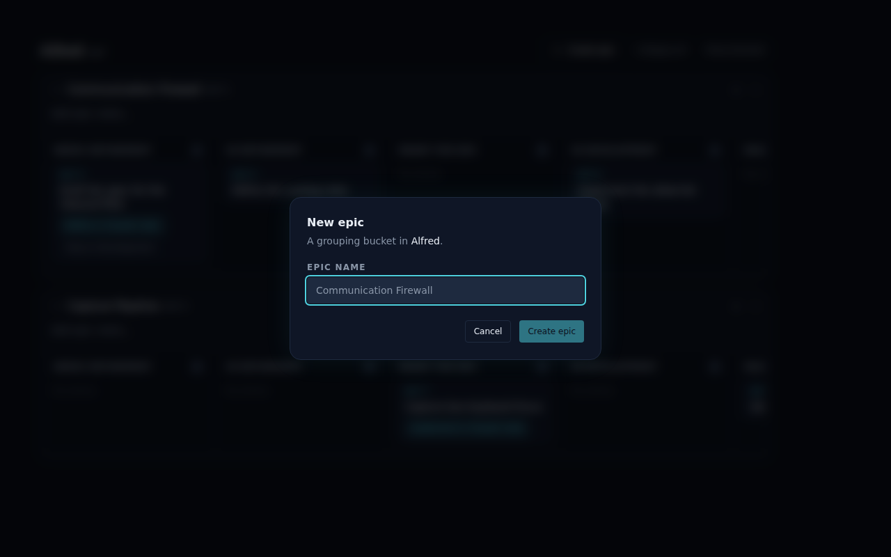

# Create epics from the project view (ALF-53)

*2026-06-26T18:29:25.564Z*

ALF-53 adds a **"+ Create epic"** button to the project board's toolbar, sitting alongside the existing *Collapse all* / *Show blocked* / *Show archived* controls. Previously an epic could only be created mid-flow from the gate ("Send to Code module"); now you can mint one directly on the board. The button reuses the existing `NewEpicDialog` and the `createEpic` store action (optimistic insert + reconcile against the `create_epic` RPC's server-allocated ref), so the new epic lands on the board with no refetch.

## The button in the board toolbar

The toolbar now leads with **+ Create epic**. It is always present — even when the project has no epics yet — so the very first epic can be created without leaving the board.

## The new-epic dialog

Clicking it opens the existing `NewEpicDialog`, scoped to the current project ("A grouping bucket in **Alfred**"): a single required **Epic name** field. **Create epic** stays disabled until the name is non-empty; the `create_epic` RPC allocates the shared per-project ref. Cancel / Escape / overlay-click close without writing.

