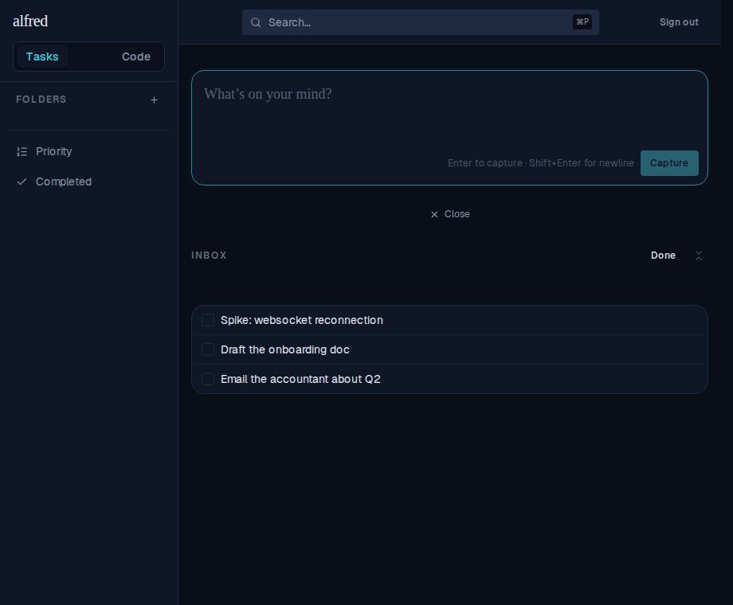
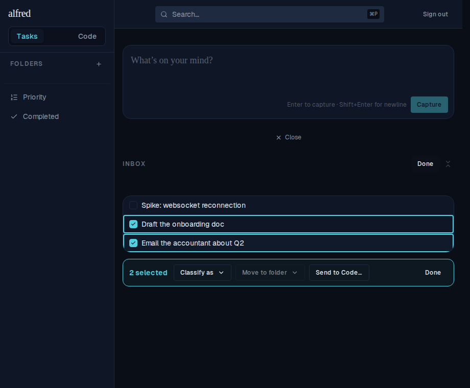
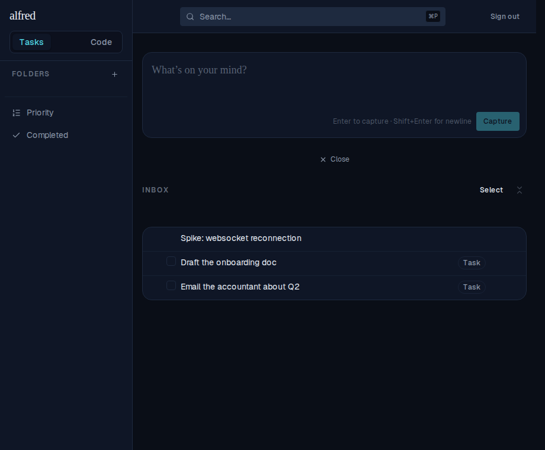
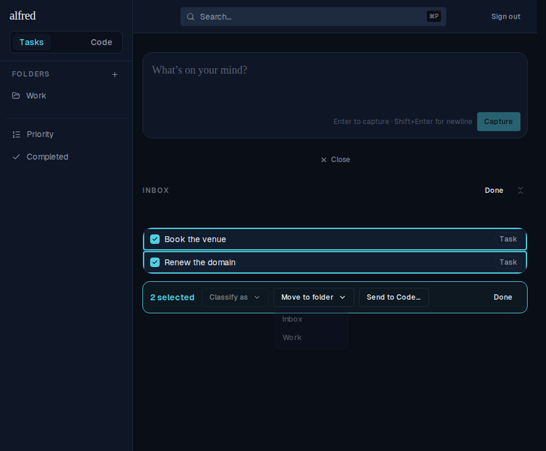
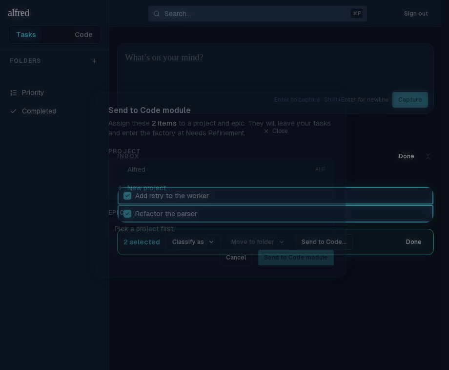

# Inbox multi-edit: bulk classify, file, and send-to-code

*2026-06-29T15:17:12.994Z*

ALF-54 adds an explicit **Select** mode to the Inbox so several captured items can be classified, filed into a folder, or sent to the Code module in one pass — instead of repeating the per-row "More actions" menu N times. The selection lives in a new `InboxSelectionProvider` coordination store (mirroring `ExpansionProvider`); the bulk actions reuse the existing per-item routes via `Promise.allSettled`, so partial failures roll back individually. Captured live against the Playwright mock backend.

**1 · Enter select mode.** Pressing *Select* in the Inbox header swaps each row's leading control for a selection checkbox; *Done* (or Esc) exits.

**2 · The action bar + the enablement matrix.** Once ≥1 item is selected the bar appears with a live count. Each action gates on the selection's composition: this all-unclassified selection has *Classify as* live and *Move to folder* disabled (task-only), while *Send to Code…* admits any item. Selected rows get the teal ring.

**3 · Bulk classify.** Picking *Classify as → Task* flips `item_type` on all selected items in one optimistic pass; on full success the selection clears and mode exits, leaving the rows badged as Task (the untouched capture stays unclassified).

**4 · Bulk move to folder.** An all-task selection enables *Move to folder*; its picker lists every folder plus *Inbox* (to unfile). Each selected task moves with its subtree cascading.

**5 · Bulk send to Code.** *Send to Code…* opens the existing gate, now generalized to a batch: one project + epic admits every selected item to the factory, and the gated items leave the Inbox. The copy pluralizes ("these 2 items").

These flows are covered end-to-end in `e2e/inbox-multi-edit.spec.ts`, with store and component tests in `inbox-selection-store.test.tsx`, `tasks-store.test.tsx` (the bulk actions + partial-failure rollback), and `inbox-bulk-bar.test.tsx`.
