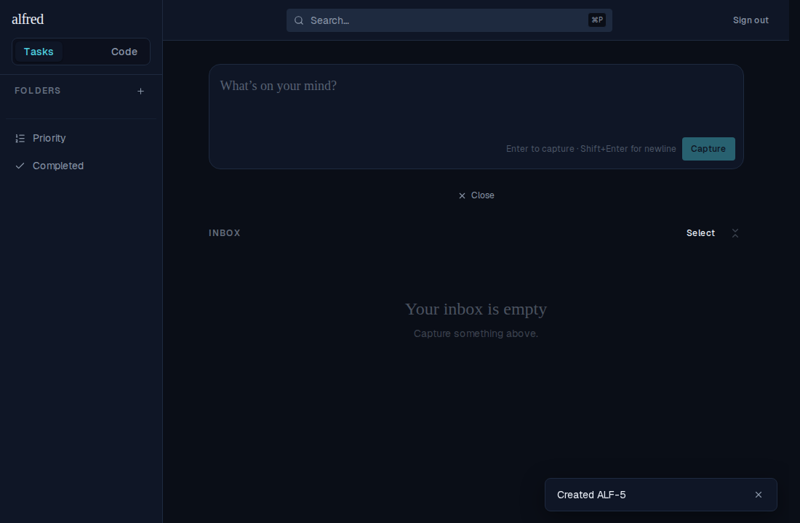
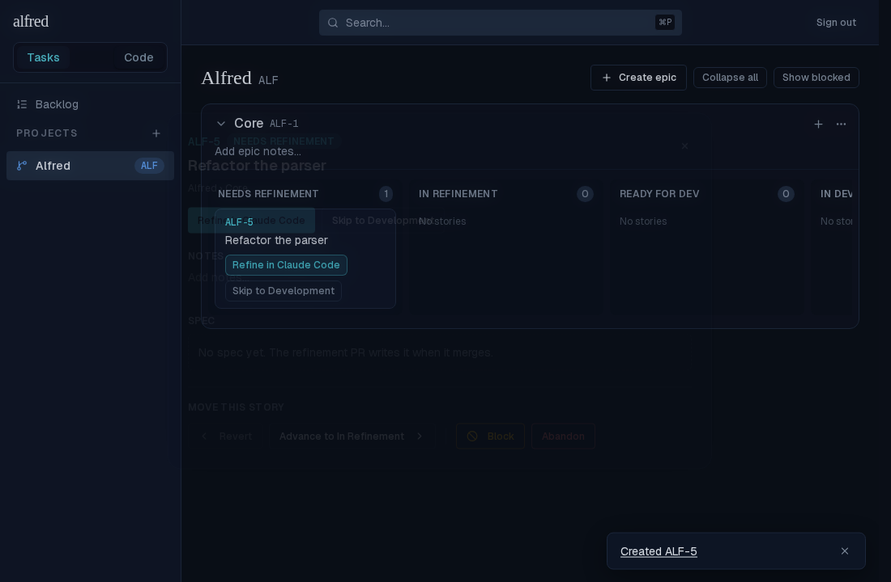

# ALF-68 — Clickable ticket-creation toasts

*2026-07-01T04:06:08.649Z*

Sending a task through the gate ("Convert to Code Story…" / "Send to Code module…") fires a **"Created <ref>"** confirmation toast. Before ALF-68 that toast was inert text: you knew the story existed but had to switch to the Code module and hunt for the new card yourself.

ALF-68 gives the toast store an optional `href` and renders a toast that carries one as a link (a client-side `ViewLink`, kept a sibling of the dismiss button so there are no nested interactive elements). The single-item toast deep-links to the new story's board modal via the existing `/code/<projectId>?story=<ref>` seam (`board.tsx`), the same mechanism the Backlog rows already use.

**Before the click** — a task was just converted; the **"Created ALF-5"** toast sits bottom-right over the Tasks view. It is now a link (it reveals an accent-blue underline on hover).

**After the click** — one click lands on the story's board at `/code/<projectId>?story=ALF-5` with the **detail modal open** on "Refactor the parser" (ALF-5, Needs Refinement). The click both navigated and dismissed nothing prematurely — the toast is still visible mid-transition. No manual module switch, no hunting for the card.

A toast without an `href` (every error toast, the realtime code-move toast, the bulk "Sent N items to Code" toast) still renders as plain, non-link text — no regression. The bulk toast is intentionally left non-clickable: it has no single-story target, and the new `href` field makes extending it a one-line change.
