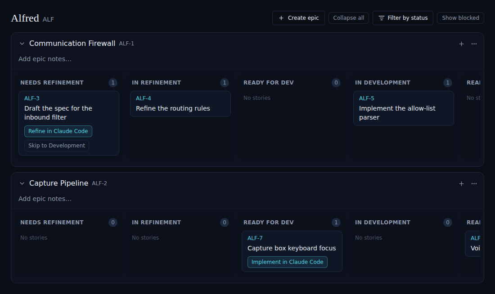
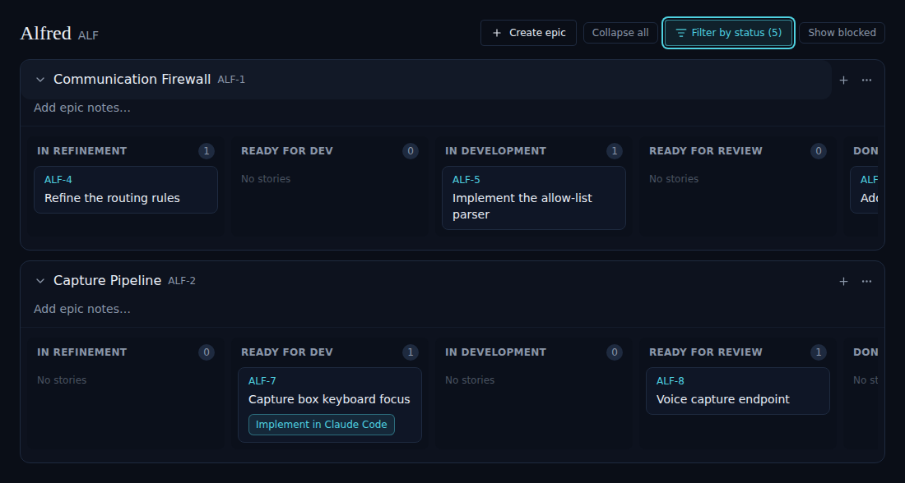

# ALF-76 — Filter by status on the project board

*2026-07-01T04:43:40.237Z*

The project board (a Kanban of the six happy-path status columns per epic) gains a **Filter by status** dropdown in its toolbar, mirroring the one the cross-project Backlog already has. Unchecking a status hides that swimlane column across every epic, letting the owner focus the board on the columns they care about. The default is all six columns shown, so an untouched board is identical to before; the separate *Show blocked* and *Show archived* toggles are unchanged (blocked/abandoned are off-track cards, never lanes). The dropdown + its selection state were extracted into a shared `StatusFilterMenu` component and a `useStatusFilter` hook, now used by both the Backlog and the board.

```bash
npm test -w frontend -- components/code/board.test components/code/status-filter-menu components/code/backlog lib/hooks/use-status-filter 2>&1 | grep -E "Tests:|Test Suites:"
```

```output
Test Suites: 5 passed, 5 total
Tests:       67 passed, 67 total
```

## The board at rest — every status column shown

The default selection is all six happy-path states, so the board is identical to before the feature. The **Filter by status** trigger sits between *Collapse all* and *Show blocked* and carries no count while at the default.



## After unchecking "Needs Refinement" — the column is hidden everywhere

Unchecking a status drops its swimlane column from **every** epic at once (both *Communication Firewall* and *Capture Pipeline* now lead with *In Refinement*). The trigger turns teal and shows the live selected count — `Filter by status (5)`. The *Show blocked* / *Show archived* toggles and the off-track cards are untouched, since blocked/abandoned are never columns.


