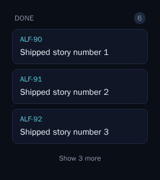

# Collapse the Done column to the latest 3 completions (ALF-81)

*2026-07-03T16:16:21.848Z*

The **Done** swimlane on the Code board accumulates every finished story, so over time it buries the active lanes under a long scroll of completed work. ALF-81 collapses it: the Done column now opens showing only the **latest 3 completions**, with a **"Show more"** control that reveals **5 more at a time** until all are shown. Two parts: (1) the store recency-sorts the Done lane so "latest" means most-recently-completed (`code_updated_at` descending — bumped when a story transitions into `done`); (2) the Swimlane caps the Done lane to a growing window while every other lane keeps rendering every card.

**The collapsed Done lane, rendered.** The screenshot below is a committed Storybook visual snapshot (`Code/Swimlane → DoneCollapsed`) of the resting state, fed a lane of **six** completed stories. The count badge reads the true total (`6`), yet only the latest **three** cards render, and a **"Show 3 more"** control sits below — clicking it reveals the next batch, and it disappears once all six are shown.

The recency ordering and the reveal-5-more behavior are pinned by unit tests alongside this change (`swimlane.test.tsx`, `board.test.tsx`, `code-store.test.tsx`): a Done lane seeded with completions whose priority order differs from their completion order comes out newest-first, and each "Show more" click widens the visible window by five until the control retires.
