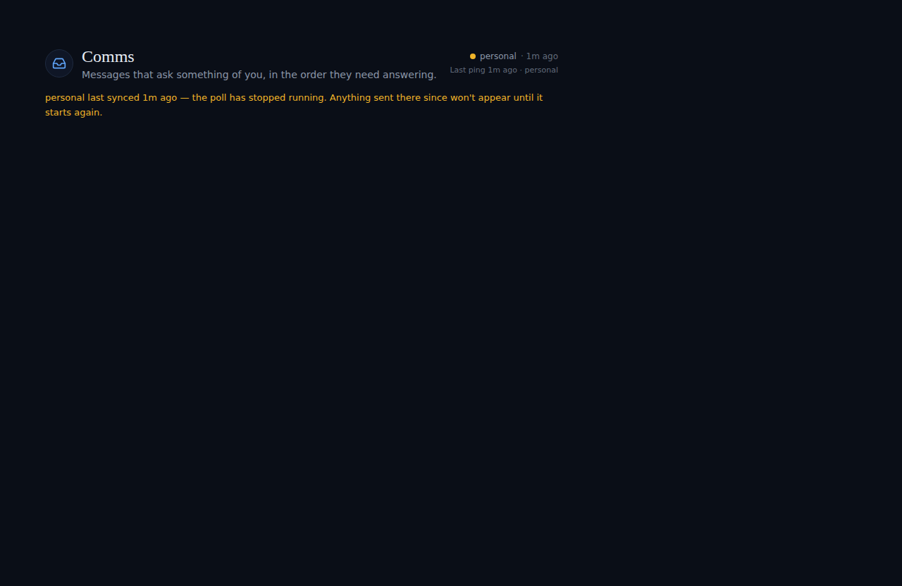
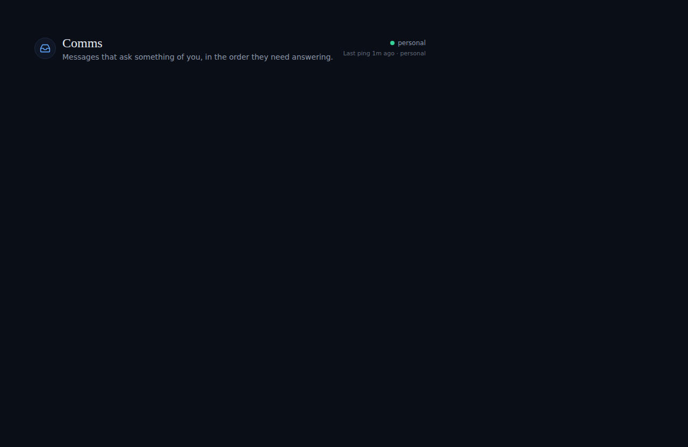
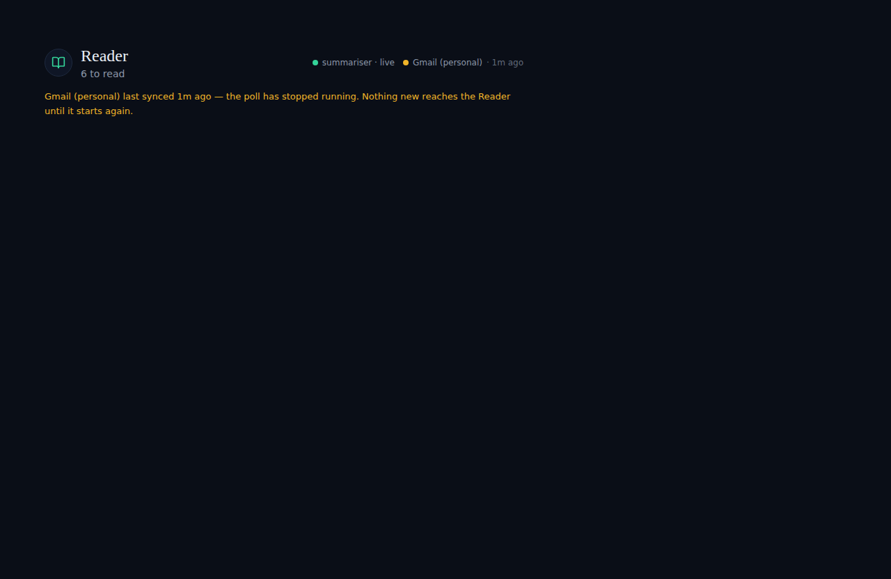
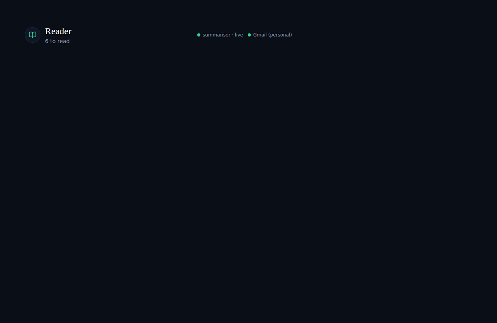

# Account dots hold live through a reconnect

*2026-09-23T13:59:10.225Z*

ALF-252: the account/mailbox status dot in Comms and Reader used to flash offline for the fraction of a second a reconnect read (the module's own re-read, triggered when a backgrounded tab returns, the network comes back, or the page is restored from bfcache) took to land — even when the source was still fine. The dot is derived purely from server timestamps (accountHealth in lib/comms/health.ts) against a freshly-ticking clock, so the instant that clock caught up with a stale cached row, the dot would recompute as stale/erroring for a beat before the fresh read confirmed it was fine after all.

The fix (lib/comms/health.ts's heldNow, ACCOUNT_RECONNECT_GRACE_MS = 5s): while the module's own reconcile attempt is in flight, both CommsHeader and ReaderHeader evaluate the account dot against a clock held at that attempt's own start rather than the live clock, for a short grace window. Nothing about the account row itself can have changed yet — the store only replaces it wholesale once the read lands — so this exactly reproduces whatever the dot showed right before the reconnect began. Once the read lands, the true state (and true clock) take back over; a source that is genuinely still down still shows it, just no sooner than the reconnect itself allowed for.

Comms — before: the tab's own reconcile read for the personal account just launched (2s ago), but the account's own 60s interval had already lapsed (62s since its last check-in) by the time the clock ticked. Without the fix, the dot flashes amber/stale and the sentence beneath it appears, even though the very next successful read (which is already in flight) will say the account is fine.

Comms — after (this PR): same scenario, same account data, same reconnect timing — the only change is that the dot now reads accountHealth against the clock held at the reconnect's own start, which is inside the grace window. It stays live, and the sentence stays off, until the read actually lands and says otherwise.

Reader — before: the exact same fix, applied to the Reader module's own mailbox dot (ReaderHeader), which shares the same accountHealth derivation and gets its own reconcileStartedAt from the Reader store's health reconcile. Without the fix, the mailbox dot and sentence flash the same false alarm.

Reader — after (this PR): the mailbox dot holds live through the same window.

Bounded, not indefinite: the hold only lasts ACCOUNT_RECONNECT_GRACE_MS (5s) from the reconnect attempt's own start — long enough to cover a normal round trip, nowhere near long enough to mask a source that is genuinely still down. If the read hangs past that window, the dot goes back to reading the true clock. Both stories above are new, permanent Storybook stories (ReconnectingHoldsLive) with their own committed visual-regression baselines; the underlying behavior is pinned by unit tests in lib/comms/health.test.ts (heldNow), lib/stores/comms-store.test.tsx and lib/stores/reader-store.test.tsx (the reconcile-attempt timestamp), and integration tests in comms-header.test.tsx, reader-header.test.tsx, comms-queue-view.test.tsx and reading-list-view.test.tsx that hold a real fetch pending and assert the dot never flashes offline.
