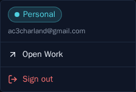
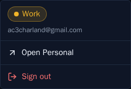

# Top-right account / instance switcher

*2026-07-17T19:42:54.279Z*

ALF-64b replaces the bare **Sign out** button in the header's top-right with an **instance menu**. alfred runs as two physically-isolated deployments — a *Personal* and a *Work* second brain, each its own Supabase + Vercel project — and the menu is how you move between them. Which instance you're in is read from `NEXT_PUBLIC_INSTANCE_*` env vars by a small typed helper (`lib/instance.ts`); the menu itself is a Radix dropdown (`components/shell/instance-menu.tsx`).

### Personal instance (teal accent)

The trigger is an accent **pill** showing this instance's label + a chevron (accessible name `Account menu`). Opening it reveals the signed-in email, an **Open Work** link — a plain cross-origin anchor (`rel="noreferrer"`) that fully navigates to the other, session-less origin — and the unchanged **Sign out** action. The header pill repeats the accent so the current brain is unmistakable.

### Work instance (amber accent)

The same component in the Work deployment: `NEXT_PUBLIC_INSTANCE_ACCENT=amber` tints the pill amber, and it links back to Personal.

### Single deployment / local dev (no other instance)

When `NEXT_PUBLIC_OTHER_INSTANCE_URL` is unset, `getInstanceConfig().other` is `null` and the switch link is simply omitted — so merging this before the second deployment exists is a no-op on the live site.

