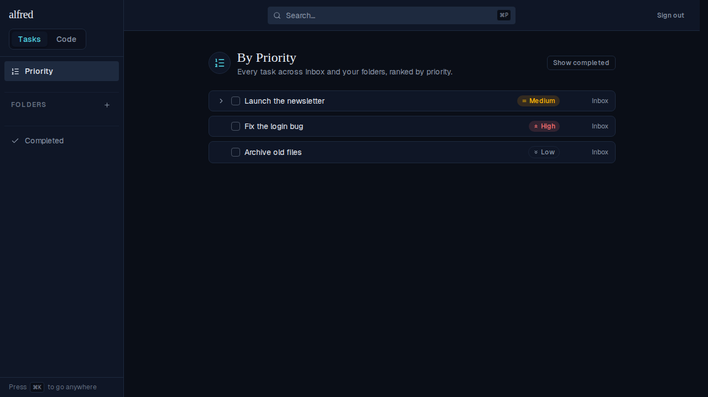
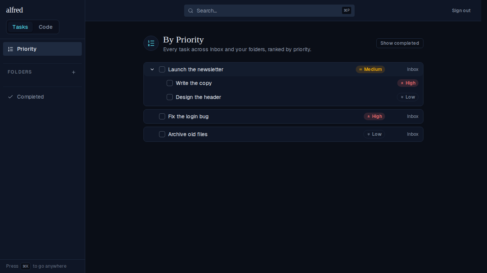
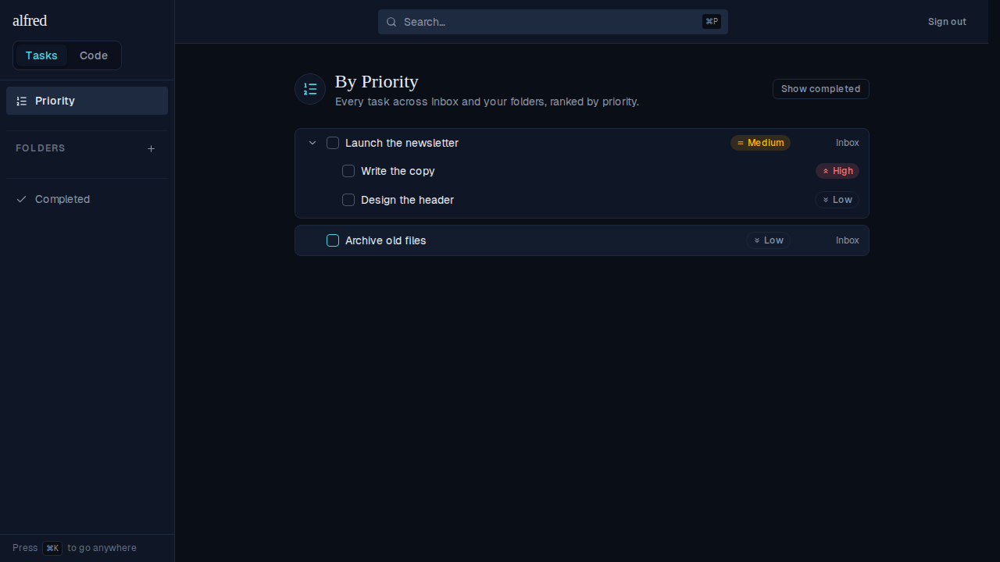

# By-Priority rows are normal task components (ALF-101)

*2026-07-06T17:07:32.459Z*

ALF-101: the By-Priority view's rows used to be a read-only index — a title, a due/priority chip and a folder label. They are now normal, actionable task components: a completion checkbox and an expand chevron that reveals subtasks inline (recursively), while keeping the title-click jump to the task's folder (ALF-96), the due/priority chips and the folder label. The add-subtask affordance and the ⋯ actions menu are deliberately left off this triage-focused view.

**1. The ranked list — every row a task component.** Each row now carries a completion checkbox and (for tasks with subtasks) an expand chevron, alongside the existing priority chip and folder label. "Launch the newsletter" sorts to the top because its High subtask rolls up over its own Medium level.

**2. Expanding a task reveals its subtasks inline.** Clicking the chevron discloses the subtree — each subtask is itself a full row (own checkbox + priority chip), indented under the parent's card. Subtasks share the root's bucket, so they carry no folder label.

**3. Ticking a task complete from its checkbox.** Completing "Fix the login bug" from the By-Priority view drops it out of the active-only list immediately (optimistic), the same as completing it anywhere else. A task with active subtasks would first raise the cascade-confirmation modal.

