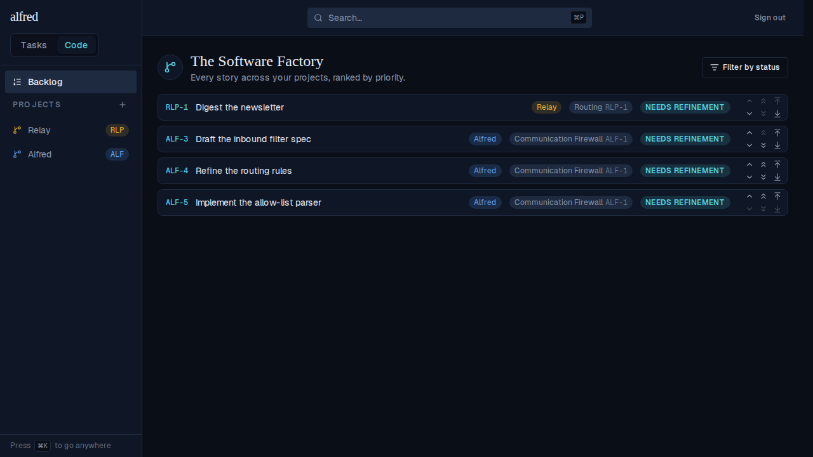
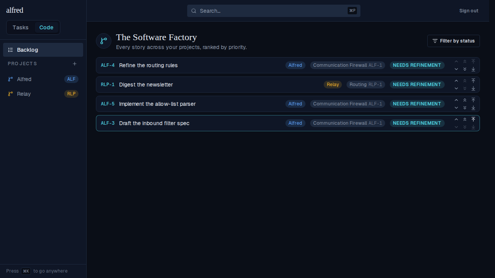

# Bump to top/bottom of project vs. top/bottom of the whole Backlog (ALF-110)

*2026-07-07T22:14:59.313Z*

The Backlog row used to have only one jump pair: double chevrons that sent a story to the top or bottom of the WHOLE cross-project Backlog. ALF-110 splits that into three distinct actions, each with its own hover text: single chevrons still swap with the visible neighbour; the double chevrons are repurposed to jump to the top/bottom of the story's own PROJECT; and new arrow-to-line icons take over the old top/bottom-of-the-whole-Backlog behavior. A brand-new story (from the gate or the board's +) now also defaults to the top of its project instead of the top of the whole Backlog.

## The journey

A two-project Backlog: Relay's RLP-1 ranks best overall; Alfred's ALF-3, ALF-4, ALF-5 follow. Each row now shows three button groups: single chevrons (swap), double chevrons (top/bottom of project), and the new arrow-to-line icons (top/bottom of the whole list).



Clicking the double-up chevron on ALF-5 ("Move ALF-5 to top of project") jumps it above ALF-3 and ALF-4 — its own project's stories — but it does NOT cross RLP-1, which stays put at the top of the whole Backlog.


Clicking the NEW arrow-up-to-line icon on ALF-4 ("Move ALF-4 to top of list") jumps it above every story in EVERY project — it leapfrogs RLP-1 too, landing at the true top of the whole Backlog.



## Hover text on all three button groups

Each button's real `title` attribute, read off the live rendered row (via Playwright, not hand-written) — this is what a mouse hover shows:

```bash
cat docs/demos/alf-110-bump-buttons/button-titles.json
```

```output
{
  "Move ALF-4 up": "Swap with the story above",
  "Move ALF-4 down": "Swap with the story below",
  "Move ALF-4 to top of project": "Move to the top of this story's project",
  "Move ALF-4 to bottom of project": "Move to the bottom of this story's project",
  "Move ALF-4 to top of list": "Move to the top of the whole Backlog",
  "Move ALF-4 to bottom of list": "Move to the bottom of the whole Backlog"
}
```

## Default for new stories: top of project, not the whole Backlog

The gate/board 'create story' path used to stamp `min(priority) - 1` across the WHOLE Backlog (ALF-71). ALF-110 narrows that to the story's own project via a shared `top_of_project_priority()` helper. The real-Postgres integration suite proves both the project-scoped RPC and the new creation default, alongside the existing global-jump/swap checks:

```bash
npm run test:integration -w database
```

```output

> database@0.0.0 test:integration
> node src/run.ts

✓ create_code_story lands a new story at top priority (ALF-71) — baseline=-1, new=-2 (ref=ALF-2)
✓ enter_code_module lands a gated story at top priority (ALF-71) — min before=-2, gated=-3 (ref=ALF-3)
✓ swap_code_priority swaps adjacent ranks without a 409 (0007) — ALF-4:-4→-5, ALF-5:-5→-4
✓ move_code_priority jumps a story past both extremes (0009) — ALF-8: top=-8 → bottom=0
✓ move_code_priority_in_project reorders within a project without crossing a better-ranked story from another project (ALF-110) — other=-8 (unmoved), p1=-7.5, p2=-7.75 (now top of project, still behind other)
✓ create_code_story lands a new story at the top of its PROJECT, not the whole Backlog (ALF-110) — other project best=-8, project top before=-7.75, new=-7.875
✓ task_items view surfaces late-added items columns (priority, recurrence) (0011) — priority=high, recurrence carried
✓ anon cannot insert (RLS write denial) — anon insert rejected by RLS
✓ anon sees zero code_items rows despite rows existing (RLS read) — admin sees 12, anon sees 0

db-integration: 9/9 passed.
```
