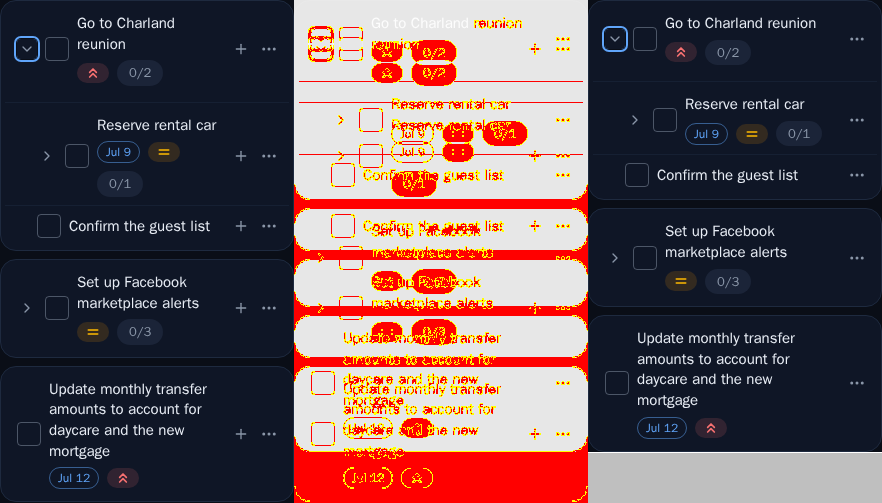
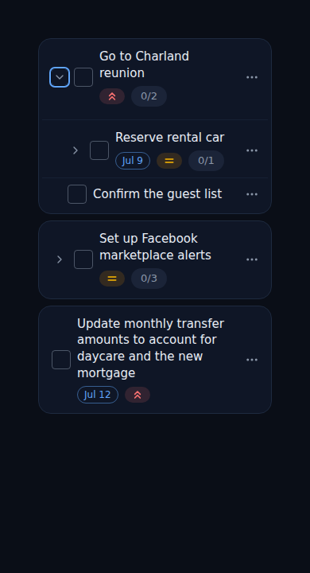
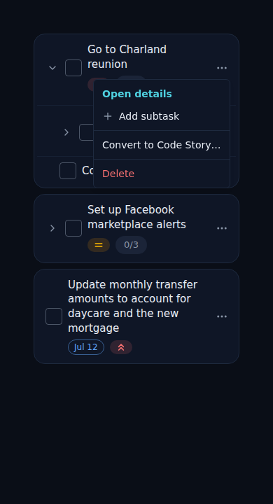
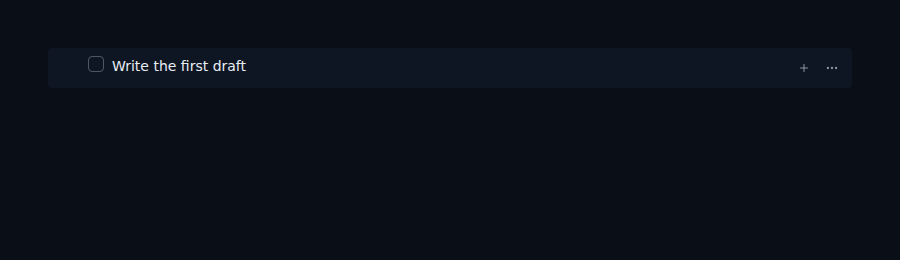
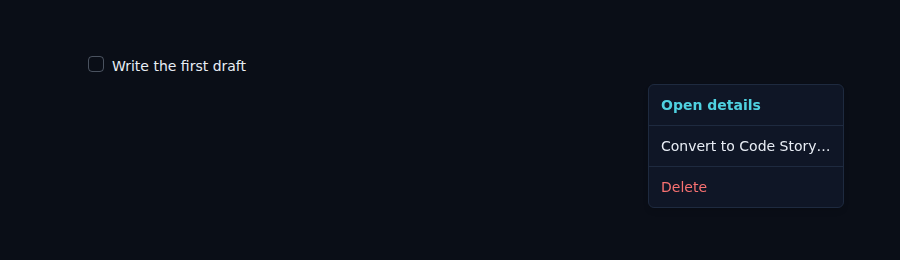

# ALF-118 · Collapse the mobile + into the dot menu

*2026-07-16T21:02:14.553Z*

## What changed

On a phone the task-row action cluster used to show **two** always-visible controls: a `+` (add subtask) and the `⋯` dot menu. ALF-118 collapses the `+` into the dot menu on mobile:

- The inline `+` button is now **desktop-only** (`hidden md:inline-flex`) — unchanged (hover-revealed) at `md`+.
- An **"Add subtask"** item (with a `+` glyph) now sits **directly below "Open details"** in the `⋯` menu on mobile. It's `md:hidden` so desktop — where the visible `+` remains — never doubles up, and it's rendered for **task rows only** (code/unclassified rows nest no subtasks).
- Both affordances open the same inline capture box + expand the subtree.

## Behaviour is pinned by unit tests

The mobile menu affordance and its gating are covered by `task-row.test.tsx`, and the responsive hide by `task-row.styles.test.ts`.

```bash
cd frontend && npm test -- task-row.test task-row.styles.test -t "Add subtask|add subtask|md:hidden|Open details|add-subtask" 2>&1 | grep -E "Tests:|✓|menu|Add subtask" | head -40
```

```output
> jest --passWithNoTests task-row.test task-row.styles.test -t Add subtask|add subtask|md:hidden|Open details|add-subtask
Tests:       191 skipped, 24 passed, 215 total
Ran all test suites matching task-row.test|task-row.styles.test with tests matching "Add subtask|add subtask|md:hidden|Open details|add-subtask".
```

## Visual evidence (mobile Storybook snapshot)

The `Tasks/TaskRow` **MobileCards** baseline moved: with the `+` gone from the head line, the long-title leaf ("Update monthly transfer amounts…") reclaims that width and wraps to fewer lines, so the card frame is shorter (294×503 → 294×452). The 3-panel diff below is **baseline | changed pixels (red) | new render**. The other fixed-height mobile snapshots stay within the 1% tolerance, so only this baseline is re-approved.



## Mobile — the `+` collapses into the `⋯` menu

Resting mobile cards: each row's action cluster now shows **only** the `⋯` — the inline `+` is gone.



Opening a task row's `⋯` menu on mobile — **"+ Add subtask" sits directly below "Open details"**:



## Desktop — no regression

The desktop row is unchanged: hovering it still reveals **both** the inline `+` (add subtask) and the `⋯` menu.



And the desktop `⋯` menu is unchanged too — **no "Add subtask" item** (it's `md:hidden`); "Open details" still leads, since the visible `+` already covers add-subtask here:


