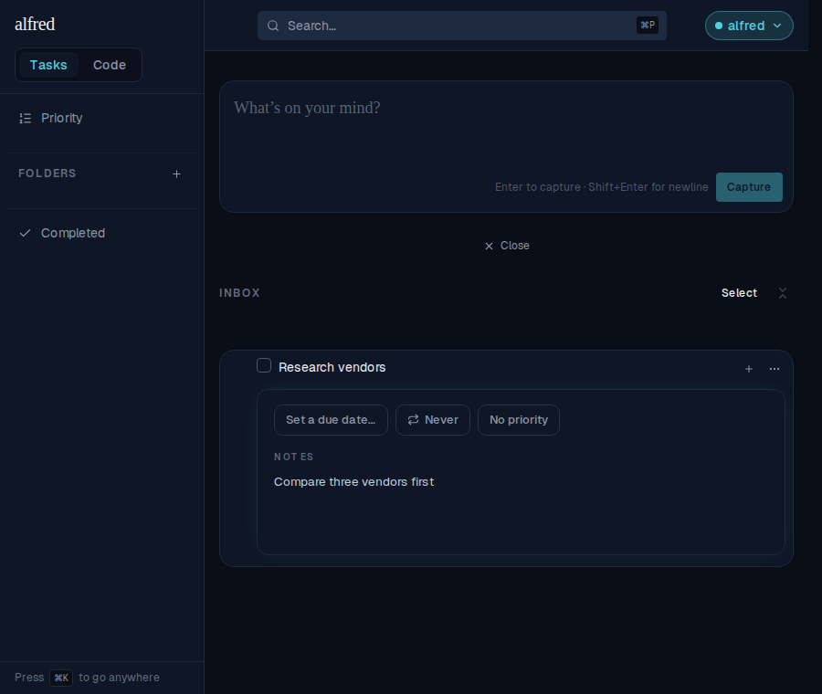
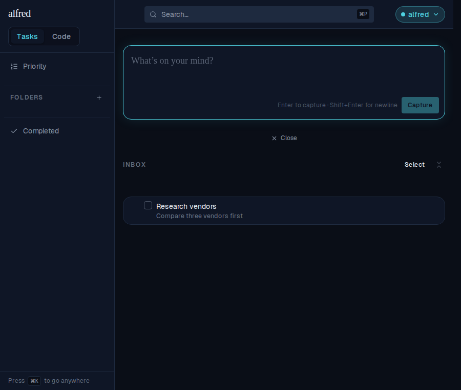
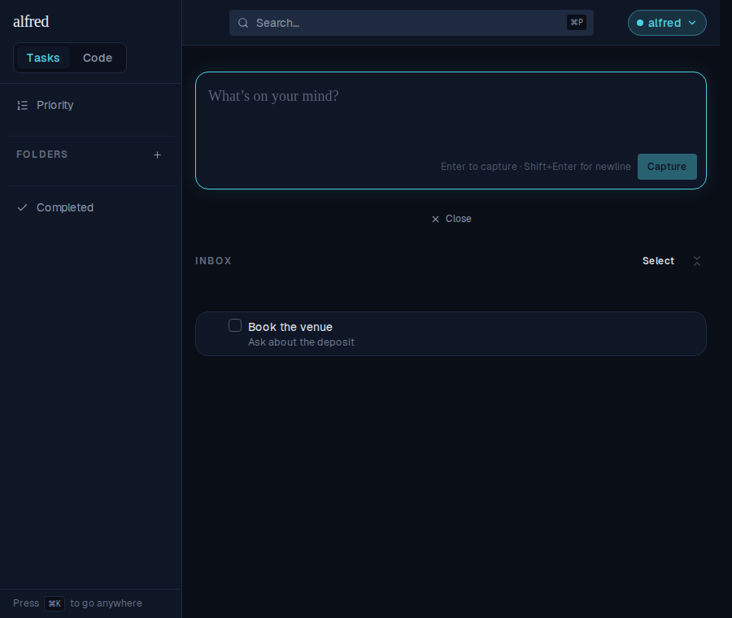

# ALF-126 — notes are saved when the detail panel is dismissed

*2026-07-25T13:08:04.835Z*

A task's detail panel (⋯ → "Open details") auto-saves its Notes **on blur**. But every dismissal route — Escape, a pointer press outside the row, "Collapse all" — closes the panel by **unmounting** it, and a removed element never fires blur. So typing notes and then dismissing the panel silently threw the text away.

The fix commits the pending draft on unmount as well, so the dismiss itself saves. Screens below are the live app driven through the Playwright mock backend, at a 900×760 viewport.

## Step 1 — type notes into an open detail panel

Same starting point in both the broken and fixed builds: open the row's details and type a note, leaving the cursor in the textarea.

## Step 2 — press Escape, then reload the page

Escape dismisses the panel. Reloading re-reads the row from the backend, so the row's one-line notes preview shows what was actually persisted — not what the client store happened to be holding.

**Before the fix — the notes are gone:**

**After the fix — the notes survived the dismiss and the reload:**

## Step 3 — the same holds for an outside-click dismiss

Typing "Ask about the deposit" and then clicking outside the row (rather than pressing Escape) takes the same unmount path, and is likewise saved:

Notes that were never touched still save nothing, and emptying the notes still clears them — both pinned by unit tests in `frontend/components/tasks/task-row.test.tsx`, alongside a browser-level check in `frontend/e2e/task-row.spec.ts`.
