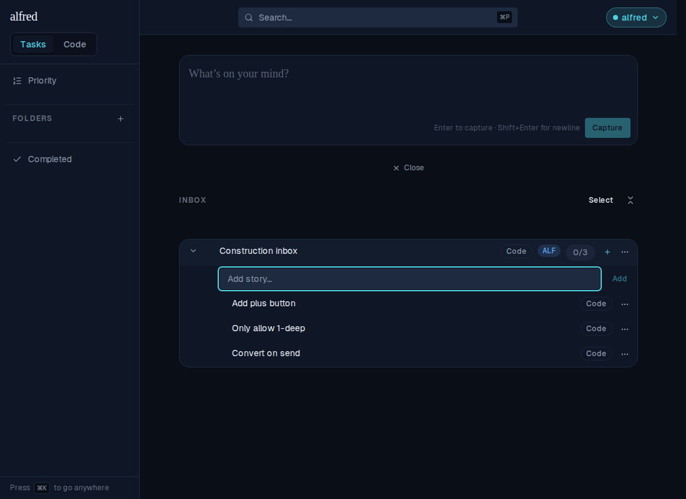
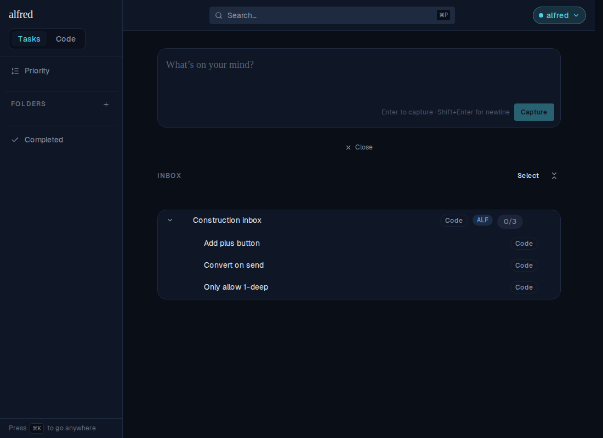
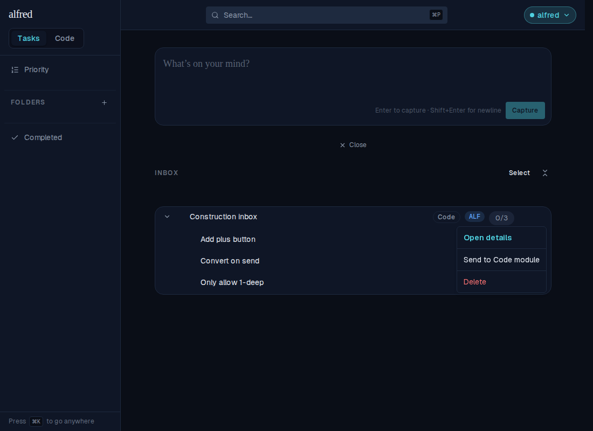
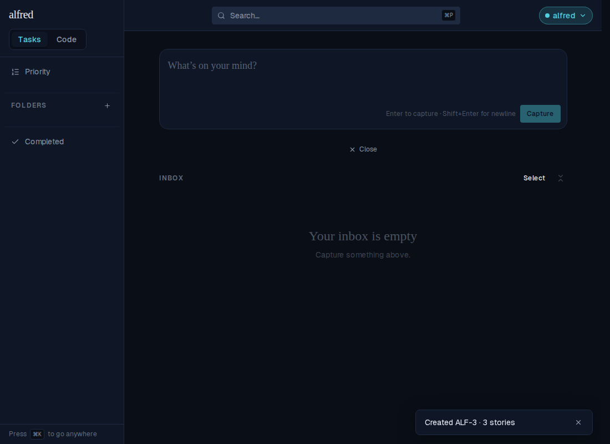
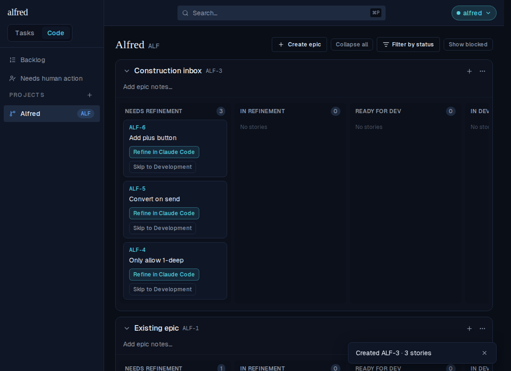
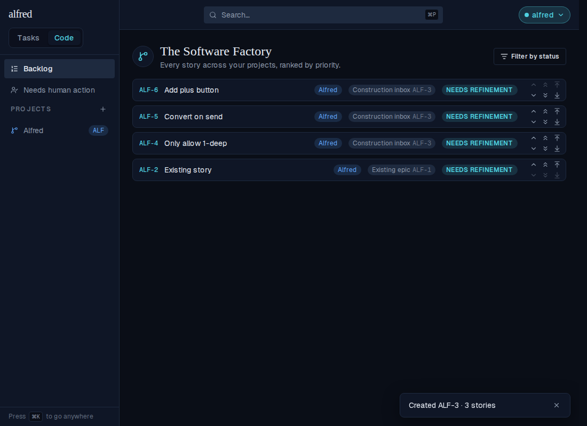
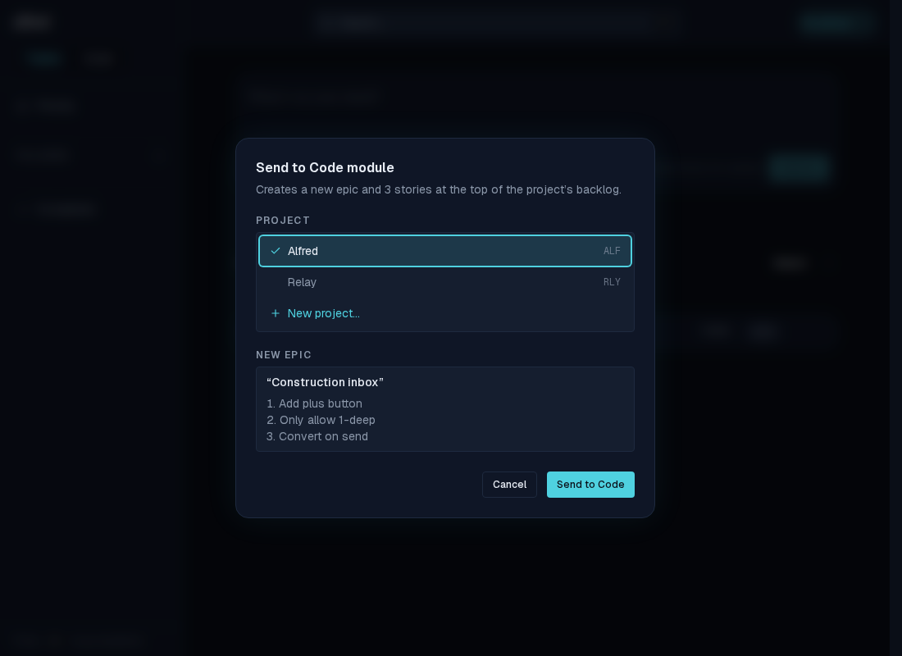
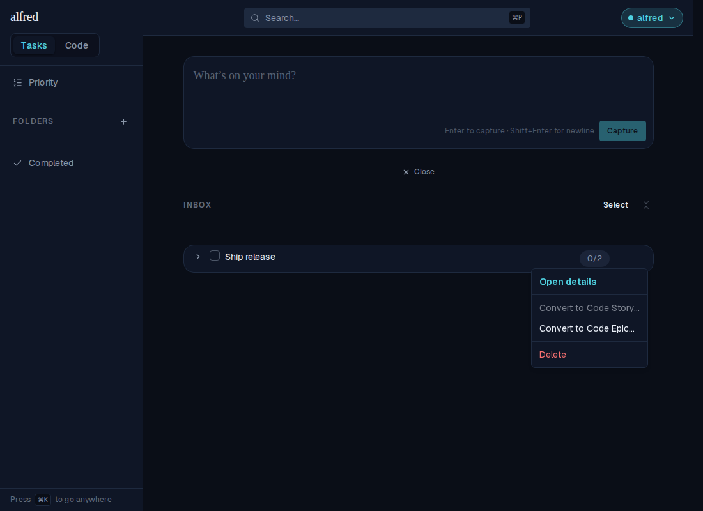

# Construct epics in the inbox; convert 1-deep parents to code epics (ALF-129)

*2026-07-25T14:41:28.224Z*

A code-classified inbox item can now be built out as an **epic under construction**: a parent plus an ordered list of code children, sent to the Code module in one action. The parent becomes the epic (its title + notes); each child becomes a story at the top of the project's Backlog, in the order they were arranged. The same conversion is offered on a decomposed task via **Convert to Code Epic…**. Everything below is driven through the running app against the in-memory mock backend (the Playwright harness), so the whole journey — capture → build → reorder → send → board — is the real route handlers, stores, and dialogs.

**1 · Build the epic.** `Alfred: Construction inbox` was captured with a project prefix (the `ALF` chip), then three stories were added through the code root's new **Add story** affordance (note the `Add story…` placeholder, the Code badge on every child, and no checkboxes — completion stays task-only):

**2 · Reorder the stories.** Code children reorder exactly like task subtasks — the gap-drop gesture and the **Move up / Move down** menu actions. Here "Convert on send" was moved up one slot; this order is what the conversion will preserve:

**3 · Send it.** The parent's menu shows **Send to Code module** — no ellipsis, because an intended project is set, so the conversion fires immediately with no dialog:

The whole group leaves the inbox in one action; the toast announces the created epic and story count, deep-linked to the project board:

**4 · The board.** A new epic named after the parent (`Construction inbox ALF-3`), with its three stories at Needs Refinement — in the display order they had in the inbox:

**5 · The Backlog order.** The stories rank at the **top of the project** in display order — first child highest (`ALF-6` Add plus button, then `ALF-5` Convert on send, then `ALF-4` Only allow 1-deep, reflecting the reorder from step 2) — with the project's pre-existing story (`ALF-2`, priority 5) below them. The conversion walks the children bottom-up through `top_of_project_priority()`, so no other project's stories are displaced:

**6 · The project-only epic gate.** A code parent captured *without* a project prefix keeps the ellipsis (**Send to Code module…**) and opens this dialog instead: a project picker plus a read-only preview of the epic and its ordered stories. There is no epic picker — the epic is being created. Confirm is disabled until a project is chosen. The tasks-module **Convert to Code Epic…** path always opens this dialog too:

**7 · The convert menu on a task.** For any convertible row, **Convert to Code Story…** and **Convert to Code Epic…** sit adjacent and are always rendered, each disabled with a hint when it doesn't apply. This task has two subtasks, so Story is greyed out ("A story is a single item — this one has subtasks.") and Epic is live. After converting, the task parent is *completed* (its history and completed children stay in the Completed view); a code parent is deleted, since the epic carries its title and notes:

**Under the hood.** Migration `0019_code_epics.sql` relaxes the `items_task_only_fields` CHECK so a `code` row may carry a `parent_id` (due dates and completion stay task-only), adds an `enforce_subtask_shape` trigger (code children are exactly one level deep, hang only off a code root, and the task/code families never mix — the database rejects what the UI already prevents), and adds the atomic `convert_to_code_epic(item, project)` RPC. Drag-and-drop got the same family guard: a task can no longer be dropped into a code group nor a code child into a task group — including onto a row body, which closes a latent hole where a task dropped on a code inbox row was silently re-parented under it. The Inbox bulk **Send to Code…** stays story-per-item and disables (with a hint) when any selected row has children.
